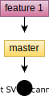
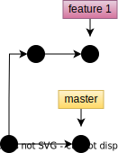
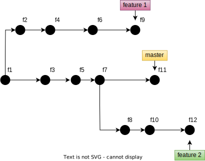
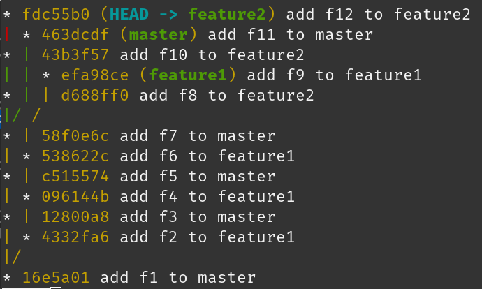
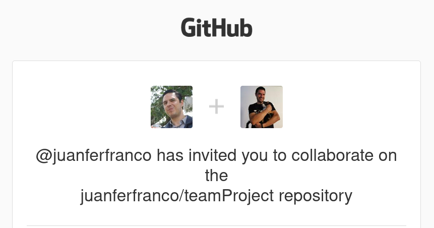
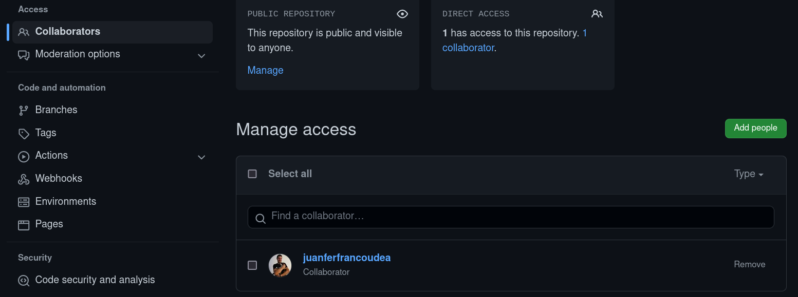

Trabajo en equipo con git y GitHub
====================================================

Ahora que ya sabes hacer algunas operaciones básicas con Git y GitHub, 
vas a aprender a trabajar en equipo con otros compañeros.

Trayecto de actividades
---------------------------------

Lectura 1: el concepto de ramas 
^^^^^^^^^^^^^^^^^^^^^^^^^^^^^^^^^^^^^^^^^^^^^

¿Recuerdas qué es un commit?

.. note:: ALERTA DE SPOILER

    Un commit es una foto del proyecto en un punto del tiempo.

En Git SOLO puedes trabajar con un commit a la vez; sin embargo, 
puedes tener diferente RAMAS apuntando a diferentes commits. De 
esta manera tienes un mecanismo que te permite saltar fácilmente 
de un commit a otro. Recuerda que con cada commit tienes una foto
diferente de tu proyecto. Por tanto, cada que cambies entre commits 
los archivos y contenido de tu proyecto cambiarán. 

Por ahora solo has trabajado con la rama ``master`` o ``main``, pero 
cuando quieras trabajar en equipo es necesario emplear muchas más ramas. Las 
ramas te permite crear secuencias ``independientes`` de commits. De esta 
manera es posible que dos o más personas puedan trabajar simultáneamente 
en el mismo proyecto sin problema, siempre y cuando cada una trabaje 
en una rama diferente.

Ejercicio 1: creación de ramas 
^^^^^^^^^^^^^^^^^^^^^^^^^^^^^^^^^^^^^^^^

Considera la siguiente figura:

Acabas de iniciar un proyecto, tu estás en la rama 
master y acabas de realizas el primer commit (tomas la primera foto). 
Ahora aparece un nuevo compañero que comienza a trabajar a partir de tu commit, 
pero en una nueva rama llamada feature1:

Tu y tu compañero podrán seguir trabajando en paralelo, cada uno en su propia rama, 
es decir, tu en la rama master y tu compañero en la rama feature1:

El proyecto sigue progresando y ahora se une otro compañero:

Entonces, para crear una rama debes ejecutar::

    git switch -c feature1

La secuencia de commits en esa rama iniciará con el último commit 
que tenía la rama desde la cual creaste la nueva.

Ejercicio 3: experimenta
^^^^^^^^^^^^^^^^^^^^^^^^^

Considera la última figura del ejercicio anterior. ¿Te animas a reproducirla? 
La idea es que simules tres personas trabajando en paralelon, una 
para master, otra para feature1 y la otra para feature2.

|

.. note:: ALERTA DE SPOILER

    Te dejo los primeros comandos, pero tu terminas de completar

Los comandos serían::

    mkdir project
    git init
    touch f1
    git add f1
    git commit -m "add f1 to master"
    git switch -c feature1
    git add f2
    git commit -m "add f2 to feature1"
    git switch master
    git add f3
    git commit -m "add f3 to master"
    git switch feature1
    git add f4
    git commit -m "add f4 to feature1"

Cuando termines compara::

    git log --graph --abbrev-commit --decorate --date-order --all --oneline

Varás algo así:

Ejercicio 4: recuerda (evaluación formativa)
^^^^^^^^^^^^^^^^^^^^^^^^^^^^^^^^^^^^^^^^^^^^^

* ¿Cómo se crea una rama?
* ¿Cómo te cambias entre ramas?
* ¿A cuál commit de la secuencia APUNTA cada rama?

De nuevo tómate unos minutos para actualizar tu lista de 
comandos y escribir una frase corta que diga qué hace el 
comando.

Ejercicio 5: inventa tu propio ejercicio
^^^^^^^^^^^^^^^^^^^^^^^^^^^^^^^^^^^^^^^^^^^^^^^^^^^^^^^^

Inventa tu propio ejercicio similar al propuesto para que 
practiques.

Ejercicio 6: otros comandos útiles
^^^^^^^^^^^^^^^^^^^^^^^^^^^^^^^^^^^^^^^

Quieres listar todas las ramas que tienes::

    git branch

Quieres borrar una rama::

    git branch d nombre_de_la_rama

Quieres cambiar el nombre de una rama::

    git switch rama
    git branch -m nombre_nuevo

Quieres ver todas tus ramas locales y las remotas::

    git branch -a

Ejercicio 7: crea tu repo en GitHub
^^^^^^^^^^^^^^^^^^^^^^^^^^^^^^^^^^^^^^

Recuerdas el repositorio del ejercicios::

    git log --graph --date-order --all --oneline

        * fdc55b0 (HEAD -> feature2) add f12 to feature2
    | * 463dcdf (master) add f11 to master
    * | 43b3f57 add f10 to feature2
    | | * efa98ce (feature1) add f9 to feature1
    * | | d688ff0 add f8 to feature2
    |/ /  
    * | 58f0e6c add f7 to master
    | * 538622c add f6 to feature1
    * | c515574 add f5 to master
    | * 096144b add f4 to feature1
    * | 12800a8 add f3 to master
    | * 4332fa6 add f2 to feature1
    |/  
    * 16e5a01 add f1 to master

Ahora vas a crear tu repositorio en GitHub o lo que es igual 
un ``remoto`` (no olvides ingresar a tu cuenta de GitHub en 
el browser y autenticar el cliente de la terminal en GitHub)::

    gh repo create projectBranches --public --source=. --push --remote=origin

Lista todas tus ramas::

    git branch -a

    feature1
    * feature2
    master
    remotes/origin/feature2

¿Notas que tienes solo una rama en el ``remote``? Envíalas todas::

    git push --all origin

    feature1
    * feature2
    master
    remotes/origin/feature1
    remotes/origin/feature2
    remotes/origin/master

Finalmente observa::

    git log --graph --date-order --all --oneline

    * fdc55b0 (HEAD -> feature2, origin/feature2) add f12 to feature2
    | * 463dcdf (origin/master, master) add f11 to master
    * | 43b3f57 add f10 to feature2
    | | * efa98ce (origin/feature1, feature1) add f9 to feature1
    * | | d688ff0 add f8 to feature2
    |/ /  
    * | 58f0e6c add f7 to master
    | * 538622c add f6 to feature1
    * | c515574 add f5 to master
    | * 096144b add f4 to feature1
    * | 12800a8 add f3 to master
    | * 4332fa6 add f2 to feature1
    |/  
    * 16e5a01 add f1 to master

Nota que las ramas master y origin/master, feature1 y origin/feature1 y 
feature2 y origin/feature2 están ``sincronizadas`` porque apuntan 
al mismo commit. 

Ejercicio 8: recuerda 
^^^^^^^^^^^^^^^^^^^^^^^^^^^^^^^^^^^^^^^^^^^^^^^^^^

Momento de actualizar de nuevo tu lista de comandos. No olvides 
agregar una pequeña explicación con tus propias palabras. No 
dudes en arreglar la redacción de otros comandos más antiguos 
en la lista. Te aseguro que a medida que avances en el 
manejo del control de versión irás refinando tu vocabulario 
y así mismo las explicaciones.

Ejercicio 9: sincronizar el local con el remoto 
^^^^^^^^^^^^^^^^^^^^^^^^^^^^^^^^^^^^^^^^^^^^^^^^^^^^^^^^^

Ya aprendiste a enviar tus repositorios locales a un remoto. 

¿Cómo actualizas los repositorios locales si los cambios ocurren 
en el remoto?

Para realizar este experimento tendrás que ingresar a tu repositorio 
en GitHub.

Cámbiate a la rama master (explora la interfaz, encontrarás cómo 
hacerlo en la zona izquierda). Adiciona a la rama master el archivo 
f13. Verás un menú desplegable llamado Add file justo al lado del 
menú Code. ``NO OLVIDES CAMBIARTE A LA RAMA MASTER``. En la zona 
inferior de la página donde creas el archivo puedes hacer el commit. 
Simplemente cambia la descripción del commit por add f13 to master y 
presiona el botón Commit new file.

Ahora regresa a la terminal y descarga a tu sistema de control 
de versión local los METADATOS de tu remoto::

    git fetch --all

Observa::

    git log --graph --date-order --all --oneline

    * b4c5397 (origin/master) add f13 to master
    | * fdc55b0 (HEAD -> feature2, origin/feature2) add f12 to feature2
    * | 463dcdf (master) add f11 to master
    | * 43b3f57 add f10 to feature2
    | | * efa98ce (origin/feature1, feature1) add f9 to feature1
    | * | d688ff0 add f8 to feature2
    |/ /  
    * | 58f0e6c add f7 to master
    | * 538622c add f6 to feature1
    * | c515574 add f5 to master
    | * 096144b add f4 to feature1
    * | 12800a8 add f3 to master
    | * 4332fa6 add f2 to feature1
    |/  
    * 16e5a01 add f1 to master

Nota que la rama master local y la remota origin/master no apuntan al 
mismo commit. (master) apunta al commit 463dcdf y (origin/master) a 
b4c5397. Entonces, para descargar f13 a tu repositorio local escribes::

    git switch master
    git pull origin master

El comando ``git pull origin master`` indica al sistema de control de versión 
que haga un ``MERGE`` entre la rama local actual, master, con la remota master.

Y compruebas de nuevo::

    git log --graph --date-order --all --oneline

    * b4c5397 (HEAD -> master, origin/master) add f13 to master
    | * fdc55b0 (origin/feature2, feature2) add f12 to feature2
    * | 463dcdf add f11 to master
    | * 43b3f57 add f10 to feature2
    | | * efa98ce (origin/feature1, feature1) add f9 to feature1
    | * | d688ff0 add f8 to feature2
    |/ /  
    * | 58f0e6c add f7 to master
    | * 538622c add f6 to feature1
    * | c515574 add f5 to master
    | * 096144b add f4 to feature1
    * | 12800a8 add f3 to master
    | * 4332fa6 add f2 to feature1
    |/  
    * 16e5a01 add f1 to master

Observa que ya tienes el archivo f13 en tu directorio de trabajo::

    ls -al
    total 16
    drwxrwxr-x 3 juanfh juanfh 4096 Jul 23 09:11 .
    drwxrwxr-x 7 juanfh juanfh 4096 Jul 22 21:10 ..
    -rw-rw-r-- 1 juanfh juanfh    0 Jul 22 22:42 f1
    -rw-rw-r-- 1 juanfh juanfh    0 Jul 23 09:05 f11
    -rw-rw-r-- 1 juanfh juanfh    1 Jul 23 09:11 f13
    -rw-rw-r-- 1 juanfh juanfh    0 Jul 22 22:49 f3
    -rw-rw-r-- 1 juanfh juanfh    0 Jul 22 22:49 f5
    -rw-rw-r-- 1 juanfh juanfh    0 Jul 22 22:49 f7
    drwxrwxr-x 8 juanfh juanfh 4096 Jul 23 09:13 .git

Ejercicio 10: recuerda
^^^^^^^^^^^^^^^^^^^^^^^^^^^

Para un momento. 

* Actualiza tu lista de comandos con la explicación de qué hacen.
* Para el ejercicio que te inventaste repite el proceso anterior.

.. warning:: NO TE PREOCUPES SI OLVIDAS

    Te voy a proponer algo:

    * Crea tu cuenta en notion
    * Crea una página que llamarás GitCommands
    * Para cada comando has esto:

        * comando
        * descripción
        * pregunta
    
    * Por ejemplo: 

        * git init
        * Crea un repositorio local
        * ¿Cómo se crea un repositorio local?

    * ¿Recuerdas que te hablé de otra herramienta llamada 
      `Anki <https://apps.ankiweb.net/>`__? Pues bien, lo que 
      te propondré es que hagas algunas flashcards. Cada 
      flashcard para un comando. Ya tienes la pregunta y 
      la respuesta será el comando con su descripción.
      Una vez construyas flashcards puedes comenzar a practicar.
      Anki lo puedes tener en tu computador y en el celular.
      Tener la app en el celular es muy útil porque puedes 
      aprovechar para practicar diario y en cualquier momento. 
      ¿Recuerdas la clase de aprender a aprender? Aquí estamos 
      empleando la técnica de retrieval practice y estás 
      espaciando en el tiempo tu práctica. Ahora, no olvides, 
      lo más importante es trates de responder de memoria las 
      preguntas que te hacen las flashcards.

Ejercicio 11: proyecto para hacer en equipo
^^^^^^^^^^^^^^^^^^^^^^^^^^^^^^^^^^^^^^^^^^^^^^^

Conforma un equipo. Para el ejemplo te mostraré un equipo de dos personas,
pero tu puedes tener más amigos que yo.

Por ahora, solo uno de los miembros del equipo creará un repositorio 
en GitHub al cual llamarás teamProject (lo creas dando click al más que 
está en la esquina superior derecha).

Ahora selecciona Settings (lo encuentras del lado derecho). Una vez allí 
mira el lado izquierdo y en la sección Access selecciona ``Collaborators``. 
En Manage Access click en Add people. Busca tus compañeros e invítalos 
uno por uno y añádelos. Al correo de cada uno llegará una invitación:

|

Cuando todos los compañeros acepten la invitación (no olvides presionar F5) 
verás algo así en GitHub:

|

Ejercicio 12: Pero ¿Cómo trabajo equipo? 
^^^^^^^^^^^^^^^^^^^^^^^^^^^^^^^^^^^^^^^^^^^^^

`Hay varias <https://www.atlassian.com/git/tutorials/comparing-workflows>`__ 
maneras de trabajar en equipo bajo control de versión. 
Una de ellas es mediante un flujo de trabajo por ramas. Te voy a 
enseñar esa; sin embargo, antes de comenzar, el trabajo en equipo 
te obliga a PLANEAR. Por tanto, lo primero que debes hacer es dividir 
el trabajo en TAREAS o dividir el proyecto que realizarás con tu 
equipo en ``features``. Cuando todas las features estén terminadas e 
integradas, tu proyecto estará listo.

¿Qué es una feature? Vamos a quedarnos por ahora con una definición.
Una feature es una funcionalidad o una capacidad de tu proyecto. 
Entonces cuando te digo que debes dividir el proyecto en features, 
lo que quiero decir es que lo dividas en funcionalidades. De esta manera 
cada integrante del equipo será responsable de hacer una de ellas.

En el flujo de trabajo que te mostraré vamos a asumir que el repositorio 
central en GitHub y la rama main representarán la historia oficial del proyecto.
El código en la rama main ``siempre`` deberá funcionar. NUNCA DEBE hacerse un COMMIT 
directamente a la rama MAIN. NUNCA. Entonces ¿Cómo se integra el código?
Cuando alguien termine de hacer su feature y esté correcta y probada, 
su contribución se mezcla con la rama main mediante solicitud. Uno de los 
miembros del equipo será el responsable de cuidar la rama main. Esta persona 
debe APROBAR las contribuciones de los demás y asegurarse que el código esté
bien. Por tanto, cuando uno de los miembros del equipo termine su parte, 
solicitará la aprobación de su contribución mediante un ``PULL REQUEST``.
Una vez aprobado el pull request, las contribuciones aparecerán en la rama 
main y se podrá proceder a borrar las rama con la feature local y en el remoto.

Ten presente que los pull requests también pueden ser usados para pedir 
ayuda a tus compañeros de trabajo o discutir sobre una nueva rama o feature.

Para nuestro ejemplo vas a suponer que debes realizar este programa:

.. code-block:: c

    #include <stdio.h>
    #include <stdlib.h>
    #include "feature1.h"
    #include "feature2.h"
    #include "feature3.h"
    #include "feature4.h"
    #include "feature5.h"

    int main(){
        feature1();
        feature2();
        feature3();
        feature4();
        feature5();
        return(EXIT_SUCCESS);
    }

Nota que el proyecto se ha divido en 5 funcionalidades. Para 
una equipo de trabajo de dos personas se ha decido dividir 
el trabajo así:

* Tu haces: feature1, feature2, feature3.
* Tu compañero: feature4, feature5.

Ya casi estas listo. Ahora lo que harás, antes de iniciar a trabajar 
con tus compañeros, es preparar el repositorio con los archivos 
iniciales.

El miembro del equipo quien creó el repositorio lo clonará localmente::

    git clone https://github.com/juanferfranco/teamProject.git

Luego vas a descargar `este <_static/files.tar>`__ archivo comprimido. 
Descomprime el archivo así::

    tar -xf files.tar

Borra files.tar y mueve todos los archivos descomprimidos al directorio 
teamProject. Te debe quedar así::

    ls -al
    total 68
    drwxrwxr-x 3 juanfh juanfh 4096 Jul 23 18:04 .
    drwxrwxr-x 9 juanfh juanfh 4096 Jul 23 18:06 ..
    -rw-rw-r-- 1 juanfh juanfh   94 Jul 23 15:50 feature1.c
    -rw-rw-r-- 1 juanfh juanfh   65 Jul 23 15:49 feature1.h
    -rw-rw-r-- 1 juanfh juanfh   99 Jul 23 16:53 feature2.c
    -rw-rw-r-- 1 juanfh juanfh   63 Jul 23 16:55 feature2.h
    -rw-rw-r-- 1 juanfh juanfh   94 Jul 23 15:53 feature3.c
    -rw-rw-r-- 1 juanfh juanfh   63 Jul 23 16:55 feature3.h
    -rw-rw-r-- 1 juanfh juanfh   94 Jul 23 15:53 feature4.c
    -rw-rw-r-- 1 juanfh juanfh   65 Jul 23 15:53 feature4.h
    -rw-rw-r-- 1 juanfh juanfh   94 Jul 23 15:53 feature5.c
    -rw-rw-r-- 1 juanfh juanfh   65 Jul 23 15:54 feature5.h
    drwxrwxr-x 8 juanfh juanfh 4096 Jul 23 18:04 .git
    -rw-rw-r-- 1 juanfh juanfh   16 Jul 23 18:03 .gitignore
    -rw-rw-r-- 1 juanfh juanfh  269 Jul 23 15:54 main.c
    -rw-rw-r-- 1 juanfh juanfh  258 Jul 23 16:54 Makefile
    -rw-rw-r-- 1 juanfh juanfh   88 Jul 23 17:14 README.md

Ahora adiciona todos los archivos al STAGE y realiza un commit::

    git add .
    git commit -m "Project setup"

Finalmente, actualiza el remoto::

    git push

Ejercicio 13: flujo de trabajo 
^^^^^^^^^^^^^^^^^^^^^^^^^^^^^^^^

Ahora que ya tienes una versión inicial del proyecto en GitHub y 
dividiste el trabajo en features ha llegado el momento de iniciar a trabajar.

Cada integrante del equipo debe clonar en su computador el repositorio.
En este ejemplo que te estoy mostrando hay dos personas. La persona 1 será 
quien creó el repositorio y la persona 2 será el otro miembro 
del equipo. Te iré contando qué haría cada uno.

Persona 1: el moderador crea una feature
____________________________________________

* Comienza a trabajar en la feature1. Por tanto lo primero que hace es 
  crear la rama feature1::

    git switch -c feature1

* Escribe el código de la feature1::

    #include "feature1.h"
    #include <stdio.h>

    void feature1(){
        // print hello from feature1
        printf("hello from feature1\n"); 
    }

* Realiza las pruebas y verifica que su código funciona correctamente::

    make
    gcc main.c  -c -g -o main.o
    gcc feature1.c  -c -g -o feature1.o
    gcc feature2.c  -c -g -o feature2.o
    gcc feature3.c  -c -g -o feature3.o
    gcc feature4.c  -c -g -o feature4.o
    gcc feature5.c  -c -g -o feature5.o
    gcc -Wall -g -o main *.o
    ➜  teamProject git:(feature1) ✗ ./main 
    hello from feature1
    ➜  teamProject git:(feature1) ✗

* A medida que va trabajando realiza commits::

    git commit -am "feature1 is done"

* Envía su rama local a GitHub para tener un respaldo del trabajo 
  en Internet::

    git push -u origin feature1

* Ahora se realizará el pull request para adicionar la contribución 
  a la rama main (enter a todas las preguntas)::

    gh pr create --title "feature 1 is done"

* Como la persona 1 es el responsable designado de aceptar los pull request 
  de todos los miembros del equipo, incluido el mismo, deberá revisar 
  el trabajo e incorporar la feature1 en la rama principal. En este 
  caso el proceso es simple porque la personas que aprueba es la misma 
  que envió la solicitud. Cuando la Persona 1 consulte GitHub verá:

|

  .. image:: ../_static/pullRequestPersona1.png
    :alt: pull request
    :align: center

|

* Ingresa al menú Pull requests, abre ``feature1 is done`` y 
  procede a aprobar. Abre el menú desplegable del botón ``Merge pull request`` 
  y selecciona ``Squash and merge``. Finalmente, presiona el botón Squash and merge. 
  GitHub te dará la opción de añadir una descripción y te habilitará el botón 
  Confirm squash and marge. Por favor confirma.

* Ve ahora en el menú Code, asegúrate que estás en la rama main y abre el archivo 
  feature1.c. Deberías ver los cambios.

* Actualiza tu repositorio local::

    git fetch --all --prune
    git log --all --oneline

    bb9d131 (origin/main, origin/HEAD) feature1 is done (#1)
    064cf61 (origin/feature1, feature1) feature1 is done
    52018b0 (HEAD -> main) add a file to initial project template
    3122d94 Project setup

  Puedes ver que la rama main remota está más actualizada que la tuya local. 
  Por tanto, procede a actualizarla::

    git switch main
    git pull origin main

  Verifica de nuevo::

    git log --all --oneline

    bb9d131 (HEAD -> main, origin/main, origin/HEAD) feature1 is done (#1)
    064cf61 (origin/feature1, feature1) feature1 is done
    52018b0 add a file to initial project template
    3122d94 Project setup

* Ya puedes borrar la rama feature1 en el remoto y en tu computador::

    git switch main
    git branch -d feature1
    error: The branch 'feature1' is not fully merged.
    If you are sure you want to delete it, run 'git branch -D feature1'.

  Este error es esperable. git te está diciendo que nos has hecho un merge 
  con el trabajo que tienes en esta feature local. No te asustes, git solo 
  quiere asegurarse que sepas lo que estás haciendo. De hecho, tu sabes 
  lo que haces y el trabajo en la feature1 ya está integrado en la rama 
  principal del proyecto. Por tanto, puedes proceder::

    git branch -D feature1

  Verifica::

    git log --all --oneline

    bb9d131 (HEAD -> main, origin/main, origin/HEAD) feature1 is done (#1)
    064cf61 (origin/feature1) feature1 is done
    52018b0 add a file to initial project template
    3122d94 Project setup

  Ya no tienes la rama local feature1, pero aún tienes la remota. Esta 
  también la puedes borrar::

    git push origin --delete feature1

  Verifica::

    git log --all --oneline

    bb9d131 (HEAD -> main, origin/main, origin/HEAD) feature1 is done (#1)
    52018b0 add a file to initial project template
    3122d94 Project setup

Los pasos anteriores los repetirá la Personas 1 cada que termine una feature. 

Persona 2: otro miembro crea una feature
____________________________________________

* Ya tenías clonado el proyecto, pero aún no has comenzado a trabajar. Cuando 
  te sientes a trabajar lo primero que debes hacer es actualizar tu repositorio 
  local porque es posible que la rama main esté actualizada con una nueva 
  contribución::

    git fetch --all --prune
    git switch main
    git pull origin main
  
* Crea la rama con la feature que te toca::

    git switch -c feature4

* Programa, prueba y termina tu feature::

    make
    gcc main.c  -c -g -o main.o
    gcc feature1.c  -c -g -o feature1.o
    gcc feature2.c  -c -g -o feature2.o
    gcc feature3.c  -c -g -o feature3.o
    gcc feature4.c  -c -g -o feature4.o
    gcc feature5.c  -c -g -o feature5.o
    gcc -Wall -g -o main *.o
    ➜  teamProject git:(feature4) ✗ ./main 
    hello from feature1
    hello from feature4

* Observa que aparecen dos features la que acabas de hacer 
  y la de otro de tus compañeros que ya se integró a la rama principal.

* Realiza el commit::

    git commit -am "feature4 is done"

* Ahora envía la rama local feature4 a Internet::
  
    git push -u origin feature4

  Verifica::

    git log --all --oneline

    534fda1 (HEAD -> feature4, origin/feature4) feature4 is done
    bb9d131 (origin/main, origin/HEAD, main) feature1 is done (#1)
    52018b0 add a file to initial project template
    3122d94 Project setup

* Realiza ahora el pull request::

    gh pr create --title "feature4 is done"

* Ahora te toca esperar a que el compañero responsable de aprobar 
  los pull request acepte tu contribución. Por lo pronto lo que podrías 
  hacer es regresar a la rama principal, actualizar tu repositorio 
  local con el remoto y desde aquí crear una nueva rama con la feature5.

Persona 1: el moderador acepta un pull request
________________________________________________

* De nuevo, en el repositorio en GitHub estará pendiente un pull request 
  para revisar. La Persona 1 debe verificar que el pull request está 
  correcto y si es así integrarlo a la rama main::

    git fetch --all --prune

  Verifica::

    git log --all --oneline

    534fda1 (origin/feature4) feature4 is done
    bb9d131 (HEAD -> main, origin/main, origin/HEAD) feature1 is done (#1)
    52018b0 add a file to initial project template
    3122d94 Project setup

  Puedes ver la feature4, descarga el los el commit de esa rama, 
  realiza las pruebas y si todo está bien regresa a GitHub para aceptar 
  el pull request. ¿Qué pasa si encuentras algo malo en la feature4? Por 
  ahora aplazaremos esa pregunta y la abordaremos en la feature5.

* Crea una rama local para verificar el pull request de la feature4::

    git switch -c feature4

* Descarga en esta nueva rama local la rama origin feature4::

    git pull origin feature4

  Verifica::

    git log --all --oneline

    534fda1 (HEAD -> feature4, origin/feature4) feature4 is done
    bb9d131 (origin/main, origin/HEAD, main) feature1 is done (#1)
    52018b0 add a file to initial project template
    3122d94 Project setup

* Realiza las pruebas en la rama feature4. Si todo está bien puedes 
  aceptar el pull request::

    ➜  teamProject git:(feature4) make
    gcc feature1.c  -c -g -o feature1.o
    gcc feature4.c  -c -g -o feature4.o
    gcc -Wall -g -o main *.o
    ➜  teamProject git:(feature4) ./main 
    hello from feature1
    hello from feature4

* En GitHub ingresa al menú Pull requests y presiona el botón ``Squash and merge`` 
  y confirma la operación.

* Verifica que efectivamente la rama principal se ha actualizado::

    git fetch --all --prune
    git log --all --oneline

    8110ad2 (origin/main, origin/HEAD) feature4 is done (#2)
    534fda1 (HEAD -> feature4, origin/feature4) feature4 is done
    bb9d131 (main) feature1 is done (#1)
    52018b0 add a file to initial project template
    3122d94 Project setup

    git log --graph --date-order --all --oneline

    * 8110ad2 (origin/main, origin/HEAD) feature4 is done (#2)
    | * 534fda1 (HEAD -> feature4, origin/feature4) feature4 is done
    |/  
    * bb9d131 (main) feature1 is done (#1)
    * 52018b0 add a file to initial project template
    * 3122d94 Project setup

* Ya puedes borrar tu feature4 local y de una vez la remota::

    git switch main
    git branch -d feature4
    git branch -D feature4
    git push origin --delete feature4

  Verifica::

    git log --all --oneline

    8110ad2 (origin/main, origin/HEAD) feature4 is done (#2)
    bb9d131 (HEAD -> main) feature1 is done (#1)
    52018b0 add a file to initial project template
    3122d94 Project setup

Persona 2: feature con un error
_______________________________________________

* Vas a realizar la última feature que te tocó, la feature5. Pero 
  primero, actualiza el estado del remoto::
    
    git fetch --all --prune 

  Verifica::

    git log --all --oneline

    8110ad2 (origin/main, origin/HEAD) feature4 is done (#2)
    534fda1 (HEAD -> feature4) feature4 is done
    bb9d131 (main) feature1 is done (#1)
    52018b0 add a file to initial project template
    3122d94 Project setup
    
* Borra la feature4 local::

    git switch main
    git branch -D feature4

* Actualiza tu repositorio main local::

    git pull origin main
 
  Verifica::

    git log --all --oneline

    8110ad2 (HEAD -> main, origin/main, origin/HEAD) feature4 is done (#2)
    bb9d131 feature1 is done (#1)
    52018b0 add a file to initial project template
    3122d94 Project setup

* Crea el local feature5. Nota que feature5 lo crearás desde el main 
  local actualizado con la feature4 lista::

    git switch -c feature5
    git push -u origin feature5

  Verifica::

    git log --all --oneline

    8110ad2 (HEAD -> feature5, origin/main, origin/feature5, origin/HEAD, main) feature4 is done (#2)
    bb9d131 feature1 is done (#1)
    52018b0 add a file to initial project template
    3122d94 Project setup
 
* Realiza la feature5, supuestamente esta funcionará, pero vas a solicitar un pull 
  request y este será rechazado por Persona 1::

    make
    gcc feature4.c  -c -g -o feature4.o
    gcc feature5.c  -c -g -o feature5.o
    gcc -Wall -g -o main *.o
    ➜  teamProject git:(feature5) ✗ ./main 
    hello from feature1
    hello from feature4
    hello from feature5!!!

* Realiza el commit::

    git commit -am "feature5 is done"

* Envía los cambios a la rama remota::

    git push

  Verifica::

    git log --all --oneline

    8e24576 (HEAD -> feature5, origin/feature5) feature5 is done
    8110ad2 (origin/main, origin/HEAD, main) feature4 is done (#2)
    bb9d131 feature1 is done (#1)
    52018b0 add a file to initial project template
    3122d94 Project setup

* Realiza el pull request::

    gh pr create --title "feature5 is done"

Persona 1: el moderador rechaza un pull request
__________________________________________________

* Detectas el pull request en GitHub y procedes a verificar que todo 
  está bien::

    git fetch --all --prune

  Verifica::

    git log --all --oneline

    8e24576 (origin/feature5) feature5 is done
    8110ad2 (origin/main, origin/HEAD) feature4 is done (#2)
    bb9d131 (HEAD -> main) feature1 is done (#1)
    52018b0 add a file to initial project template
    3122d94 Project setup

* Actualiza la rama main local::

    git pull origin main

  Verifica::

    git log --all --oneline

    8e24576 (origin/feature5) feature5 is done
    8110ad2 (HEAD -> main, origin/main, origin/HEAD) feature4 is done (#2)
    bb9d131 feature1 is done (#1)
    52018b0 add a file to initial project template
    3122d94 Project setup

* Te muestro ahora una manera más rápida de crear la rama local sincronizada 
  de una vez con la remota::

    git switch -c feature5 origin/feature5

  Verifica::

    git branch -a

    * feature5
      main
      remotes/origin/HEAD -> origin/main
      remotes/origin/feature5
      remotes/origin/main
  
  Como puedes notar estás ahora en la rama local feature5 y adicionaste un remoto 
  nuevo origin/feature5

* Compila y verifica que todo esté bien::

    ➜  teamProject git:(feature5) make 
    gcc feature4.c  -c -g -o feature4.o
    gcc feature5.c  -c -g -o feature5.o
    gcc -Wall -g -o main *.o
    ➜  teamProject git:(feature5) ./main 
    hello from feature1
    hello from feature4
    hello from feature5!!!

  Aquí te das cuenta que la feature5 quedó mal, debería ser ``hello from feature5``, 
  pero al ejecutarla sale ``hello from feature5!!!``. Por tanto, no puedes aceptar 
  el pull request.

* Regresa a GitHub y en el pull request dile a tu compañero que luego de hacer 
  pruebas te diste cuenta que hay un error. Dile que debe eliminar los tres 
  signos de admiración al final.

Persona 2: miembro realiza una corrección a un pull request
______________________________________________________________

* Lee las correcciones que indica Persona 1 y procede a arreglar el código::

    ➜  teamProject git:(feature5) make 
    gcc feature5.c  -c -g -o feature5.o
    gcc -Wall -g -o main *.o
    ➜  teamProject git:(feature5) ./main 
    hello from feature1
    hello from feature4
    hello from feature5

* Realiza el commit y el push::

    git commit -am "feature5 remove 3 marks"
    git push origin feature5

  Verifica::

    git log --all --oneline

    aebfc73 (HEAD -> feature5, origin/feature5) feature5 remove 3 marks
    8e24576 feature5 is done
    8110ad2 (origin/main, origin/HEAD, main) feature4 is done (#2)
    bb9d131 feature1 is done (#1)
    52018b0 add a file to initial project template
    3122d94 Project setup

Persona 1: el moderador aprueba un pull request luego de una corrección
_________________________________________________________________________

* Revisa de nuevo las correcciones::

    git fetch --all

  Verifica::

    git log --all --oneline

    aebfc73 (origin/feature5) feature5 remove 3 marks
    8e24576 (HEAD -> feature5) feature5 is done
    8110ad2 (origin/main, origin/HEAD, main) feature4 is done (#2)
    bb9d131 feature1 is done (#1)
    52018b0 add a file to initial project template
    3122d94 Project setup

  Aquí ya se ve el commit con la corrección.

* Actualiza tu rama local feature5 para repetir las pruebas::

    git switch feature5
    git pull origin feature5

* Compila y ejecuta::

    ➜  teamProject git:(feature5) make 
    gcc feature5.c  -c -g -o feature5.o
    gcc -Wall -g -o main *.o
    ➜  teamProject git:(feature5) ./main 
    hello from feature1
    hello from feature4
    hello from feature5

* Ya puedes aceptar el pull request. Esta vez te voy a ensañar una manera 
  más rápida para que no tengas que ir a GitHub::

    gh pr merge -d -s

  En este caso aceptas el pull request, borras la rama feature5 local 
  y la remota (-d) y realizas un Squash merge (-s).

  Verifica::

    git log --all --oneline

    15e3bec (HEAD -> main, origin/main, origin/HEAD) feature5 is done (#3)
    aebfc73 (origin/feature5) feature5 remove 3 marks
    8e24576 feature5 is done
    8110ad2 feature4 is done (#2)
    bb9d131 feature1 is done (#1)
    52018b0 add a file to initial project template
    3122d94 Project setup

  Nota que aún aparece origin/feature5 aunque ya la habías borrado. Puedes 
  ir a GitHub y comprobar que origin/feature5 ya no existe. En ese caso ejecuta::

    git fetch --all --prune

  Verifica::

    git log --all --oneline

    15e3bec (HEAD -> main, origin/main, origin/HEAD) feature5 is done (#3)
    8110ad2 feature4 is done (#2)
    bb9d131 feature1 is done (#1)
    52018b0 add a file to initial project template
    3122d94 Project setup

    git log --graph --date-order --all --oneline

    * 15e3bec (HEAD -> main, origin/main, origin/HEAD) feature5 is done (#3)
    * 8110ad2 feature4 is done (#2)
    * bb9d131 feature1 is done (#1)
    * 52018b0 add a file to initial project template
    * 3122d94 Project setup

Para terminar el ejercicio solo queda faltando que Persona 1 termine 
las features 2 y 3.

* En este caso crea solo una rama para las dos features que faltan::
  
    git fetch --all --prune
    git switch main
    git pull origin main
    git switch -c feature2_3
  
* Termina el código::

    ➜  teamProject git:(feature2_3) make 
    gcc feature2.c  -c -g -o feature2.o
    gcc feature3.c  -c -g -o feature3.o
    gcc -Wall -g -o main *.o
    ➜  teamProject git:(feature2_3) ✗ ./main 
    hello from feature1
    hello from feature2
    hello from feature3
    hello from feature4
    hello from feature5

* Realiza el commit y envía los cambios a GitHub::

    git commit -am "feature 2 and 3 are done"
    git push origin feature2_3
  
  Verifica::

    git log --all --oneline

    a9291fd (HEAD -> feature2_3, origin/feature2_3) feature 2 and 3 are done
    15e3bec (origin/main, origin/HEAD, main) feature5 is done (#3)
    8110ad2 feature4 is done (#2)
    bb9d131 feature1 is done (#1)
    52018b0 add a file to initial project template
    3122d94 Project setup

* Crea el pull request::

    gh pr create --title "feature 2 and 3 are done"

* Acepta el pull request y borrar las ramas local y remotas::

    gh pr merge -d -s

  Verifica::

    git fetch --all --prune
    git log --all --oneline

    b1dfcc6 (HEAD -> main, origin/main, origin/HEAD) feature 2 and 3 are done (#4)
    15e3bec feature5 is done (#3)
    8110ad2 feature4 is done (#2)
    bb9d131 feature1 is done (#1)
    52018b0 add a file to initial project template
    3122d94 Project setup

Ejercicio 14: recuerda
^^^^^^^^^^^^^^^^^^^^^^^^^^^

* Actualiza tu lista de comandos con la explicación de qué hacen.
* Si te animaste crea flashcards para Anki.

Ejercicio 15: recuerda
^^^^^^^^^^^^^^^^^^^^^^^^^^^

Te propongo ahora que repitas el proceso de trabajo en equipo, pero 
esta vez cambia de rol, es decir, si antes era quien aceptaba los pull request,
ahora cambia y deja que otro de tus compañeros haga este rol.

Ejercicio 16: CONFLICTOS
^^^^^^^^^^^^^^^^^^^^^^^^^^^^^^

Cuando estás trabajando en equipo los conflictos, aunque los intentemos 
evitar, aparecen. En este ejercicio vas a introducir conflictos en 
el código de teamProject y verás como resolverlos.

¿Cuándo aparecen conflictos? Cuando dos miembros tocan el mismo código y 
no es posible resolver cuál de las dos versiones del código es la correcta. 
En este punto no queda más remedio que resolver, de manera, manual el conflicto.

El equipo ha decido realizar un cambio a la feature2 para incorporar un adorno 
al mensaje. Por falta de comunicación tanto Persona1 como Persona2 creyeron 
que esa tarea les tocaba a ellos.

Persona 1:

* Actualiza su copia local de main::

    git fetch --all
    git switch main
    git pull

  Verifica::

    git log --all --oneline

    b1dfcc6 (HEAD -> main, origin/main, origin/HEAD) feature 2 and 3 are done (#4)
    15e3bec feature5 is done (#3)
    8110ad2 feature4 is done (#2)
    bb9d131 feature1 is done (#1)
    52018b0 add a file to initial project template
    3122d94 Project setup

* Crea una nueva rama para trabajar en la actualización de la feature2::

    git switch -c feature2-update

Persona 2: 

* Actualiza su copia local de main::

    git fetch --all
    git switch main
    git pull

  Verifica::

    git log --all --oneline

    b1dfcc6 (HEAD -> main, origin/main, origin/HEAD) feature 2 and 3 are done (#4)
    15e3bec feature5 is done (#3)
    8110ad2 feature4 is done (#2)
    bb9d131 feature1 is done (#1)
    52018b0 add a file to initial project template
    3122d94 Project setup

* Crea una nueva rama para trabajar en la actualización de la feature2::

    git switch -c feature2-myupdate

Persona 1 termina primero la actualización de la feature2.

Persona 1:

* Actualiza feature2:

  .. code-block:: c
  
    #include "feature2.h"
    #include <stdio.h>

    void feature2(){
        // print hello from feature2
        printf("*hello from feature2*\n");
    }

* Compila y prueba::

    ➜  teamProject git:(feature2-update) make 
    gcc feature2.c  -c -g -o feature2.o
    gcc -Wall -g -o main *.o
    ➜  teamProject git:(feature2-update) ✗ ./main 
    hello from feature1
    *hello from feature2*
    hello from feature3
    hello from feature4
    hello from feature5

* Realiza el commit, crea la rama remota y realiza el pull request::

    git commit -m "prettify feature2"
    git push -u origin feature2-update    

  Verifica::

    c84b7ab (HEAD -> feature2-update, origin/feature2-update) prettify feature2
    b1dfcc6 (origin/main, origin/HEAD, main) feature 2 and 3 are done (#4)
    15e3bec feature5 is done (#3)
    8110ad2 feature4 is done (#2)
    bb9d131 feature1 is done (#1)
    52018b0 add a file to initial project template
    3122d94 Project setup

  Pull request::

    gh pr create --title "feature2 prettified"

* Y como Persona 1 es el moderado de la rama main, entonces acepta 
  inmediatamente::

    gh pr merge -d -s
    git fetch --all --prune
  
  Verifica::

    git log --all --oneline

    2cb4629 (HEAD -> main, origin/main, origin/HEAD) prettify feature2 (#5)
    b1dfcc6 feature 2 and 3 are done (#4)
    15e3bec feature5 is done (#3)
    8110ad2 feature4 is done (#2)
    bb9d131 feature1 is done (#1)
    52018b0 add a file to initial project template
    3122d94 Project setup

Por su parte Persona 2 termina de modificar feature2.

Persona 2:

* Mofica feature2:

  .. code-block:: c

    #include "feature2.h"
    #include <stdio.h>

    void feature2(){
        // print hello from feature2
        printf("#hello from feature2#\n");
    }
  
* Compila y prueba::

    ➜  teamProject git:(feature2-myupdate) ✗ make 
    gcc feature2.c  -c -g -o feature2.o
    gcc feature3.c  -c -g -o feature3.o
    gcc -Wall -g -o main *.o
    ➜  teamProject git:(feature2-myupdate) ✗ ./main 
    hello from feature1
    #hello from feature2#
    hello from feature3
    hello from feature4
    hello from feature5

* Realiza el commit y crea la rama remota::

    git commit -am "feature2 has new look and feel"
    git push -u origin feature2-myupdate

  Verifica::

    git log --all --oneline

    f249af9 (HEAD -> feature2-myupdate, origin/feature2-myupdate) feature2 has new look and feel
    b1dfcc6 (origin/main, origin/HEAD, main) feature 2 and 3 are done (#4)
    15e3bec feature5 is done (#3)
    8110ad2 feature4 is done (#2)
    bb9d131 feature1 is done (#1)
    52018b0 add a file to initial project template
    3122d94 Project setup

Nota que Persona2 aún no ha actualizado los metadatos del repositorio remoto y no 
se ha dado cuenta que Persona 1 ya había hecho las modificaciones.

  Solita el pull request::

    gh pr create --title "feature2 has new life"

Persona 1 recibe una notificación por correo donde se le informa que 
Persona 2 realizó el trabajo esperado (que Persona 1 ya había hecho)

Persona 1:

* Ve a GitHub, ingresa al menú Pull requests, abre el pull request de Persona 2:

  .. image:: ../_static/conflictPR.png
    :alt: conflicto con un pull request
    :align: center

* Trata de aceptar el pull request desde la terminal::

    ➜  teamProject git:(main) gh pr merge 6 
    X Pull request #6 is not mergeable: the merge commit cannot be cleanly created.
    To have the pull request merged after all the requirements have been met, add the `--auto` flag.
    Run the following to resolve the merge conflicts locally:
      gh pr checkout 6 && git fetch origin main && git merge origin/main

Como sea Persona 1 tiene que resolver el conflicto.

* Observa el conflicto:

  .. code-block:: c

    #include "feature2.h"
    #include <stdio.h>

    void feature2(){
        // print hello from feature2
    <<<<<<< feature2-myupdate
        printf("#hello from feature2#\n");
    =======
        printf("*hello from feature2*\n");
    >>>>>>> main
    }

  Nota que en la rama main tiene una versión de printf diferente 
  a la de feature2-myupdate. ¿Por qué hay un conflicto? porque tienes 
  que decidir cuál de las dos el correcta.

* Resuelve el conflicto diciendo con cuál de las dos versiones de código 
  te quedarás. En este caso decides que te quedarás con la versión que 
  hizo Persona 2.

  Descarga la rama que aporta el conflicto::

    gh pr checkout 6
  
  Actualiza los metadatos del repositorio remoto::

    git fetch origin main
  
  Verifica::

    git log --all --oneline

    f249af9 (HEAD -> feature2-myupdate, origin/feature2-myupdate) feature2 has new look and feel
    2cb4629 (origin/main, origin/HEAD, main) prettify feature2 (#5)
    b1dfcc6 feature 2 and 3 are done (#4)
    15e3bec feature5 is done (#3)
    8110ad2 feature4 is done (#2)
    bb9d131 feature1 is done (#1)
    52018b0 add a file to initial project template
    3122d94 Project setup
  
  Resuelve localmente el conflicto, intentando primero mezclar el contenido 
  de origin/main en tu local de feature2-myupdate::

    git merge origin/main
    Auto-merging feature2.c
    CONFLICT (content): Merge conflict in feature2.c
    Automatic merge failed; fix conflicts and then commit the result.

  Abre el archivo con problemas y resuleve el conflicto:

  .. code-block:: c

    #include "feature2.h"
    #include <stdio.h>

    void feature2(){
        // print hello from feature2
    <<<<<<< HEAD
        printf("#hello from feature2#\n");
    =======
        printf("*hello from feature2*\n");
    >>>>>>> origin/main
    }

  Edita el archivo:

  .. code-block:: c

    #include "feature2.h"
    #include <stdio.h>

    void feature2(){
        // print hello from feature2
        printf("#hello from feature2#\n");
    }

  Realiza el commit::

    ➜  teamProject git:(feature2-myupdate) ✗ git commit -am "resolve conflic in feature2"
    [feature2-myupdate 3bb07b9] resolve conflic in feature2
    ➜  teamProject git:(feature2-myupdate) 

  Verifica::

    git log --all --oneline

    3bb07b9 (HEAD -> feature2-myupdate) resolve conflic in feature2
    f249af9 (origin/feature2-myupdate) feature2 has new look and feel
    2cb4629 (origin/main, origin/HEAD, main) prettify feature2 (#5)
    b1dfcc6 feature 2 and 3 are done (#4)
    15e3bec feature5 is done (#3)
    8110ad2 feature4 is done (#2)
    bb9d131 feature1 is done (#1)
    52018b0 add a file to initial project template
    3122d94 Project setup

  Termina de realizar el ``merge``::

      git switch main
      git merge feature2-myupdate
  
  Verifica::

    3bb07b9 (HEAD -> main, feature2-myupdate) resolve conflic in feature2
    f249af9 (origin/feature2-myupdate) feature2 has new look and feel
    2cb4629 (origin/main, origin/HEAD) prettify feature2 (#5)
    b1dfcc6 feature 2 and 3 are done (#4)
    15e3bec feature5 is done (#3)
    8110ad2 feature4 is done (#2)
    bb9d131 feature1 is done (#1)
    52018b0 add a file to initial project template
    3122d94 Project setup

  Actualiza el remoto::

    git push
    git fetch --all

  Verifica::

    git log --all --oneline

    3bb07b9 (HEAD -> main, origin/main, origin/HEAD, feature2-myupdate) resolve conflic in feature2
    f249af9 (origin/feature2-myupdate) feature2 has new look and feel
    2cb4629 prettify feature2 (#5)
    b1dfcc6 feature 2 and 3 are done (#4)
    15e3bec feature5 is done (#3)
    8110ad2 feature4 is done (#2)
    bb9d131 feature1 is done (#1)
    52018b0 add a file to initial project template
    3122d94 Project setup
  
  Borra el local feature2-myupdate y el remoto::

    git branch -D feature2-myupdate
    git push origin --delete feature2-myupdate
    git fetch --all --prune
  
  Verifica::

    3bb07b9 (HEAD -> main, origin/main, origin/HEAD) resolve conflict in feature2
    f249af9 feature2 has new look and feel
    2cb4629 prettify feature2 (#5)
    b1dfcc6 feature 2 and 3 are done (#4)
    15e3bec feature5 is done (#3)
    8110ad2 feature4 is done (#2)
    bb9d131 feature1 is done (#1)
    52018b0 add a file to initial project template
    3122d94 Project setup

Ejercicio 17: para aquellas personas curiosas
^^^^^^^^^^^^^^^^^^^^^^^^^^^^^^^^^^^^^^^^^^^^^^^^

Si quieres aprender más te voy a dejar unos enlaces:

* `Introducción <https://youtu.be/xbMleco5wiI>`__ a Git.
* `Lecturas <https://www.atlassian.com/git/tutorials/learn-git-with-bitbucket-cloud>`__ de Atlassian.
* `Learn Git <https://www.gitkraken.com/learn/git>`__ de la empresa GitKraken.
* Flujo de trabajo `ramificado <https://youtu.be/CZNl7_rj1tE>`__ más complejo.
* `Ejemplo <https://youtu.be/PjIgou_S9Yc>`__ de un flujo de trabajo ramificado complejo. 
* Flujo de trabajo `bifurcado <https://youtu.be/-G7aAyDeVo4>`__.
* `Git lfs <https://www.gitkraken.com/learn/git/git-lfs>`__.
* `Desarrollo de productos <https://www.youtube.com/watch?v=t9HRzE7_2Xc>`__ 
  interactivos sin estrés.
* `DevOps <https://youtu.be/M2BZr02uai0>`__ con aplicaciones interactivas.
* Aumentar el `rendimiento <https://thepowerups-learning.com/git-hub-actions-para-aumentar-el-rendimiento-en-unity/>`__ del equipo de trabajo.

