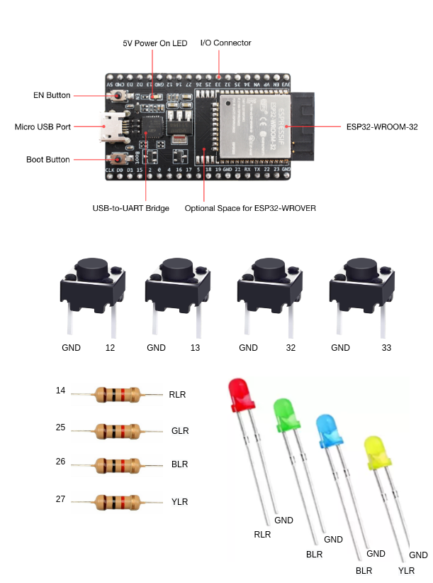
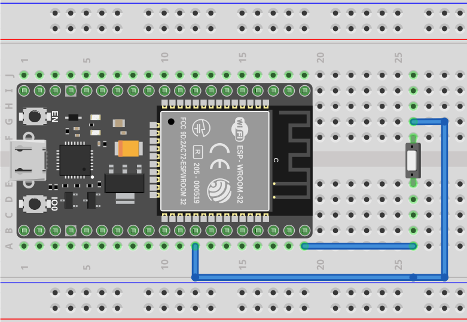
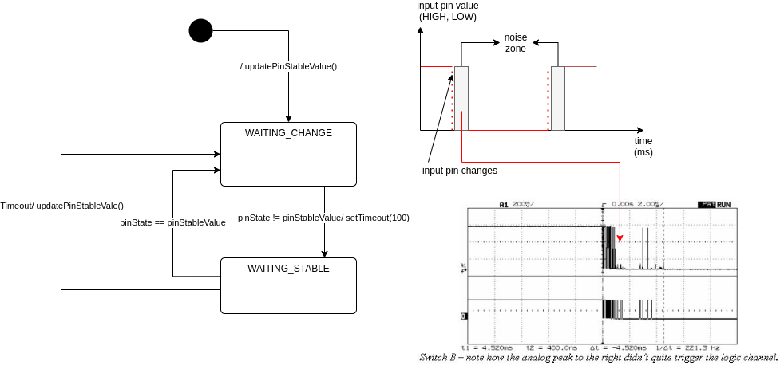
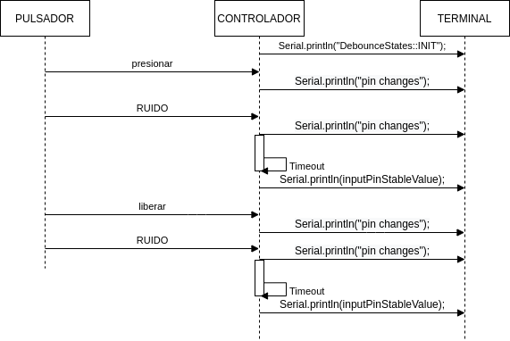
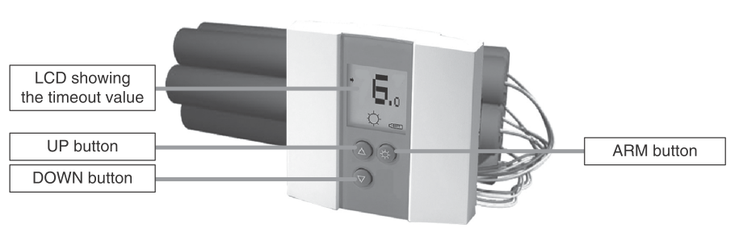

Unidad 1. Software para sistemas embebidos
==============================================

Introducción
--------------

En esta unidad vas a aprender técnicas para programar 
los sistemas embebidos (controladores) que permitirán capturar y/o generar 
la información que fluye desde y hacia el mundo exterior 
de la aplicación interactiva.

Propósito de aprendizaje
***************************

Modelar el software del controlador, mediante el uso de máquinas
de estado, para poder establecer escenarios que permitan
documentar y verificar su funcionamiento.

Implementar el software del controlador mediante las técnicas de
programación adecuadas que permitan sacarle el máximo provecho a
dicho controlador.

Verificar el software del controlador por medio de la
comparación de resultados de funcionamiento con los posibles
escenarios o vectores de prueba definidos en el modelado.

Temas
*******

* Introducción a la programación NO BLOQUEANTE.
* Técnicas de programación: encapsulamiento mediante tareas, programación
  concurrente.
* Modelamiento y programación utilizando máquinas de estado.
* Manejo del puerto serial, medidas de tiempo y retardos
  utilizando técnicas de programación no bloqueantes.

Trayecto de actividades
---------------------------

Ejercicios 
************

Ejercicio 1: introducción 
^^^^^^^^^^^^^^^^^^^^^^^^^^^^

Vamos a revisar entre todos este 
`material introductorio <https://docs.google.com/presentation/d/1eSLyx7koTF5aWOM5hDj1pAqp0Y4mkYWrRofmItw04pw/edit?usp=sharing>`__.

Ejercicio 2: ¿Cómo funciona un microcontrolador? 
^^^^^^^^^^^^^^^^^^^^^^^^^^^^^^^^^^^^^^^^^^^^^^^^^^^^

Vamos a revisar esta pregunta juntos en el tablero.

Ejercicio 3: demo del ambiente de trabajo 
^^^^^^^^^^^^^^^^^^^^^^^^^^^^^^^^^^^^^^^^^^

Te voy a mostrar cómo programar el microcontrolador. Trata de tomar 
nota porque en el próximo ejercicio lo harás tu mismo.

Ejercicio 4: retrieval practice (evaluación formativa)
^^^^^^^^^^^^^^^^^^^^^^^^^^^^^^^^^^^^^^^^^^^^^^^^^^^^^^^^

Para realizar esta evaluación sigue los siguientes pasos:

* Abre el browser, ingresa a Github, cierra la cuenta actual y entra a tu cuenta.
* Ingresa a `este <https://classroom.github.com/a/55dY8_5P>`__ 
  enlace, busca tu ID y nombre para que puedas ingresar a 
  nuestro GitHub Classroom y acepta la primera evaluación 
  formativa del curso. Espera unos segundos y presiona 
  la tecla F5.
* Ahora ingresa al enlace con tu repositorio, despliega el menú del botón
  Code y selecciona la opción https. Copia la URL.
* Abre la terminal y escribe el comando::

    cd ~

* Ahora clona el repositorio así (cambia las XXX por tu usuario de 
  GitHub o simplemente copia la URL completa de tu repositorio)::

    git clone https://github.com/jfUPB/simpleproject-XXX.git

* Cámbiate al directorio que tiene el repositorio::

    cd simpleproject-XXX

* Ejecuta el comando::

    code .

  Este comando abre tu directorio COMPLETO en visual studio code. SIEMPRE 
  debes abrir directorios completos.

* Una vez en visual studio code, abre la paleta de comandos con CRTL+SHIFT+P
* Escribe el comando Arduino: Initialize (si no te sale, llama al profe).
* Y cambia sketch.ino por simpleProject.ino
* Selecciona tu microcontrolador. Escribe ESP32 (si tienes uno ESP32) y 
  luego selecciona el ESP32 Dev Module.
* Conecta tu sistema de desarrollo del ESP32 a tu computador. Linux 
  debe reconocer el dispositivo y cargar el driver.
* En la parte inferior de visual studio code selecciona <Select Programmer> por 
  Esptool y <Select Serial Port> por el puerto serial que el sistema operativo 
  le asignó a tu sistema de desarrollo. Usualmente lo encuentras en la parte 
  final de la lista y es algo similar a /dev/ttyUSB0.
* Abre el archivo simpleProject.ino y reemplaza el código que está allí por este:

    .. code-block:: cpp

      void setup()
      {
        Serial.begin(115200);
      }

      void loop()
      {
          static uint32_t counter = 0;
          static uint32_t lasTime = 0;
          static const uint32_t INTERVAL = 1000;

          uint32_t currentTime = millis();

          if( (currentTime - lasTime) >= INTERVAL){
              lasTime = currentTime;
            Serial.println(counter++);
          } 
      }

* Compila: esquina superior derecha, ícono con el chulo verde.
* Graba la memoria de programa del microcontrolador con el código de máquina 
  que resulta del proceso de traducción del programa anterior. Ícono al lado 
  izquierdo del chulo verde.
* Abre el Monitor serial y comprueba el resultado (parte inferior ícono con 
  un enchufe).
* Regresa a la termina y en el directorio del proyecto escribe (si 
  hay un error, posiblemente tu terminal no está autenticada aún. Llama 
  al profe)::

    git add --all
    git commit -m "Test done"
    git push

* Regresa a GitHub y verifica que tu trabajo está en el repositorio.  

Ejercicio 5: documentación 
^^^^^^^^^^^^^^^^^^^^^^^^^^^^^^^^^^^^^^^^^^

`Ingresa <https://docs.espressif.com/projects/arduino-esp32/en/latest/index.html>`__ 
a la documentación oficial del port de Arduino para el ESP32. No tienes 
que leer todo, solo te pido que recorras superficialmente para que te hagas 
una idea de la información que puedes encontrar allí.

Ejercicio 6: RETO montaje
^^^^^^^^^^^^^^^^^^^^^^^^^^^^^

Ahora vas a realizar el siguiente montaje en el protoboard. Si no recuerdas 
qué es un protoboard o cómo lo puedes trabajar, te dejaré este par de recursos:

* Un video `aquí <https://youtu.be/6WReFkfrUIk>`__.
* Una lectura con imágenes `aquí <https://learn.sparkfun.com/tutorials/how-to-use-a-breadboard>`__.

|

Ejercicio 7: prueba tu montaje 
^^^^^^^^^^^^^^^^^^^^^^^^^^^^^^^^

Con este programa vas a verificar que tu montaje esté correcto.

.. code-block:: cpp

  void task1()
  {
      // Definición de estados y variable de estado
      enum class Task1States
      {
          INIT,
          WAIT_TIMEOUT
      };
      static Task1States task1State = Task1States::INIT;

      // Definición de variables static (conservan
      // su valor entre llamadas a task1)
      static uint32_t lasTime = 0;

      // Constantes

      constexpr uint32_t INTERVAL = 1000;
      constexpr uint8_t button1Pin = 12;
      constexpr uint8_t button2Pin = 13;
      constexpr uint8_t button3Pin = 32;
      constexpr uint8_t button4Pin = 33;
      constexpr uint8_t ledRed = 14;
      constexpr uint8_t ledGreen = 25;
      constexpr uint8_t ledBlue = 26;
      constexpr uint8_t ledYellow = 27;

      // MÁQUINA de ESTADOS

      switch (task1State)
      {
      case Task1States::INIT:
      {
          Serial.begin(115200);
          pinMode(button1Pin, INPUT_PULLUP);
          pinMode(button2Pin, INPUT_PULLUP);
          pinMode(button3Pin, INPUT_PULLUP);
          pinMode(button4Pin, INPUT_PULLUP);
          pinMode(ledRed, OUTPUT);
          pinMode(ledGreen, OUTPUT);
          pinMode(ledBlue, OUTPUT);
          pinMode(ledYellow, OUTPUT);
          lasTime = millis();
          task1State = Task1States::WAIT_TIMEOUT;

          break;
      }
      case Task1States::WAIT_TIMEOUT:
      {
          uint8_t btn1State = digitalRead(button1Pin);
          uint8_t btn2State = digitalRead(button2Pin);
          uint8_t btn3State = digitalRead(button3Pin);
          uint8_t btn4State = digitalRead(button4Pin);
          uint32_t currentTime = millis();

          // Evento 1:
          if ((currentTime - lasTime) >= INTERVAL)
          {   
              lasTime = currentTime;
              printf("btn1: %d,btn2: %d, btn3: %d, btn4: %d\n", btn1State, btn2State, btn3State, btn4State);
          }

          // Evento 2
          if (btn1State == LOW)
              digitalWrite(ledRed, HIGH);
          // Evento 3
          if (btn2State == LOW)
              digitalWrite(ledGreen, HIGH);
          // Evento 4
          if (btn3State == LOW)
              digitalWrite(ledBlue, HIGH);
          // Evento 5
          if (btn4State == LOW)
              digitalWrite(ledYellow, HIGH);

          break;
      }
      default:
      {
          Serial.println("Error");
      }
      }
  }

  void setup()
  {
      task1();
  }

  void loop()
  {
      task1();
  }

Te en cuenta lo siguiente:

* Los programas los dividiremos en tareas. En este caso 
  solo tenemos una. Las tareas son una manera de distribuir 
  el trabajo para poder realizar el programa en equipo. Lo 
  ideal es que las tareas sean independientes, pero no siempre 
  se logra. Por tanto, será necesario definir mecanismos de 
  comunicación entre ellas. Más adelante te enseño cómo.
* Este programa tiene un pseudo estado y un estado, pero 
  desde ahora diremos que tiene 2 estados: 

  .. code-block:: cpp
  
      enum class Task1States
      {
          INIT,
          WAIT_TIMEOUT
      };

* ¿Qué son los estados? Son condiciones de espera. Son momentos 
  en los cuales tu programa está esperando a que algo ocurra. En este 
  caso en ``Task1States::INIT`` realmente no ``ESPERAMOS`` nada, por eso 
  decimos que es un pseudo estado. Este estado SIEMPRE lo usaremos 
  para configurar las condiciones INICIALES de tu programa.
* Nota cómo se pasa de un estado a otro:: 
  
    task1State = Task1States::WAIT_TIMEOUT;

* En el estado `Task1States::WAIT_TIMEOUT` si estamos esperando a 
  que ocurran varios ``EVENTOS``. En este caso los eventos los 
  identificamos mediante los ``IF``. Por tanto, en un estado tu 
  programa estará siempre preguntando por la ocurrencia de algunos 
  eventos.
* Cuando la condición de un evento se produce entonces tu programa 
  ejecuta ACCIONES. Por ejemplo aquí:

  .. code-block:: c

    if (btn4State == LOW)
      digitalWrite(ledYellow, HIGH);
  
  Si el evento ``if (btn4State == LOW)`` ocurre, el programa 
  ejecutará una sola acción que será ``digitalWrite(ledYellow, HIGH);``.
  Ten presente que si requieres ejecutar más acciones en este evento, 
  tendrás que encerrarlas por llaves ``{}``.

Ejercicio 8: retrieval practice (evaluación formativa)
^^^^^^^^^^^^^^^^^^^^^^^^^^^^^^^^^^^^^^^^^^^^^^^^^^^^^^^^

Lo primero que debes hacer es aceptar 
`esta <https://classroom.github.com/a/w0LJZNMN>`__ evaluación e 
ingresar a tu equipo de trabajo (el mismo de la evaluación 
anterior).

* Entra al repositorio y copia la url para clonarlo en tu 
  computador local.
* Mira, en este momento TODOS tienen acceso al repositorio del equipo,
  pero por lo pronto, la idea es que solo suban al repositorio 
  el trabajo desde una de las cuentas, a menos
  que ya sepan como trabajar en equipo con control de versión.
  (Si quieres aprender mira la guía de trabajo en equipo 
  que está antes de las unidades del curso).

Realiza un programa que lea el estado de dos pulsadores en los puertos 
12 y 13 y encienda solo uno de 4 LEDs. El programa debe enviar 
por el puerto serial cuál de los LED se encendió, PERO DEBE HACERLO 
solo una vez, es decir, tu programa NO DEBE quedarse enviando por 
el puerto serial qué LED está encendido y tampoco se debe quedar 
enciendo el LED. Por tanto, enviar el mensaje y encender el LED 
solo se debe hacer una vez, es decir, cada que se detecte una combinación 
nueva de los pulsadores.

=====  =====  =======
12     13     LED
=====  =====  =======
LOW    LOW    14
LOW    HIGH   25
HIGH   LOW    26
HIGH   HIGH   27
=====  =====  =======

Antes de comenzar a programar:

* ¿Cuáles son los estados de tu programa?
* ¿Cuáles serían los eventos?
* ¿Cuáles serían las acciones?

Ejercicio 9: template para trabajo en equipo por tareas
^^^^^^^^^^^^^^^^^^^^^^^^^^^^^^^^^^^^^^^^^^^^^^^^^^^^^^^^^

Como sé que sé o sé quieres comenzar a trabajar en equipo, 
te voy a dejar `un repositorio <https://github.com/juanferfranco/arduinoTeamTemplate.git>`__ 
que puedes usar como un template para trabajar con otros compañeros.

El template tiene un archivo .ino que usarás para llamar las 
diferentes tareas que componen tu aplicación. Por tanto, cuando 
tengas un problema de programación a resolver, lo primero 
que deberás hacer es dividirlo por tareas.

.. code-block:: cpp

  #include "task1.h"
  #include "task2.h"
  #include "task3.h"

  void setup()
  {
      task1();
      task2();
      task3();
  }

  void loop()
  {
      task1();
      task2();
      task3();
  }

Luego, cada tarea estará compuesta de un archivo .h y un archivo cpp.
En el archivo .h publicarás el API de tu tarea, por ejemplo, el prototipo 
del método que define la tarea (el tipo de retorno, el tipo de los 
argumentos). En el archivo .cpp estará la implementación de la tarea en sí.

Ejercicio 10: RETO
^^^^^^^^^^^^^^^^^^^^^^^

Este es un RETO para que resuelvas en equipo. Te voy a indicar una 
serie de pasos que puedes seguir para comenzar y luego te invitaré 
a pensar con tus compañeros los pasos finales del reto.

#. Clona el `template <https://github.com/juanferfranco/arduinoTeamTemplate.git>`__ 
   de trabajo en equipo.
#. Ingresa a la carpeta con el repositorio y borra el directorio .git::

    rm -r -f .git

  ¿Por qué es necesario que hagas esto? porque la carpeta .git contiene toda 
  la información del repositorio que clonaste. Al borrar la carpeta, estás 
  borrando el repositorio. De esta manera, tu puedes iniciar un nuevo 
  repositorio.

#. Crea tu propio repositorio::

    git init
    git add --all
    git commit -m "Init project"

#. Ahora abre el browser e ingresa a tu cuenta de GitHub.
#. Luego en la terminal autoriza el acceso a tu cuenta de Github::

    gh auth logout 
    gh auth login

#. Crea el repositorio en Github con el cual sincronizarás el repositorio 
   local::

    gh repo create PROJECT_NAME --public --source=. --push --remote=origin

#. Verifica que el repositorio se ha creado y que tienes los mismos archivos 
   que en el repositorio local.

#. Te voy a mostrar el código para la task1 y luego con tu equipo vas 
   a construir las demás tareas. La frecuencia del LED rojo será de 5 Hz

  .. code-block:: cpp
  
    #include <Arduino.h>
    #include "task1.h"

    void task1(){
        enum class Task1States{
            INIT,
            WAIT_TO_TOGGLE_LED
        };
        static Task1States task1State = Task1States::INIT;
        static uint32_t lasTime;
        static constexpr uint32_t INTERVAL = 100;
        static constexpr uint8_t ledRed = 14;
        static bool ledStatus = false;

        switch(task1State){
            case Task1States::INIT:{
                pinMode(ledRed,OUTPUT);
                lasTime = millis();
                task1State = Task1States::WAIT_TO_TOGGLE_LED;
                break;
            }

            case Task1States::WAIT_TO_TOGGLE_LED:{
                // evento 1:
                uint32_t currentTime = millis();
                if( (currentTime - lasTime) >= INTERVAL ){
                    lasTime = currentTime;
                    digitalWrite(ledRed,ledStatus);
                    ledStatus = !ledStatus;
                }
                break;
            }

            default:{
                break;
            }
        }

    }  

Los pasos que harás con tus compañeros serán estos:

#. Piensa con tus compañeros la construcción de tres 
   tareas más que modifiquen los LED restantes (25, 26, 27) a 
   una frecuencia de 4 Hz, 3 Hz, 2 Hz respectivamente.

#. No olvides realizar commit y push a medida que vas trabajando::

    git commit -am "update taskX file with..."
    git push

Ejercicio 11: RETO
^^^^^^^^^^^^^^^^^^^^^^^

Usando las tareas definidas en el reto anterior vas a realizar 
este ejercicio de trabajo en equipo bajo control de versión 
como lo harías en el mundo real. Ten presente que en tu equipo 
de trabajo es posible que solo tengas un sistema de desarrollo.
No importa, como la idea es practicar, lo que puedes hacer es 
rotar entre todos el uso del sistema de desarrollo. Incluso, pueden 
trabajar en el mismo computador. Lo que cambiará es la cuenta de GitHub 
que usará cada persona cuando le toque su turno. MIRA, es 
muy importante que SE ACOMPAÑEN entre todos, es decir, cuando 
llegue el turno de un compañero, la idea es que los otros 
estén atentos para ayudarle y corregir errores. ¿Me prometes que harás 
el ejercicio como te lo propongo?

#. Clona de nuevo el template y borra el repositorio. Vas a crear 
   tu propio repositorio.
#. Divide las tareas entre tus compañeros, por ejemplo, si son 4 personas, 
   cada uno puedo hacer una tarea.
#. Dale acceso al repositorio, como colaborador, a cada uno de tus compañeros::

    gh api -X PUT repos/TU-GITHUB-USER/EL-NOMBRE-DEL-REPO/collaborators/EL-GITHUB-USER-DE-TU-COMPA
   
#. Cada compañero debe iniciar sesión en GitHub (puede ser desde el celular o 
   una pestaña incógnita). Luego abrir el correo y aceptar la invitación a 
   trabajar como colaborador en el repositorio.

#. Ahora ha llegado el turno de que cada uno haga la tarea que le tocó. Te 
   voy a mostrar paso a paso lo que debe hacer cada uno de tus compañeros. PERO 
   recuerda hacer el ejercicio por turnos para que todos practiquen y repasen 
   a la vez.

#. Crea un nuevo directorio (si estás trabajando en el mismo computador) por 
   fuera del repositorio. 
  
#. Clona el proyecto.

#. Crea una nueva rama para desarrollar tu tarea (cada uno tendrá un valor 
   diferente para X)::

    git switch -c taskX

#. Inicializa un proyecto de Arduino (CRTL+SHIFT+P, Arduino Initialize, selecciona
   el sistema de desarrollo).

#. Desarrolla tu tarea, compila, realiza pruebas.
#. Realiza commit y push. Para crear el push::

    git push -u origin taskX

#. Realiza un pull request. La idea es que uno de los miembros del 
   equipo sea el encargado de hacer las pruebas de integración con todas 
   las tareas de los compañeros. Ese miembro del equipo será el responsable 
   de aceptar los pull request y de mezclar las contribuciones de todos 
   en la rama principal (master en este caso o main si le cambiaste 
   el nombre)::

    gh pr create --title "Termine la taskX"

#. Ahora tu debes verificar el pull request de tu compañero, verifica 
   que todo funciona correctamente y acepta el trabajo (por ahora). 

#. Ingresa de nuevo a tu cuenta de GitHub si están trabajando en el mismo 
   computador. Vas a descargar a tu local TODOS los metadatos 
   desde repositorio de GitHub::

    git fetch --all --prune
    git log --oneline --all

#. Ya puedes ver la rama en el remoto de uno de tus compañeros. Ahora 
   mira las ramas locales y remotas::

    git branch -a

#. Descarga la rama remota de tu compañero (a tu local)::

    gh pr checkout 1

#. Verifica, compila, realiza pruebas y si todo está bien acepta el pull 
   request::

    gh pr merge -d -s

   Te explico qué hace el comando. Acepta el pull request (merge), borra 
   la rama task2 local y la remota (-d) y realiza un Squash merge (-s). 

#. Verifica que todo quedó bien::

    git fetch --all --prune
    git branch -a

#. Repite los pasos anteriores con los demás compañeros.

Ejercicio 12: monitor serial
^^^^^^^^^^^^^^^^^^^^^^^^^^^^^^
Para profundizar un poco más en el funcionamiento de los programas 
vas a usar una herramienta muy interesante llamada terminal serial.
En este curso vas a utilizar ScriptCommunicator. La aplicación 
la encuentras en la carpeta Apps o apps del directorio del usuario.
Si estás usando otro sistema operativo diferente a Linux puedes 
descargar la aplicación `aquí <https://sourceforge.net/projects/scriptcommunicator/>`__

Para lanzar la aplicación abre el directorio ScriptCommunicator en la terminal 
y ejecuta::

  ./ScriptCommunicator &

Ingresa al menu Settings, selecciona la pestaña serial port y elige 
el puerto (el puerto asignado por el sistema operativo a tu sistema 
de desarrollo) y la BaudRate a 115200. Los demás parámetros los puedes 
dejar igual.

Selecciona la pestaña console options y allí marca ÚNICAMENTE las opciones: 
utf8, receive, hex, mixed.

En la pestaña serial port ve a la sección general, selecciona como 
current interface serial port. Cierra la ventana de configuración.

.. warning:: IMPORTANTE

  No olvides que para DEBES TENER conectado el sistema de desarrollo 
  al computador para poder seleccionar el Port correcto.

Para conectar ScriptCommunicator al microcontrolador, solo tienes que 
dar click en Connect y para desconectar Disconnect.

.. warning:: ESTO ES CRÍTICO

  SOLO UNA APLICACIÓN puede comunicarse a la vez con el microcontrolador.
  Por tanto SOLO una aplicación puede abrir o conectarse al puerto 
  serial que el sistema operativo le asigna al sistema de desarrollo.

Ejercicio 13: retrieval practice
^^^^^^^^^^^^^^^^^^^^^^^^^^^^^^^^^^^^^

Ahora vas a probar ScriptCommunicator con el sistema de desarrollo.

Usa el template para trabajar en equipo y crea una tarea con 
este código:

.. code-block:: cpp

  #include <Arduino.h>
  #include "task1.h"

  void task1()
  {
      enum class Task1States
      {
          INIT,
          WAIT_DATA
      };
      static Task1States task1State = Task1States::INIT;

      switch (task1State)
      {
      case Task1States::INIT:
      {
          Serial.begin(115200);
          task1State = Task1States::WAIT_DATA;
          break;
      }

      case Task1States::WAIT_DATA:
      {
          // evento 1:
          // Ha llegado al menos un dato por el puerto serial?
          if (Serial.available() > 0)
          {                  
              Serial.read();
              Serial.print("Hola computador\n"); 
          }
          break;
      }

      default:
      {
          break;
      }
      }
  }

Ahora abre ScriptCommunicator:

* Presiona el botón Connect.
* Selecciona la pestaña Mixed.
* Luego escribe una letra en la caja de texto que está debajo del botón 
  ``send``. Si quiere coloca la letra `s`.
* Al lado del botón send selecciona la opción utf8.
* Dale click a send.
* Deberías recibir el mensaje ``Hola computador``.

Ahora PIENSA:

#. Analiza el programa.
#. `Abre <https://www.asciitable.com/>`__ esta tabla.
#. Analiza los números que se ven debajo de las letras. Nota 
   que luego de la r, abajo, hay un número. ¿Qué es ese número?
#. ¿Qué relación encuentras entre las letras y los números?

Ejercicio 14: punteros
^^^^^^^^^^^^^^^^^^^^^^^

Vas a explorar un concepto fundamental de los lenguajes de programación 
C y C++. Se trata de los punteros. Para ello, te voy a proponer que 
escribas el siguiente programa (es una tarea). Para probarlo usa ScriptCommunicator. 

.. code-block:: cpp

  #include <Arduino.h>
  #include "task1.h"

  void task1()
  {
      enum class Task1States
      {
          INIT,
          WAIT_DATA
      };
      static Task1States task1State = Task1States::INIT;

      switch (task1State)
      {
      case Task1States::INIT:
      {
          Serial.begin(115200);
          task1State = Task1States::WAIT_DATA;
          break;
      }

      case Task1States::WAIT_DATA:
      {
          // evento 1:
          // Ha llegado al menos un dato por el puerto serial?
          if (Serial.available() > 0)
          {                  
              // DEBES leer ese dato, sino se acumula y el buffer de recepción
              // del serial se llenará.            
              Serial.read(); 
              uint32_t var = 0;
              // Almacena en pvar la dirección de var.
              uint32_t *pvar = &var;         
              // Envía por el serial el contenido de var usando 
              // el apuntador pvar.
              printf("var content: %d\n", *pvar); 
              // ESCRIBE el valor de var usando pvar
              *pvar = 10;                    
              printf("var content: %d\n", *pvar); 
          }
          break;
      }

      default:
      {
          break;
      }
      }
  }

La variable ``pvar`` se conoce como puntero. Simplemente es una variable 
en la cual se almacenan direcciones de otras variables. En este caso, 
en pvar se almacena la dirección de ``var``. Nota que debes decirle al 
compilador el tipo de la variable (uint32_t en este caso) 
cuya dirección será almacenada en pvar. 

Ahora responde las siguientes preguntas:

* ¿Cómo se declara un puntero?
* ¿Cómo se define un puntero? (cómo se inicializa)
* ¿Cómo se obtiene la dirección de una variable?
* ¿Cómo se puede leer el contenido de una variable por medio de un 
  puntero?
* ¿Cómo se puede escribir el contenido de una variable por medio 
  de un puntero?

.. warning:: IMPORTANTE

  No avances hasta que este ejercicio no lo tengas claro.

Ejercicio 15: punteros y funciones 
^^^^^^^^^^^^^^^^^^^^^^^^^^^^^^^^^^^^^

Vas a escribir el siguiente programa, pero antes de ejecutarlo vas 
a tratar de lanzar una HIPÓTESIS de qué hace. Luego lo vas a 
ejecutar y compararás el resultado con lo que creías. Si el 
resultado no es el esperado, no deberías seguir al siguiente 
ejercicio hasta que no experimentes y salgas de la duda.

.. code-block:: cpp

  #include <Arduino.h>
  #include "task1.h"

  static void changeVar(uint32_t *pdata)
  {
      *pdata = 10;
  }

  static void printVar(uint32_t value)
  {
      printf("var content: %d\n", value);
  }

  void task1()
  {
      enum class Task1States
      {
          INIT,
          WAIT_DATA
      };
      static Task1States task1State = Task1States::INIT;

      switch (task1State)
      {
      case Task1States::INIT:
      {
          Serial.begin(115200);
          task1State = Task1States::WAIT_DATA;
          break;
      }

      case Task1States::WAIT_DATA:
      {
          // evento 1:
          // Ha llegado al menos un dato por el puerto serial?
          if (Serial.available() > 0)
          {
              Serial.read();
              uint32_t var = 0;
              uint32_t *pvar = &var;
              printVar(*pvar);
              changeVar(pvar);
              printVar(var);
          }
          break;
      }

      default:
      {
          break;
      }
      }
  }

Ejercicio 16: retrieval practice (evaluación formativa)
^^^^^^^^^^^^^^^^^^^^^^^^^^^^^^^^^^^^^^^^^^^^^^^^^^^^^^^^^
Realiza un programa que intercambie mediante una función 
el valor de dos variables. Clona `este <https://classroom.github.com/a/DpmeuO2p>`__ 
repositorio para que trabajes con tus compañeros.

Ejercicio 17: punteros y arreglos
^^^^^^^^^^^^^^^^^^^^^^^^^^^^^^^^^^^

Escribe el siguiente programa (como siempre te doy la tarea). ``ANALIZA`` qué 
hace, cómo funciona y qué necesitas para probarlo. No olvides revisar de nuevo 
una tabla ASCII. Para hacer las pruebas usa ScriptCommunicator y abre la pestaña 
Utf8. 

.. code-block:: cpp

  #include <Arduino.h>
  #include "task1.h"

  static void processData(uint8_t *pData, uint8_t size, uint8_t *res)
  {

      uint8_t sum = 0;
      for (int i = 0; i < size; i++)
      {
          sum = sum + (pData[i] - 0x30);
      }
      *res = sum;
  }

  void task1()
  {
      enum class Task1States
      {
          INIT,
          WAIT_DATA
      };
      static Task1States task1State = Task1States::INIT;
      static uint8_t rxData[5];
      static uint8_t dataCounter = 0;

      switch (task1State)
      {
      case Task1States::INIT:
      {
          Serial.begin(115200);
          task1State = Task1States::WAIT_DATA;
          break;
      }

      case Task1States::WAIT_DATA:
      {
          // evento 1:

          if (Serial.available() > 0)
          {
              rxData[dataCounter] = Serial.read();
              dataCounter++;
              if (dataCounter == 5)
              {
                  uint8_t result = 0;
                  processData(rxData, dataCounter, &result);
                  dataCounter = 0;
                  printf("result: %d\n",result);
              }
          }
          break;
      }

      default:
      {
          break;
      }
      }
  }

Piensa en las siguientes cuestiones:

* ¿Por qué es necesario declarar ``rxData`` static?
* dataCounter se define static y se inicializa en 0. Cada 
  vez que se ingrese a la función loop dataCounter se inicializa 
  a 0? ¿Por qué es necesario declararlo static?
* Observa que el nombre del arreglo corresponde a la dirección 
  del primer elemento del arreglo. Por tanto, usar en una expresión 
  el nombre rxData (sin el operador []) equivale a &rxData[0].
* En la expresión ``sum = sum + (pData[i] - 0x30);`` observa que 
  puedes usar el puntero pData para indexar cada elemento del 
  arreglo mediante el operador [].
* Finalmente, la constante ``0x30`` en ``(pData[i] - 0x30)`` ¿Por qué 
  es necesaria? 
  
  
.. tip:: ALERTA DE SPOILER

  Con respecto a la pregunta anterior. Al enviar un carácter numérico desde 
  ScriptCommunicator este se envía codificado, es decir, se envía 
  un byte codificado en ASCII que representa al número. Por tanto, 
  es necesario decodificar dicho valor. El código ASCII que 
  representa los valores del 0 al 9 es respectivamente: 0x30, 0x31, 
  0x32, 0x33, 0x34, 0x35, 0x36, 0x37, 0x38, 0x39. De esta manera, 
  si envías el ``1`` recibirás el valor 0x31. Si restas de 0x31 el 
  0x30 obtendrás el número 1.

  Repite el ejercicio anterior pero esta vez usa la pestaña Mixed.

Ejercicio 18: análisis del api serial (investigación: hipótesis-pruebas)
^^^^^^^^^^^^^^^^^^^^^^^^^^^^^^^^^^^^^^^^^^^^^^^^^^^^^^^^^^^^^^^^^^^^^^^^^

Para responder estas preguntas 
Qué crees que ocurre cuando:

* ¿Qué pasa cuando hago un `Serial.available() <https://www.arduino.cc/reference/en/language/functions/communication/serial/available/>`__?
* ¿Qué pasa cuando hago un `Serial.read() <https://www.arduino.cc/reference/en/language/functions/communication/serial/read/>`__?
* ¿Qué pasa cuando hago un Serial.read() y no hay nada en el buffer de
  recepción?
* Un patrón común al trabajar con el puerto serial es este:

.. code-block:: cpp

    if(Serial.available() > 0){
        int dataRx = Serial.read() 
    }

* ¿Cuántos datos lee Serial.read()?
* ¿Y si quiero leer más de un dato? No olvides que no se pueden leer más datos
  de los disponibles en el buffer de recepción porque no hay
  más datos que los que tenga allí.
* ¿Qué pasa si te envían datos por serial y se te olvida llamar Serial.read()?

.. warning:: NO AVANCES SIN ACLARAR LAS PREGUNTAS ANTERIORES

  Te pido que resuelvas las preguntas anteriores antes de avanzar. 
  ES MUY IMPORTANTE.  

Ejercicio 19: buffer de recepción
^^^^^^^^^^^^^^^^^^^^^^^^^^^^^^^^^^^^^^

Así se pueden leer 3 datos que han llegado al puerto serial:

.. code-block:: cpp

    if(Serial.available() >= 3){
        int dataRx1 = Serial.read()
        int dataRx2 = Serial.read() 
        int dataRx3 = Serial.read() 
    }

¿Qué escenarios podría tener en este caso?

.. code-block:: cpp

    if(Serial.available() >= 2){
        int dataRx1 = Serial.read()
        int dataRx2 = Serial.read() 
        int dataRx3 = Serial.read() 
    }

Para responder, es necesario que experimentes. ESTOS son los ejercicios 
que realmente te ayudarán a aprender.

Ejercicio 20: miniRETO
^^^^^^^^^^^^^^^^^^^^^^^

Piense cómo podrías hacer lo siguiente:

* Crea una aplicación con una tarea.
* La tarea debe tener su propio buffer de recepción y una capacidad 
  para 32 bytes.
* La tarea almacena los datos del serial en su propio buffer de recepción
  (el buffer será un arreglo).
* El buffer debe estar encapsulado en la tarea.
* Los datos almacenados en el buffer no se pueden perder
  entre llamados a la tarea.
* La tarea debe tener algún mecanismo para ir contando 
  la cantidad de datos que han llegado. ¿Cómo lo harías?

Inventa un programa que ilustre todo lo anterior.

Ejercicio 21: CASO DE ESTUDIO
^^^^^^^^^^^^^^^^^^^^^^^^^^^^^^^^^^^^^

Una aplicación interactiva posee un sensor que produce ruido eléctrico al
cambiar de estado. La siguiente figura, capturada con un osciloscopio
, muestra la señal del sensor.

.. image:: ../_static/bounce.jpg
  :alt: bounce

En la figura se observa el ruido generado en la transición de la señal
al pasar del estado alto al estado bajo; sin embargo, el
mismo fenómeno ocurre al cambiar del estado bajo al alto. Nota que
además pueden ocurrir falsos positivos en la señal, que se manifiestan
como pulsos de muy corta duración.
Un ingeniero electrónica experto nos indica que podemos considerar un
cambio de estado en el sensor siempre que la señal esté estable por
lo menos durante 100 ms, es decir, sin ruido y sin falsos positivos.
Se debe realizar una aplicación que filtre el comportamiento ruidoso
del sensor y reporte por un puerto serial únicamente los valores
estables de la señal.

Para este ejercicio debes:

* Realizar un diagrama con el modelo en máquinas de estado para la aplicación
* Definir escenarios de prueba usando diagramas de secuencias.
* Implementar el modelo.
* Verificar los escenarios definidos

Te muestro un posible montaje en el protoboard para ilustrar este problema. 
Para este montaje elegí como puerto de entrada el número 19. Tu debes 
seleccionar el puerto que más te convenga en un tu microcontrolador.

Mira un posible diagrama de estados y un video corto 
donde te explico el diagrama:

.. raw:: html

  

        <iframe width="100%" height="315" src="https://www.youtube.com/embed/DTSqhBkYbJQ" frameborder="0" allow="accelerometer; autoplay; encrypted-media; gyroscope; picture-in-picture" allowfullscreen></iframe>
  

Definición de los escenarios de prueba:

.. raw:: html
  
    

          <iframe width="100%" height="315" src="https://www.youtube.com/embed/FSfR9sLR3v4" frameborder="0" allow="accelerometer; autoplay; encrypted-media; gyroscope; picture-in-picture" allowfullscreen></iframe>
    

El código de la solución será este:

.. code-block:: cpp

    void setup() {
      Serial.begin(115200);
    }

    void task() {
      enum class DebounceStates {INIT, WAITING_CHANGE, WAITING_STABLE};
      static DebounceStates debounceState =  DebounceStates::INIT;
      static uint8_t inputPinStableValue;
      static uint32_t referenceTime;
      const uint8_t INPUTPIN = 19;
      const uint32_t STABLETIMEOUT = 100;

      switch (debounceState) {

        case DebounceStates::INIT: {
            pinMode(INPUTPIN, INPUT_PULLUP);
            inputPinStableValue = digitalRead(INPUTPIN);
            debounceState = DebounceStates::WAITING_CHANGE;
            Serial.println("DebounceStates::INIT");
            break;
          }
        case DebounceStates::WAITING_CHANGE: {
            if (digitalRead(INPUTPIN) != inputPinStableValue) {
              referenceTime = millis();
              debounceState = DebounceStates::WAITING_STABLE;
              Serial.println("pin changes");
            }

            break;
          }
        case DebounceStates::WAITING_STABLE: {
            uint8_t pinState = digitalRead(INPUTPIN);
            if ( pinState == inputPinStableValue) {
              debounceState = DebounceStates::WAITING_CHANGE;
            }
            else if ( (millis() - referenceTime) >= STABLETIMEOUT) {
              inputPinStableValue = pinState;
              debounceState = DebounceStates::WAITING_CHANGE;
              Serial.print("pinState:");
              Serial.println(inputPinStableValue);
            }
            break;
          }

        default:
          Serial.println("Error");
          break;
      }
    }

    void loop() {
      task();
    }

Explicación del código:

.. raw:: html

  

        <iframe width="100%" height="315" src="https://www.youtube.com/embed/Gdc2VvRwwBM" frameborder="0" allow="accelerometer; autoplay; encrypted-media; gyroscope; picture-in-picture" allowfullscreen></iframe>
  

Verificación de los escenarios de prueba:

  .. raw:: html
  
    

          <iframe width="100%" height="315" src="https://www.youtube.com/embed/dyONJlylaBo" frameborder="0" allow="accelerometer; autoplay; encrypted-media; gyroscope; picture-in-picture" allowfullscreen></iframe>
    

Ejercicio 22: RETO
^^^^^^^^^^^^^^^^^^^^^^^^

Vas a crear y configurar tu proyecto para trabajar en equipo 
en `este <https://classroom.github.com/a/DJ4VeJ3m>`__ repositorio. Ten 
en cuenta que SOLO debes subir al repositorio estos archivos: .ino, .cpp, 
.h, .gitignore y README.md.

Vas a documentar la solución al problema en README.md.

En un escape room se requiere construir una aplicación para controlar 
una bomba temporizada.La siguiente figura ilustra la interfaz de la bomba. 
El circuito de control de la bomba está compuesto por tres sensores digitales,
en este caso pulsadores, denominados UP, DOWN, ARM,
un display (simulado con el serial), un LED que indica si la bomba está 
contando o no y una salida digital para simular la activación de la bomba, 
de nuevo otro LED.

El controlador funciona así:

* Inicia en modo de ``configuración``, es decir, sin hacer cuenta regresiva aún, 
  la bomba está ``desarmada``. El valor inicial del conteo regresivo es de 20 segundos.
* En el modo de configuración, los pulsadores UP y DOWN permiten
  aumentar o disminuir el tiempo inicial de la bomba. El LED de bomba contando 
  está PERMANENTEMENTE encendido.
* El tiempo se puede programar entre 10 y 60 segundos con cambios de 1 segundo.
* El tiempo de configuración se debe visualizar por el serial.
* El pulsador ARM arma la bomba.
* Una vez armada la bomba, comienza la cuenta regresiva que será visualizada
  por el serial por medio de una cuenta regresiva en segundos. El LED que 
  indica que la bomba está contando enciende y apaga a una frecuencia de 1Hz.
* La bomba explotará (se activa la salida de activación de la bomba) cuando
  el tiempo llegue a cero. En este punto el control regresará al modo de
  configuración.
* Una vez la bomba esté armada es posible desactivarla ingresando un código
  de seguridad. El código será la siguiente secuencia de pulsadores
  presionados uno después de otro:  UP, DOWN, UP, DOWN, UP, UP, ARM.
* Si la secuencia se ingresa correctamente la bomba pasará de nuevo
  al modo de configuración de lo contrario continuará la fatal cuenta
  regresiva.
* Debes almacenar la clave de desarmado de la bomba en un arreglo.
* Debes definir una función a la cual le pasarás la dirección en memoria 
  de dos arreglos: uno con la clave recibida y otro con la clave correcta. 
  La función deberá devolver un `bool <https://www.arduino.cc/reference/en/language/variables/data-types/bool/>`__ 
  así: true si la clave recibida es igual a la clave almacenada o 
  false si las claves no coinciden.

.. warning:: ALERTA DE SPOILER

  Te voy a dejar dos recursos para que les des una mirar.
  El `código <https://github.com/juanferfranco/ex22-bomb-2022-20>`__ y un 
  `video <https://youtu.be/ZYu_O1PJutA?t=22>`__ capturado en clase donde se explica parte de la solución.

Evaluación
---------------------------

.. warning:: SUSTENTACIÓN DE LA EVALUACIÓN

  La evaluación debe estar lista ANTES de la sesión del jueves 
  25 de agosto. En la primera hora aprovecha para estudiar con tu equipo de trabajo 
  la solución. En la segunda hora realizarás la sustentación con tu equipo de trabajo.

  No inicies la evaluación si aún no has estudiado en detalle el reto de la bomba.

Consideraciones
********************

* Entrega la evaluación en `este <https://classroom.github.com/a/tgKfWef5>`__ enlace.
* Usa el template que está `aquí <https://github.com/juanferfranco/arduinoTeamTemplate>`__.
* La evaluación la debes realizar con tu equipo de trabajo.

Enunciado
****************

En un escape room se requiere implementar un control compuesto por: 1 LED y 2 botones.
El funcionamiento del control es así:

* El LED tiene tres modos de operación: lento, medio y rápido.
* En el modo lento enciende y apaga cada segundo, en el medio cada 500 ms y en el 
  rápido cada 250 ms.
* Al ingresar a cada modo el LED inicia encendido.
* Si en el modo lento se presiona el botón 1 el LED debe quedar PERMANENTEMENTE APAGADO, pero DEBE ESPERAR 
  a que termine el segundo ya sea encendido o apagado. 
* Para regresar el modo lento se debe presionar el botón 1.
* Para pasar del modo lento al modo medio y viceversa se debe presionar el botón 2.
* Si en el modo medio se presiona el botón 1 el LED debe quedar PERMANENTEMENTE ENCENDIDO, pero 
  DEBE ESPERAR a que terminen los 500 ms ya sea encendido o apagado.
* Para regresar al modo medio se debe presionar de nuevo el botón 1.
* Al modo rápido se ingresa cuando el LED está PERMANENTEMENTE apagado o encendido y se presiona 
  el botón 2.
* Si estando en modo rápido se presiona la secuencia botón 1, botón 1, botón 2, botón 2, botón 1 
  el LED debe regresar al modo desde el que venía cuando ingresó al modo rápido. 

Criterios de evaluación 
************************

* Funcionamiento: 2 unidades para la implementación de los modos lento y medio con sus condiciones 
  de permanentemente encendido o apagado. 1 unidad para el modo rápido y la condición de regreso a los 
  modos lentos y medio.
* Sustentación: 2 unidades por contestar correctamente las preguntas realizadas a cada 
  miembro del equipo.