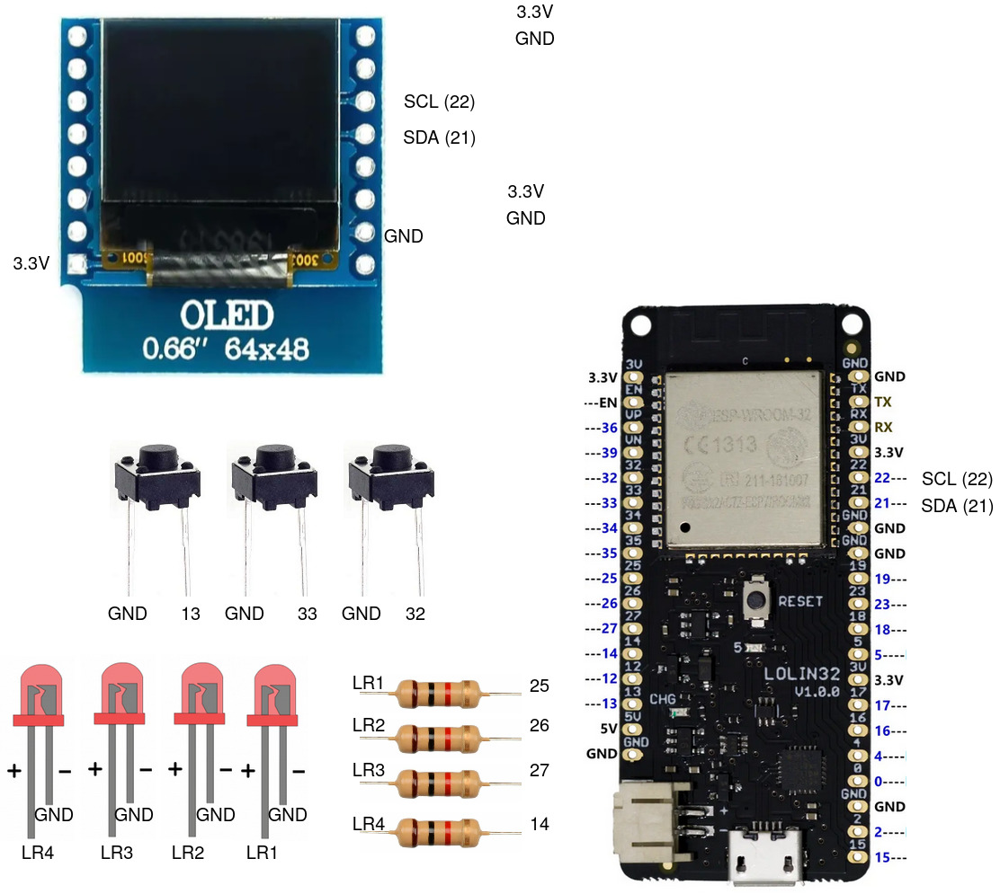

Unidad 1. Software para sistemas embebido
==============================================

Introducción
--------------

En esta unidad vamos a aprender técnicas para programar 
los sistemas embebidos que permitirán capturar y/o generar información 
desde y hacia el mundo exterior de la aplicación interactiva.

Propósito de aprendizaje
***************************

Analizar la plataforma de hardware y software del controlador que se empleará
como interfaz entre los sensores-actuadores y las plataformas de software
interactivas a utilizar en el curso.

Construir aplicaciones simples para el controlador con el fin de explorar algunas
posibilidades y características de su plataforma de software.

Modelar el software del controlador, mediante el uso de máquinas
de estado, para poder establecer escenarios que permitan
documentar y verificar su funcionamiento.

Implementar el software del controlador mediante las técnicas de
programación adecuadas que permitan sacarle el máximo provecho a
dicho controlador. 

Verificar el software del controlador por medio de la
comparación de resultados de funcionamiento con los posibles
escenarios o vectores de prueba definidos en el modelado.

Temas
*******

* Introducción a la programación NO BLOQUEANTE.
* Técnicas de programación: encapsulamiento mediante tareas, programación
  concurrente.
* Modelamiento y programación utilizando máquinas de estado.
* Manejo del puerto serial, medidas de tiempo y retardos
  utilizando técnicas de programación no bloqueantes.

Trayecto de actividades
---------------------------

Sesión 1
*************

Ejercicio 1: Introducción a Git y GitHub 
^^^^^^^^^^^^^^^^^^^^^^^^^^^^^^^^^^^^^^^^^^^^^^

(Tiempo estimado: 1 hora 40 minutos)

.. toctree::
    :maxdepth: 1

    Introducción a Git y GitHub <./introGit>

Trabajo autónomo 1
*********************
(Tiempo estima: 1 horas 20 minutos)

Ejercicio 2: terminar sesión 1 y conseguir materiales 
^^^^^^^^^^^^^^^^^^^^^^^^^^^^^^^^^^^^^^^^^^^^^^^^^^^^^^

* Termina la sesión 1 y trae para la próxima sesión presencial dudas, si es del caso.
* Consigue algunos materiales para el curso.

Los materiales los puedes conseguir en `didácticas electrónicas <https://www.didacticaselectronicas.com/>`__.

#. Sistema de `desarrollo ESP32 <https://www.didacticaselectronicas.com/index.php/sistemas-de-desarrollo/espressif-systems/esp32/wifi-wi-fi-bluetooth-internet-iot-tarjetas-de-desarrollo-con-de-wifi-wi-fi-internet-y-bluetooth-con-esp32-esp-32-detail>`__ 
   similar a la versión DevKit. Solicitar el servicio de soldado de los pines.
#. Protoboard.
#. Cables conexión fácil macho a macho: paquete de 20.
#. 4 LEDs.
#. 4 resistencias de 1000 ohm.
#. 3 `pulsadores <https://www.didacticaselectronicas.com/index.php/suiches-y-conectores/suiches/pulsadores/pulsador-peque%C3%B1o-2-pines-2mm-interruptores-botones-switch-suiches-pulsadores-cuadrados-de-2-pines-6mm-x-5mm-momentaneos-moment%C3%A1neo-sw-6x5-2p-sw-057b-de-montaje-through-hole-detail>`__ 
   de patas largas para introducir en el protobard.
#. `Display tipo OLED <https://www.didacticaselectronicas.com/index.php/optoelectronica/display-oled/shield-oled-64x48-pixeles-para-wemos-d1-mini-wemos-sh-oled-pantallas-displays-oled-screen-oled-64x48-para-wemos-detail>`__.

Sesión 2
*************

Continuar con el Ejercicio 1

Trabajo Autónomo 2
*********************

Terminar la guía

Sesión 3
*************

Ejercicio 3: introducción y ambiente de trabajo
^^^^^^^^^^^^^^^^^^^^^^^^^^^^^^^^^^^^^^^^^^^^^^^^^

Vamos a revisar entre todos este `material introductorio <https://docs.google.com/presentation/d/1lx-4htbKwA1fpIUZ6SpGnAnS5YY3VExF1jMdmARkGYk/edit?usp=sharing>`__.

El material anterior cubre los pasos necesarios para instalar y configurar el entorno de
desarrollo de software bajo el framework de arduino. En este escenario se utilizan los 
lenguajes C y C++.

Ejercicio 4: flujo de trabajo 
^^^^^^^^^^^^^^^^^^^^^^^^^^^^^^^^^

El flujo de trabajo para realizar aplicaciones con arduino será:

* Crear un archivo nuevo. Este archivo inicia con dos funciones: ``setup()`` y ``loop()``.
* La función setup se ejecuta solo una vez al momento de energizar el ESP32 o cuando se presiona el botón de reset.
* La función loop será llamada constantemente por el framework de arduino.
* Una vez escrita la parte de la aplicación que se desea probar, se debe compilar. El proceso de compilación verifica que 
  el programa no tenga errores sintácticos y genera el código de máquina que posteriormente se cargará en la memoria de
  programa del ESP32. Para realizar la verificación y compilación se selecciona el primer ícono en la parte superior izquierda.
* Una vez compilada la aplicación se procede a grabar la memoria del microcontrolador. Esto se realiza con el segundo ícono
  de la parte superior izquierda.
* Finalmente se selecciona el ícono del monitor serial en la esquina superior derecha. Este ícono permite abrir la terminal
  serial por medio la cual se podrán visualizar los mensajes que el ESP32 le enviará al computador utilizando el 
  objeto ``Serial``.

Vamos a probar todos los pasos anteriores con este programa:

.. code-block:: cpp

    void setup() {
      Serial.begin(115200);
    }

    void loop() {
      Serial.print("Hello from ESP32\n");  
      delay(1000);  
    }

Trabajo Autónomo 3
*********************

* Vas a terminar los retos del a sesión 3.
* Si ya terminaste los retos y te queda tiempo, por favor, repasa todo 
  el material de la sesión 3.

Sesión 4
*************

Ejercicio 5: API de arduino 
^^^^^^^^^^^^^^^^^^^^^^^^^^^^^^

En `este enlace <https://www.arduino.cc/reference/en/>`__ se pueden consultar muchas de las funciones disponibles para
realizar programas usando el API de Arduino.

El siguiente programa permite encender y apagar un LED conectado a un puerto de entrada salida:

.. code-block:: cpp

    #define LED_PIN 5

    void setup()
    {
      pinMode(LED_PIN, OUTPUT);
    }
    
    void loop()
    {
      digitalWrite(LED_PIN, HIGH);
      delay(1000); // Wait for 1000 millisecond(s)
      digitalWrite(LED_PIN, LOW);
      delay(1000); // Wait for 1000 millisecond(s)
    }

Para probar el siguiente programa, vas a necesitar utilizar 
el protoboard. Te voy a dejar un par de recursos para que 
ves cómo es por dentro un protoboard y cómo se usa:

* Un video `aquí <https://youtu.be/6WReFkfrUIk>`__.
* Una lectura con imágenes `aquí <https://learn.sparkfun.com/tutorials/how-to-use-a-breadboard>`__.

El siguiente programa permite leer un puerto digital y encender y apagar un LED:

.. code-block:: cpp
    
    #define LED_PIN 5
    #define PUSHBUTTON_PIN 32 

    void setup()
    {
      pinMode(LED_PIN, OUTPUT);
      pinMode(PUSHBUTTON_PIN,INPUT_PULLUP);
    }
    
    void loop()
    {
      if(digitalRead(PUSHBUTTON_PIN) == HIGH){
        digitalWrite(LED_PIN, HIGH);  
      }
      else{
        digitalWrite(LED_PIN, LOW);
      }
    }

Ejercicio 6: RETO
^^^^^^^^^^^^^^^^^^^^^

Antes de este reto monta el siguiente circuito en el protobard:

Este montaje no solo te permitirá abordar este reto, sino otros 
que vendrán.

Realiza un programa que lea el estado de dos switches y encienda solo
uno de 4 LEDs (un LED para cada combinación posible de los suiches).

Ejercicio 7: puerto serial
^^^^^^^^^^^^^^^^^^^^^^^^^^^^^^^

En el siguiente ejercicio vas a explorar, de manera básica el puerto 
serial del microcontrolador. Lee el programa, entiéndelo, realiza 
el montaje de hardware necesario y verifica su funcionamiento. 

.. code-block:: cpp

    #define LED_PIN 5
    #define PUSHBUTTON_PIN 32 

    void setup()
    {
      pinMode(LED_PIN, OUTPUT);
      pinMode(PUSHBUTTON_PIN,INPUT_PULLUP);
      Serial.begin(115200);
      
    }
    
    void loop()
    {
      if(digitalRead(PUSHBUTTON_PIN) == HIGH){
        digitalWrite(LED_PIN, HIGH);  
        Serial.println("LED ON");
      }
      else{
        digitalWrite(LED_PIN, LOW);
        Serial.println("LED OFF");
      }
    }

Ejercicio 8: RETO 
^^^^^^^^^^^^^^^^^^^^

Modifica el código del reto anterior (ejercicio 6) para indicar, SOLO UNA VEZ, por 
el puerto serial cuál de los 4 LEDs está encendido.

Trabajo Autónomo 4
*********************

Revisa de nuevo toda la unidad hasta este punto. He realizado algunas 
actualizaciones al material para que complementes y SOBRE TODO 
repases y PUEDAS RECORDAR lo que ya has practicado.

Sesión 5
*************

Ejercicio 9: variables static
^^^^^^^^^^^^^^^^^^^^^^^^^^^^^^^^^^

Vamos a explorar un poco más el lenguaje de programación.

Analiza el siguiente código:

.. code-block:: cpp

    void setup() {
      Serial.begin(115200);
    }

    void loop() {
      uint8_t counter = 20;
      counter++;
      Serial.println(counter);
      delay(100);
    }

Compara el código anterior con este:

.. code-block:: cpp

    void setup() {
      Serial.begin(115200);
    }

    void loop() {
      static uint8_t counter = 20;
      counter++;
      Serial.println(counter);
      delay(100);
    }

* ¿Qué puedes concluir? 
* ¿Para qué sirve la palabra reservada static? 
* ¿Cuándo es necesario declarar una variable static?

Ejercicio 10: introducción al código no bloqueante
^^^^^^^^^^^^^^^^^^^^^^^^^^^^^^^^^^^^^^^^^^^^^^^^^^^^

Analiza el siguiente ejemplo:

.. code-block:: cpp

    #define LED_PIN 5
    const uint32_t interval = 1000;

    void setup() {
      // set the digital pin as output:
      pinMode(LED_PIN, OUTPUT);
    }
    
    void loop() {
      static uint32_t previousMillis = 0;
      static uint8_t ledState = LOW;
    
      uint32_t currentMillis = millis();

      if (currentMillis - previousMillis >= interval) {
        previousMillis = currentMillis;
        if (ledState == LOW) {
          ledState = HIGH;
        } else {
          ledState = LOW;
        }
        digitalWrite(LED_PIN,ledState);
    }

* ¿Qué hace este programa?
* ¿Cómo funciona?

Ejercicio 11: RETO 
^^^^^^^^^^^^^^^^^^^^^^

Realice un programa que encienda y apague 4 LEDs a
1 Hz, 5 Hz, 7 Hz y 9 Hz respectivamente utilizando la técnica vista en
el ejercicio anterior.

Ejercicio 12: arreglos
^^^^^^^^^^^^^^^^^^^^^^^^^^^^^^^

Analiza uno de los ejemplos que vienen con el
SDK de arduino (modificado). Este ejemplo nos permite ver cómo podemos
hacer uso de los arreglos para manipular varios LEDs:

.. code-block:: cpp
    
    int timer = 100;           // The higher the number, the slower the timing.
    int ledPins[] = {
      25, 26, 27,14
    };       // an array of pin numbers to which LEDs are attached
    int pinCount = 4;           // the number of pins (i.e. the length of the array)
    
    void setup() {
      // the array elements are numbered from 0 to (pinCount - 1).
      // use a for loop to initialize each pin as an output:
      for (int thisPin = 0; thisPin < pinCount; thisPin++) {
        pinMode(ledPins[thisPin], OUTPUT);
      }
    }
    
    void loop() {
      // loop from the lowest pin to the highest:
      for (int thisPin = 0; thisPin < pinCount; thisPin++) {
        // turn the pin on:
        digitalWrite(ledPins[thisPin], HIGH);
        delay(timer);
        // turn the pin off:
        digitalWrite(ledPins[thisPin], LOW);
    
      }
    
      // loop from the highest pin to the lowest:
      for (int thisPin = pinCount - 1; thisPin >= 0; thisPin--) {
        // turn the pin on:
        digitalWrite(ledPins[thisPin], HIGH);
        delay(timer);
        // turn the pin off:
        digitalWrite(ledPins[thisPin], LOW);
      }
    }

Ejercicio 13: encapsulamiento en tareas
^^^^^^^^^^^^^^^^^^^^^^^^^^^^^^^^^^^^^^^^^^

Analiza la estructura del siguiente código. Esta estructura 
te permitirá trabajar fácilmente en equipo porque puedes 
delegar las diferentes partes de la aplicación a varias personas.
La idea es que cada persona pueda realizar una tarea.

Un pedido especial para ti. Recuerda:

* ¿Para qué se usa la palabra reservada static en este caso?
* PREGUNTA DE INVESTIGACIÓN: ¿Qué ocurre con el programa si 
  le quitas el static a las variables?

.. code-block:: cpp

    void setup() {
      task1();
      task2();
    }

    void task1(){
      static uint32_t previousMillis = 0;
      static const uint32_t interval = 1250;
      static bool taskInit = false;
      static const uint8_t ledPin =  25;
      static uint8_t ledState = LOW;
      
      if(taskInit == false){
        pinMode(ledPin, OUTPUT);	
        taskInit = true;
      }
      
      uint32_t currentMillis = millis();	
      if ( (currentMillis - previousMillis) >= interval) {
        previousMillis = currentMillis;
        if (ledState == LOW) {
          ledState = HIGH;
        } else {
          ledState = LOW;
        }
        digitalWrite(ledPin, ledState);
      }
    }

    void task2(){
      static uint32_t previousMillis = 0;
      static const uint32_t interval = 370;
      static bool taskInit = false;
      static const uint8_t ledPin =  26;
      static uint8_t ledState = LOW;
      
      if(taskInit == false){
        pinMode(ledPin, OUTPUT);	
        taskInit = true;
      }
      
      uint32_t currentMillis = millis();	
      if ( (currentMillis - previousMillis) >= interval) {
        previousMillis = currentMillis;
        if (ledState == LOW) {
          ledState = HIGH;
        } else {
          ledState = LOW;
        }
        digitalWrite(ledPin, ledState);
      }
    }

    void loop() {
      task1();
      task2();
    }

Ejercicio 14: punteros
^^^^^^^^^^^^^^^^^^^^^^^

Vas a explorar un concepto fundamental de los lenguajes de programación 
C y C++. Se trata de los punteros. Para ello, te voy a proponer que 
escribas el siguiente programa. Para probarlo, debes abrir el monitor 
serial y enviar un carácter. Asegúrate que en las configuraciones 
del monitor serial tengas seleccionado ``No line ending`` y ``115200``. 

.. code-block:: cpp

  void setup() {
    Serial.begin(115200);
  }

  void loop() {

    if(Serial.available()>0){ // Ha llegado al menos un dato por el puerto serial?
      Serial.read(); // DEBO leer ese dato, sino se acumula y el buffer de recepción
                    // del serial se llenará. 
      uint32_t var= 0;
      uint32_t *pvar = &var; // Almaceno en pvar la dirección de var.
      Serial.print("var content: "); // Envía por el puerto serial el arreglo de caracteres 
                                  // "var content"
      Serial.print(*pvar);         // LEE el valor de var por medio de pvar
      Serial.print('\n');          // Envía solo un carácter usas comillas sencillas.
      *pvar = 10;                  // ESCRIBE el valor de var por medio de pvar

      Serial.print("var content: ");
      Serial.print(*pvar);
      Serial.print('\n');
    }
  }

La variable ``pvar`` se conoce como puntero. Simplemente es una variable 
en la cual se almacenan direcciones de otras variables. En este caso 
en pvar se almacena la dirección de ``var``. Nota que debes decirle al 
compilador cuál es el tipo de la variable (uint32_t en este caso) 
cuya dirección será almacenada en pvar. 

Ahora responde las siguientes preguntas:

* ¿Cómo se declara un puntero?
* ¿Cómo se define un puntero? (cómo se inicializa)
* ¿Cómo se obtiene la dirección de una variable?
* ¿Cómo se puede leer el contenido de una variable por medio de un 
  puntero?
* ¿Cómo se puede escribir el contenido de una variable por medio 
  de un puntero?

.. warning:: IMPORTANTE

  No avances hasta que este ejercicio no lo tengas claro.

Ejercicio 15: punteros y funciones 
^^^^^^^^^^^^^^^^^^^^^^^^^^^^^^^^^^^^^

Ahora analiza este programa:

.. code-block:: cpp

  void setup() {
    Serial.begin(115200);
  }

  void changeVar(uint32_t *pdata) {
    *pdata = 10;
  }

  void printVar(uint32_t value) {
    Serial.print("var content: ");
    Serial.print(value);
    Serial.print('\n');
  }

  void loop() {

    if (Serial.available() > 0) {
      Serial.read();
      uint32_t var = 0;
      uint32_t *pvar = &var;
      printVar(*pvar);
      changeVar(pvar);
      printVar(var);
    }
  }

Nota entonces como pdata recibe el valor de la dirección 
de var que está almacenada en pvar.

Ejercicio 16: RETO
^^^^^^^^^^^^^^^^^^^^^^^

Realiza un programa que intercambie mediante una función 
el valor de dos variables definidas en la función loop. 

Ejercicio 17: punteros y arreglos
^^^^^^^^^^^^^^^^^^^^^^^^^^^^^^^^^^^

Realiza el siguiente programa. Luego abre el monitor serial. Verifica 
que en las configuración indique ``No line ending`` y la velocidad sea 
``115200``. Envía 5 número de un solo dígito. ¿Qué hace el programa? 

.. code-block:: cpp

    void setup(){
        Serial.begin(115200);
    }

    void processData(uint8_t *pData, uint8_t size, uint8_t *res){
      uint8_t sum = 0;

      for(int i= 0; i< size; i++){
        sum = sum + (pData[i] - 0x30);
      }
      *res =  sum;
    }

    void loop(void){
      static uint8_t rxData[5];
      static uint8_t dataCounter = 0;  

      if(Serial.available() > 0){
          rxData[dataCounter] = Serial.read();
          dataCounter++;
        if(dataCounter == 5){
          uint8_t result = 0;
          processData(rxData, dataCounter, &result);
          dataCounter = 0;
          Serial.println(result);
        }
      }
    }

Piensa en las siguientes cuestiones:

* ¿Por qué es necesario declarar ``rxData`` static?
* dataCounter se define static y se inicializa en 0. Cada 
  vez que se ingrese a la función loop dataCounter se inicializa 
  a 0? ¿Por qué es necesario declararlo static?
* Observa que el nombre del arreglo corresponde a la dirección 
  del primer elemento del arreglo. Por tanto, usar en una expresión 
  el nombre rxData (sin el operador []) equivale a &rxData[].
* En la expresión ``sum = sum + (pData[i] - 0x30);`` observa que 
  puedes usar el puntero pData para indexar cada elemento del 
  arreglo mediante el operador [].
* Finalmente, la constante ``0x30`` en ``(pData[i] - 0x30)`` ¿Por qué 
  es necesaria? Porque al enviar un carácter numérico desde 
  el monitor serial, este se envía codificado, es decir, se envía 
  un byte codificado en ASCII que representa al número. Por tanto, 
  es necesario decodificar dicho valor. El código ASCII que 
  representa los valores del 0 al 9 es respectivamente: 0x30, 0x31, 
  0x32, 0x33, 0x34, 0x35, 0x36, 0x37, 0x38, 0x39. De esta manera, 
  si envías el ``1`` recibirás el valor 0x31. Si restas de 0x31 el 
  0x30 obtendrás el número 1.

Trabajo Autónomo 5
*********************

Termina de realizar todos los ejercicios pendientes. Si vas 
al día, dale una nueva revisión al material.

Sesión 6
*************

Ejercicio 18: comunicaciones seriales
^^^^^^^^^^^^^^^^^^^^^^^^^^^^^^^^^^^^^^^^^^^ 

En el siguiente video te explico como funcionan las comunicaciones 
seriales entre un sistema embebidos y una plataforma de cómputo interactiva.

.. raw:: html

    

        <iframe width="100%" height="315" src="https://www.youtube.com/embed/nm0EdjXEBGQ" frameborder="0" allow="accelerometer; autoplay; encrypted-media; gyroscope; picture-in-picture" allowfullscreen></iframe>
    

Ejercicio 19: api serial de arduino
^^^^^^^^^^^^^^^^^^^^^^^^^^^^^^^^^^^^

¿Dónde encuentro el API de arduino para el manejo del serial?

`Aquí <https://www.arduino.cc/reference/en/language/functions/communication/serial/>`__

Las siguientes preguntas las responderemos en los próximos ejercicios, 
pero por ahora lee algunas de las funciones del API del serial y responde:

* ¿Cual es la diferencia entre print y println?
* ¿Cuál es la diferencia entre print y write?
* ¿Qué pasa si utilizas read() cuando available() te devuelva cero?
* ¿Cuál es la diferencia entre readBytes? y readBytesUntil()?
* ¿Qué pasa si quieres leer 10 bytes con readBytes pero solo se han recibido 3?

Ejercicio 20: análisis del api serial (investigación: hipótesis-pruebas)
^^^^^^^^^^^^^^^^^^^^^^^^^^^^^^^^^^^^^^^^^^^^^^^^^^^^^^^^^^^^^^^^^^^^^^^^^

Qué crees que ocurre cuando:

* ¿Qué pasa cuando hago un Serial.available()?
* ¿Qué pasa cuando hago un Serial.read()?
* ¿Qué pasa cuando hago un Serial.read() y no hay nada en el buffer de
  recepción?
* Un patrón común al trabajar con el puerto serial es este:

.. code-block:: cpp

    if(Serial.available() > 0){
        int dataRx = Serial.read() 
    }

* ¿Cuántos datos lee Serial.read()?
* ¿Y si quiero leer más de un dato? No olvides que no se pueden leer más datos
  de los disponibles en el buffer de recepción porque no hay
  más datos que los que tenga allí.

Ejercicio 21: buffer de recepción
^^^^^^^^^^^^^^^^^^^^^^^^^^^^^^^^^^^^^^

Así se pueden leer 3 datos que han llegado al puerto serial:

.. code-block:: cpp

    if(Serial.available() >= 3){
        int dataRx1 = Serial.read()
        int dataRx2 = Serial.read() 
        int dataRx3 = Serial.read() 
    }

¿Qué escenarios podría tener en este caso?

.. code-block:: cpp

    if(Serial.available() >= 2){
        int dataRx1 = Serial.read()
        int dataRx2 = Serial.read() 
        int dataRx3 = Serial.read() 
    }

Para responder, es necesario que experimentes. ESTOS son los ejercicios 
que realmente te ayudarán a aprender.

Ejercicio 22: miniRETO
^^^^^^^^^^^^^^^^^^^^^^^

Piense cómo podrías hacer lo siguiente:

.. code-block:: cpp

    void taskSerial(){
        // Esta tarea tiene su propio buffer de recepción,
        // es decir, su propio vector. Nadie más tiene acceso
    }
    void loop(){
        taskSerial();
    }

* En taskSerial almacena los datos del serial en su propio buffer de recepción
  (el buffer será un arreglo).
* El buffer debe estar encapsulado en la tarea.
* Los datos almacenados en el buffer no se pueden perder
  entre llamados a taskSerial(). La función taskSerial() se llama
  en la función loop.
* La tarea taskSerial() debe tener algún mecanismo para ir contando 
  la cantidad de datos que han llegado. ¿Cómo lo harías?

Ejercicio 23: terminal serial
^^^^^^^^^^^^^^^^^^^^^^^^^^^^^^^^

Vamos a detenernos un momento en el software del lado del
computador: el terminal. Veamos dos de ellas, la terminal
de arduino y `esta <https://sourceforge.net/projects/scriptcommunicator/>`__
otra (scriptcommunicator)

Considera el siguiente programa

.. code-block:: cpp

    void setup()
    {
      Serial.begin(9600);
    }
    void loop()
    {
      if(Serial.available() > 0){
        Serial.read();
        int8_t var = -1;
        Serial.println("Inicio de la prueba");
        Serial.write(var);
        Serial.print("\n");
        Serial.print(var);
        Serial.print('\n');
        Serial.println("Fin de la prueba"); 
      }
    }

Ejecuta el programa

¿Qué observas en la terminal de arduino justo en estas dos líneas?

.. code-block:: cpp

    Serial.write(var);
    Serial.print(var);

¿Qué observas en Scriptcommunicator para las dos líneas anteriores?

Ejercicio 24: miniRETO
^^^^^^^^^^^^^^^^^^^^^^^

Considera el siguiente código para analizar en Scriptcommunicator:

.. code-block:: cpp

    void setup()
    {
      Serial.begin(9600);
    }

    void loop()
    {
      if(Serial.available() > 0){
        Serial.read();
        int8_t var = 255;
        int8_t var2 = 0xFF;
        Serial.write(var);
        Serial.print(var);
        Serial.write(var2);
        Serial.print(var2);
      }
    }

Explica qué está ocurriendo en cada caso.

Ejercicio 25: máquinas de estado
^^^^^^^^^^^^^^^^^^^^^^^^^^^^^^^^^^^^^

Este ejercicio lo vamos a realizar todos juntos:

Una aplicación interactiva posee un sensor que produce ruido eléctrico al
cambiar de estado. La siguiente figura, capturada con un osciloscopio
muestra la señal del sensor.

.. image:: ../_static/bounce.jpg
  :alt: bounce

En la figura se observa el ruido generado en la transición de la señal
al pasar del estado alto al estado bajo; sin embargo, el
mismo fenómeno ocurre al cambiar del estado bajo al alto. Nota que
además pueden ocurrir falsos positivos en la señal, que se manifiestan
como pulsos de muy corta duración.
Un ingeniero electrónica experto nos indica que podemos considerar un
cambio de estado en el sensor siempre que la señal esté estable por
lo menos durante 100 ms, es decir, sin ruido y sin falsos positivos.
Se debe realizar una aplicación que filtre el comportamiento ruidoso
del sensor y reporte por un puerto serial únicamente los valores
estables de la señal.

Para este ejercicio debes:

* Realizar un diagrama con el modelo en máquinas de estado para la aplicación
* Definir escenarios de prueba usando diagramas de secuencias.
* Implementar el modelo.
* Verificar los escenarios definidos

Te muestro un posible montaje en el protoboard para solucionar el ejercicio 30. 
Para este montaje elegí como puerto de entrada el número 19. Tu debes seleccionar 
el puerto que más te convenga en un tu microcontrolador. SI NO QUIERES 
hacer cambios al montaje que ya tienes, recuerda que debes los pulsadores 
están conectados a los puertos 13, 32 y 33. No olvides modificar el puerto 
en el siguiente código en caso de ser necesario.

.. image:: ../_static/debounceCircuit.png
  :alt: circuito

Mira un posible diagrama de estados y un video corto 
donde te explico el diagrama:

.. image:: ../_static/debounceStateDiagram.png
  :alt: state machine

.. raw:: html

  

        <iframe width="100%" height="315" src="https://www.youtube.com/embed/DTSqhBkYbJQ" frameborder="0" allow="accelerometer; autoplay; encrypted-media; gyroscope; picture-in-picture" allowfullscreen></iframe>
  

Definición de los escenarios de prueba:

.. image:: ../_static/debounceEscenarios.png
  :alt: Escenarios de prueba

.. raw:: html
  
    

          <iframe width="100%" height="315" src="https://www.youtube.com/embed/FSfR9sLR3v4" frameborder="0" allow="accelerometer; autoplay; encrypted-media; gyroscope; picture-in-picture" allowfullscreen></iframe>
    

El código de la solución será este:

.. code-block:: cpp

    void setup() {
      Serial.begin(115200);
    }

    void task() {
      enum class DebounceStates {INIT, WAITING_CHANGE, WAITING_STABLE};
      static DebounceStates debounceState =  DebounceStates::INIT;
      static uint8_t inputPinStableValue;
      static uint32_t referenceTime;
      const uint8_t INPUTPIN = 19;
      const uint32_t STABLETIMEOUT = 100;

      switch (debounceState) {

        case DebounceStates::INIT: {
            pinMode(INPUTPIN, INPUT_PULLUP);
            inputPinStableValue = digitalRead(INPUTPIN);
            debounceState = DebounceStates::WAITING_CHANGE;
            Serial.println("DebounceStates::INIT");
            break;
          }
        case DebounceStates::WAITING_CHANGE: {
            if (digitalRead(INPUTPIN) != inputPinStableValue) {
              referenceTime = millis();
              debounceState = DebounceStates::WAITING_STABLE;
              Serial.println("pin changes");
            }

            break;
          }
        case DebounceStates::WAITING_STABLE: {
            uint8_t pinState = digitalRead(INPUTPIN);
            if ( pinState == inputPinStableValue) {
              debounceState = DebounceStates::WAITING_CHANGE;
            }
            else if ( (millis() - referenceTime) >= STABLETIMEOUT) {
              inputPinStableValue = pinState;
              debounceState = DebounceStates::WAITING_CHANGE;
              Serial.print("pinState:");
              Serial.println(inputPinStableValue);
            }
            break;
          }

        default:
          Serial.println("Error");
          break;
      }
    }

    void loop() {
      task();
    }

Explicación del código:

.. raw:: html

  

        <iframe width="100%" height="315" src="https://www.youtube.com/embed/Gdc2VvRwwBM" frameborder="0" allow="accelerometer; autoplay; encrypted-media; gyroscope; picture-in-picture" allowfullscreen></iframe>
  

Verificación de los escenarios de prueba:

  .. raw:: html
  
    

          <iframe width="100%" height="315" src="https://www.youtube.com/embed/dyONJlylaBo" frameborder="0" allow="accelerometer; autoplay; encrypted-media; gyroscope; picture-in-picture" allowfullscreen></iframe>
    

Trabajo Autónomo 6
*********************

Revisa el material de la unidad hasta este punto. RECUERDA que la próxima 
semana tendremos la evaluación de la UNIDAD 1. Para solucionar 
el problema que te daré y realizar la documentación tendrás 6 horas. ES IMPORTANTE 
entonces que te prepares para la evaluación revisando DETENIDAMENTE el material 
trabajado hasta ahora.