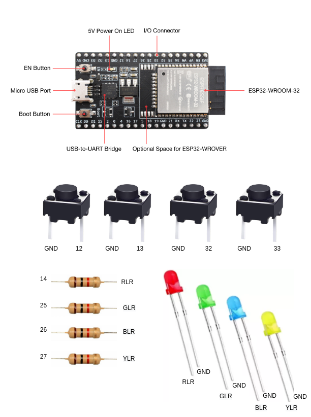

Unidad 1. Software para sistemas embebidos
==============================================

Introducción
--------------

En esta unidad vas a aprender técnicas para programar 
los sistemas embebidos (controladores) que permitirán capturar y/o generar 
la información que fluye desde y hacia el mundo exterior 
de la aplicación interactiva.

Propósito de aprendizaje
***************************

Modelar el software del controlador, mediante el uso de máquinas
de estado, para poder establecer escenarios que permitan
documentar y verificar su funcionamiento.

Implementar el software del controlador mediante las técnicas de
programación adecuadas que permitan sacarle el máximo provecho a
dicho controlador.

Verificar el software del controlador por medio de la
comparación de resultados de funcionamiento con los posibles
escenarios o vectores de prueba definidos en el modelado.

Temas
*******

* Introducción a la programación NO BLOQUEANTE.
* Técnicas de programación: encapsulamiento mediante tareas, programación
  concurrente.
* Modelamiento y programación utilizando máquinas de estado.
* Manejo del puerto serial, medidas de tiempo y retardos
  utilizando técnicas de programación no bloqueantes.

Trayecto de actividades
---------------------------

Ejercicios 
************

Ejercicio 1: introducción 
^^^^^^^^^^^^^^^^^^^^^^^^^^^^

Vamos a revisar entre todos este 
`material introductorio <https://docs.google.com/presentation/d/1eSLyx7koTF5aWOM5hDj1pAqp0Y4mkYWrRofmItw04pw/edit?usp=sharing>`__.

Ejercicio 2: ¿Cómo funciona un microcontrolador? 
^^^^^^^^^^^^^^^^^^^^^^^^^^^^^^^^^^^^^^^^^^^^^^^^^^^^

Vamos a revisar esta pregunta juntos en el tablero.

Ejercicio 3: demo del ambiente de trabajo 
^^^^^^^^^^^^^^^^^^^^^^^^^^^^^^^^^^^^^^^^^^

Te voy a mostrar cómo programar el microcontrolador. Trata de tomar 
nota porque en el próximo ejercicio lo harás tu mismo.

Ejercicio 4: retrieval practice (evaluación formativa)
^^^^^^^^^^^^^^^^^^^^^^^^^^^^^^^^^^^^^^^^^^^^^^^^^^^^^^^^

Para realizar esta evaluación sigue los siguientes pasos:

* Abre el browser, ingresa a Github, cierra la cuenta actual y entra a tu cuenta.
* Ingresa a `este <https://classroom.github.com/a/55dY8_5P>`__ 
  enlace, busca tu ID y nombre para que puedas ingresar a 
  nuestro GitHub Classroom y acepta la primera evaluación 
  formativa del curso. Espera unos segundos y presiona 
  la tecla F5.
* Ahora ingresa al enlace con tu repositorio, despliega el menú del botón
  clone y selecciona la opción https. Copia la URL.
* Abre la terminal y escribe el comando::

    cd ~

* Ahora clona el repositorio así (cambia las XXX por tu usuario de 
  GitHub o simplemente copia la URL completa de tu repositorio)::

    git clone https://github.com/jfUPB/simpleproject-XXX.git

* Cámbiate al directorio que tiene el repositorio::

    cd simpleproject-XXX

* Ejecuta el comando::

    code .

  Este comando abre tu directorio COMPLETO en visual studio code. SIEMPRE 
  debes abrir directorios completos.

* Una vez en visual studio code, abre la paleta de comandos con CRTL+SHIFT+P
* Escribe el comando Arduino: Initialize.
* Y cambia sketch.ino por simpleProject.ino
* Selecciona tu microcontrolador. Escribe ESP32 (si tienes uno ESP32) y 
  luego selecciona el ESP32 Dev Module.
* Conecta tu sistema de desarrollo del ESP32 a tu computador. Linux 
  debe reconocer el dispositivo y cargar el driver.
* En la parte inferior de visual studio code selecciona <Select Programmer> por 
  Esptool y <Select Serial Port> por el puerto serial que el sistema operativo 
  le asignó a tu sistema de desarrollo. Usualmente lo encuentras en la parte 
  final de la lista y es algo similar a /dev/ttyUSB0.
* Abre el archivo simpleProject.ino y reemplaza el código que está allí por este:

    .. code-block:: cpp

      void setup()
      {
        Serial.begin(115200);
      }

      void loop()
      {
          static uint32_t counter = 0;
          static uint32_t lasTime = 0;
          static const uint32_t INTERVAL = 1000;

          uint32_t currentTime = millis();

          if( (currentTime - lasTime) >= INTERVAL){
              lasTime = currentTime;
            Serial.println(counter++);
          } 
      }

* Compila: esquina superior derecha, ícono con el chulo verde.
* Graba la memoria de programa del microcontrolador con el código de máquina 
  que resulta del proceso de traducción del programa anterior. Ícono al lado 
  izquierdo del chulo verde.
* Abre el Monitor serial y comprueba el resultado (parte inferior ícono con 
  un enchufe).
* Regresa a la termina y en el directorio del proyecto escribe::

    git add --all
    git commit -m "Test done"
    git push

* Regresa a GitHub y verifica que tu trabajo está en el repositorio.  

Ejercicio 5: documentación 
^^^^^^^^^^^^^^^^^^^^^^^^^^^^^^^^^^^^^^^^^^

`Ingresa <https://docs.espressif.com/projects/arduino-esp32/en/latest/index.html>`__ 
a la documentación oficial del port de Arduino para el ESP32. No tienes 
que leer todo, solo te pido que recorras superficialmente para que te hagas 
una idea de la información que puedes encontrar allí.

Ejercicio 6: RETO montaje
^^^^^^^^^^^^^^^^^^^^^^^^^^^^^

Ahora vas a realizar el siguiente montaje en el protoboard. Si no recuerdas 
qué es un protoboard o cómo lo puedes trabajar, te dejaré este par de recursos:

* Un video `aquí <https://youtu.be/6WReFkfrUIk>`__.
* Una lectura con imágenes `aquí <https://learn.sparkfun.com/tutorials/how-to-use-a-breadboard>`__.

Ejercicio 7: prueba tu montaje 
^^^^^^^^^^^^^^^^^^^^^^^^^^^^^^^^

Con este programa vas a verificar que tu montaje esté correcto.

.. code-block:: cpp

  void task1()
  {
      // Definición de estados y variable de estado
      enum class Task1States
      {
          INIT,
          WAIT_TIMEOUT
      };
      static Task1States task1State = Task1States::INIT;

      // Definición de variables static (conservan
      // su valor entre llamadas a task1)
      static uint32_t lasTime = 0;

      // Constantes

      constexpr uint32_t INTERVAL = 1000;
      constexpr uint8_t button1Pin = 12;
      constexpr uint8_t button2Pin = 13;
      constexpr uint8_t button3Pin = 32;
      constexpr uint8_t button4Pin = 33;
      constexpr uint8_t ledRed = 14;
      constexpr uint8_t ledGreen = 25;
      constexpr uint8_t ledBlue = 26;
      constexpr uint8_t ledYellow = 27;

      // MÁQUINA de ESTADOS

      switch (task1State)
      {
      case Task1States::INIT:
      {
          Serial.begin(115200);
          pinMode(button1Pin, INPUT_PULLUP);
          pinMode(button2Pin, INPUT_PULLUP);
          pinMode(button3Pin, INPUT_PULLUP);
          pinMode(button4Pin, INPUT_PULLUP);
          pinMode(ledRed, OUTPUT);
          pinMode(ledGreen, OUTPUT);
          pinMode(ledBlue, OUTPUT);
          pinMode(ledYellow, OUTPUT);
          lasTime = millis();
          task1State = Task1States::WAIT_TIMEOUT;

          break;
      }
      case Task1States::WAIT_TIMEOUT:
      {
          uint8_t btn1State = digitalRead(button1Pin);
          uint8_t btn2State = digitalRead(button2Pin);
          uint8_t btn3State = digitalRead(button3Pin);
          uint8_t btn4State = digitalRead(button4Pin);
          uint32_t currentTime = millis();

          // Evento 1:
          if ((currentTime - lasTime) >= INTERVAL)
          {   
              lasTime = currentTime;
              printf("btn1: %d,btn2: %d, btn3: %d, btn4: %d\n", btn1State, btn2State, btn3State, btn4State);
          }

          // Evento 2
          if (btn1State == LOW)
              digitalWrite(ledRed, HIGH);
          // Evento 3
          if (btn2State == LOW)
              digitalWrite(ledGreen, HIGH);
          // Evento 4
          if (btn3State == LOW)
              digitalWrite(ledBlue, HIGH);
          // Evento 5
          if (btn4State == LOW)
              digitalWrite(ledYellow, HIGH);

          break;
      }
      default:
      {
          Serial.println("Error");
      }
      }
  }

  void setup()
  {
      task1();
  }

  void loop()
  {
      task1();
  }

Te en cuenta lo siguiente:

* Los programas los dividiremos en tareas. En este caso 
  solo tenemos una. Las tareas son una manera de distribuir 
  el trabajo para poder realizar el programa en equipo. Lo 
  ideal es que las tareas sean independientes, pero no siempre 
  se logra. Por tanto, será necesario definir mecanismos de 
  comunicación entre ellas. Más adelante te enseño cómo.
* Este programa tiene un pseudo estado y un estado, pero 
  desde ahora diremos que tiene 2 estados: 

  .. code-block:: cpp
  
      enum class Task1States
      {
          INIT,
          WAIT_TIMEOUT
      };

* ¿Qué son los estados? Son condiciones de espera. Son momentos 
  en los cuales tu programa está esperando a que algo ocurra. En este 
  caso en ``Task1States::INIT`` realmente no ``ESPERAMOS`` nada, por eso 
  decimos que es un pseudo estado. Este estado SIEMPRE lo usaremos 
  para configurar las condiciones INICIALES de tu programa.
* Nota cómo se pasa de un estado a otro:: 
  
    task1State = Task1States::WAIT_TIMEOUT;

* En el estado `Task1States::WAIT_TIMEOUT` si estamos esperando a 
  que ocurran varios ``EVENTOS``. En este caso los eventos los 
  identificamos mediante los ``IF``. Por tanto, en un estado tu 
  programa estará siempre preguntando por la ocurrencia de algunos 
  eventos.
* Cuando la condición de un evento se produce entonces tu programa 
  ejecuta ACCIONES. Por ejemplo aquí:

  .. code-block:: c

    if (btn4State == LOW)
      digitalWrite(ledYellow, HIGH);
  
  Si el evento ``if (btn4State == LOW)`` ocurre, el programa 
  ejecutará una sola acción que será ``digitalWrite(ledYellow, HIGH);``.
  Ten presente que si requieres ejecutar más acciones en este evento, 
  tendrás que encerrarlas por llaves ``{}``.

Ejercicio 8: retrieval practice (evaluación formativa)
^^^^^^^^^^^^^^^^^^^^^^^^^^^^^^^^^^^^^^^^^^^^^^^^^^^^^^^^

Lo primero que debes hacer es aceptar 
`esta <https://classroom.github.com/a/w0LJZNMN>`__ evaluación e 
ingresar a tu equipo de trabajo (el mismo de la evaluación 
anterior).

* Entra al repositorio y copia la url para clonarlo en tu 
  computador local.
* Mira, en este momento TODOS tienen acceso al repositorio del equipo,
  pero por lo pronto, la idea es que solo suban al repositorio 
  el trabajo desde una de las cuentas, a menos
  que ya sepan como trabajar en equipo con control de versión.
  (Si quieres aprender mira la guía de trabajo en equipo 
  que está antes de las unidades del curso).

Realiza un programa que lea el estado de dos pulsadores en los puertos 
12 y 13 y encienda solo uno de 4 LEDs. El programa debe enviar 
por el puerto serial cuál de los LED se encendió, PERO DEBE HACERLO 
solo una vez, es decir, tu programa NO DEBE quedarse enviando por 
el puerto serial qué LED está encendido y tampoco se debe quedar 
enciendo el LED. Por tanto, enviar el mensaje y encender el LED 
solo se debe hacer una vez, es decir, cada que se detecte una combinación 
nueva de los pulsadores.

=====  =====  =======
12     13     LED
=====  =====  =======
LOW    LOW    14
LOW    HIGH   25
HIGH   LOW    26
HIGH   HIGH   27
=====  =====  =======

Antes de comenzar a programar:

* ¿Cuáles son los estados de tu programa?
* ¿Cuáles serían los eventos?
* ¿Cuáles serían las acciones?

..
  Ejercicio 13: encapsulamiento con tareas
  ^^^^^^^^^^^^^^^^^^^^^^^^^^^^^^^^^^^^^^^^^^

  Analiza la estructura del siguiente código. Esta estructura 
  te permitirá trabajar fácilmente en equipo porque puedes 
  delegar las diferentes partes de la aplicación a varias personas.
  La idea es que cada persona pueda realizar una tarea.

  Un pedido especial para ti. Recuerda:

  * ¿Para qué se usa la palabra ``static`` en este caso?
  * PREGUNTA DE INVESTIGACIÓN: ¿Qué ocurre con el programa si 
    le quitas el static a las variables?

  .. code-block:: cpp

      void setup() {
        task1();
        task2();
      }

      void task1(){
        static uint32_t previousMillis = 0;
        static const uint32_t interval = 1250;
        static bool taskInit = false;
        static const uint8_t ledPin =  25;
        static uint8_t ledState = LOW;
        
        if(taskInit == false){
          pinMode(ledPin, OUTPUT);	
          taskInit = true;
        }
        
        uint32_t currentMillis = millis();	
        if ( (currentMillis - previousMillis) >= interval) {
          previousMillis = currentMillis;
          if (ledState == LOW) {
            ledState = HIGH;
          } else {
            ledState = LOW;
          }
          digitalWrite(ledPin, ledState);
        }
      }

      void task2(){
        static uint32_t previousMillis = 0;
        static const uint32_t interval = 370;
        static bool taskInit = false;
        static const uint8_t ledPin =  26;
        static uint8_t ledState = LOW;
        
        if(taskInit == false){
          pinMode(ledPin, OUTPUT);	
          taskInit = true;
        }
        
        uint32_t currentMillis = millis();	
        if ( (currentMillis - previousMillis) >= interval) {
          previousMillis = currentMillis;
          if (ledState == LOW) {
            ledState = HIGH;
          } else {
            ledState = LOW;
          }
          digitalWrite(ledPin, ledState);
        }
      }

      void loop() {
        task1();
        task2();
      }

  Ejercicio 14: punteros
  ^^^^^^^^^^^^^^^^^^^^^^^

  Vas a explorar un concepto fundamental de los lenguajes de programación 
  C y C++. Se trata de los punteros. Para ello, te voy a proponer que 
  escribas el siguiente programa. Para probarlo, debes abrir el monitor 
  serial y enviar un carácter. Asegúrate que en las configuraciones 
  del monitor serial tengas seleccionado ``No line ending`` y ``115200``. 

  .. code-block:: cpp

    void setup() {
      Serial.begin(115200);
    }

    void loop() {

      if(Serial.available()>0){ // Ha llegado al menos un dato por el puerto serial?
        Serial.read(); // DEBO leer ese dato, sino se acumula y el buffer de recepción
                      // del serial se llenará. 
        uint32_t var= 0;
        uint32_t *pvar = &var; // Almaceno en pvar la dirección de var.
        Serial.print("var content: "); // Envía por el puerto serial el arreglo de caracteres 
                                    // "var content"
        Serial.print(*pvar);         // LEE el valor de var por medio de pvar
        Serial.print('\n');          // Envía solo un carácter usas comillas sencillas.
        *pvar = 10;                  // ESCRIBE el valor de var por medio de pvar

        Serial.print("var content: ");
        Serial.print(*pvar);
        Serial.print('\n');
      }
    }

  La variable ``pvar`` se conoce como puntero. Simplemente es una variable 
  en la cual se almacenan direcciones de otras variables. En este caso 
  en pvar se almacena la dirección de ``var``. Nota que debes decirle al 
  compilador cuál es el tipo de la variable (uint32_t en este caso) 
  cuya dirección será almacenada en pvar. 

  Ahora responde las siguientes preguntas:

  * ¿Cómo se declara un puntero?
  * ¿Cómo se define un puntero? (cómo se inicializa)
  * ¿Cómo se obtiene la dirección de una variable?
  * ¿Cómo se puede leer el contenido de una variable por medio de un 
    puntero?
  * ¿Cómo se puede escribir el contenido de una variable por medio 
    de un puntero?

  .. warning:: IMPORTANTE

    No avances hasta que este ejercicio no lo tengas claro.

  Ejercicio 15: punteros y funciones 
  ^^^^^^^^^^^^^^^^^^^^^^^^^^^^^^^^^^^^^

  Ahora analiza este programa:

  .. code-block:: cpp

    void setup() {
      Serial.begin(115200);
    }

    void changeVar(uint32_t *pdata) {
      *pdata = 10;
    }

    void printVar(uint32_t value) {
      Serial.print("var content: ");
      Serial.print(value);
      Serial.print('\n');
    }

    void loop() {

      if (Serial.available() > 0) {
        Serial.read();
        uint32_t var = 0;
        uint32_t *pvar = &var;
        printVar(*pvar);
        changeVar(pvar);
        printVar(var);
      }
    }

  Nota entonces como pdata recibe el valor de la dirección 
  de var que está almacenada en pvar.

  Ejercicio 16: RETO
  ^^^^^^^^^^^^^^^^^^^^^^^

  Realiza un programa que intercambie mediante una función 
  el valor de dos variables definidas en la función loop. 

  Ejercicio 17: punteros y arreglos
  ^^^^^^^^^^^^^^^^^^^^^^^^^^^^^^^^^^^

  Realiza el siguiente programa. Luego abre el monitor serial. Verifica 
  que en las configuración indique ``No line ending`` y la velocidad sea 
  ``115200``. Envía 5 número de un solo dígito. ¿Qué hace el programa? 

  .. code-block:: cpp

      void setup(){
          Serial.begin(115200);
      }

      void processData(uint8_t *pData, uint8_t size, uint8_t *res){
        uint8_t sum = 0;

        for(int i= 0; i< size; i++){
          sum = sum + (pData[i] - 0x30);
        }
        *res =  sum;
      }

      void loop(void){
        static uint8_t rxData[5];
        static uint8_t dataCounter = 0;  

        if(Serial.available() > 0){
            rxData[dataCounter] = Serial.read();
            dataCounter++;
          if(dataCounter == 5){
            uint8_t result = 0;
            processData(rxData, dataCounter, &result);
            dataCounter = 0;
            Serial.println(result);
          }
        }
      }

  Piensa en las siguientes cuestiones:

  * ¿Por qué es necesario declarar ``rxData`` static?
  * dataCounter se define static y se inicializa en 0. Cada 
    vez que se ingrese a la función loop dataCounter se inicializa 
    a 0? ¿Por qué es necesario declararlo static?
  * Observa que el nombre del arreglo corresponde a la dirección 
    del primer elemento del arreglo. Por tanto, usar en una expresión 
    el nombre rxData (sin el operador []) equivale a &rxData[].
  * En la expresión ``sum = sum + (pData[i] - 0x30);`` observa que 
    puedes usar el puntero pData para indexar cada elemento del 
    arreglo mediante el operador [].
  * Finalmente, la constante ``0x30`` en ``(pData[i] - 0x30)`` ¿Por qué 
    es necesaria? Porque al enviar un carácter numérico desde 
    el monitor serial, este se envía codificado, es decir, se envía 
    un byte codificado en ASCII que representa al número. Por tanto, 
    es necesario decodificar dicho valor. El código ASCII que 
    representa los valores del 0 al 9 es respectivamente: 0x30, 0x31, 
    0x32, 0x33, 0x34, 0x35, 0x36, 0x37, 0x38, 0x39. De esta manera, 
    si envías el ``1`` recibirás el valor 0x31. Si restas de 0x31 el 
    0x30 obtendrás el número 1.

  Ejercicio 18: comunicaciones seriales
  ^^^^^^^^^^^^^^^^^^^^^^^^^^^^^^^^^^^^^^^^^^^ 

  En el siguiente video te explico como funcionan las comunicaciones 
  seriales entre un sistema embebidos y una plataforma de cómputo interactiva.

  .. raw:: html

      

          <iframe width="100%" height="315" src="https://www.youtube.com/embed/nm0EdjXEBGQ" frameborder="0" allow="accelerometer; autoplay; encrypted-media; gyroscope; picture-in-picture" allowfullscreen></iframe>
      

  Ejercicio 19: api serial de arduino
  ^^^^^^^^^^^^^^^^^^^^^^^^^^^^^^^^^^^^

  ¿Dónde encuentro el API de arduino para el manejo del serial?

  `Aquí <https://www.arduino.cc/reference/en/language/functions/communication/serial/>`__

  Las siguientes preguntas las responderemos en los próximos ejercicios, 
  pero por ahora lee algunas de las funciones del API del serial y responde:

  * ¿Cual es la diferencia entre print y println?
  * ¿Cuál es la diferencia entre print y write?
  * ¿Qué pasa si utilizas read() cuando available() te devuelva cero?
  * ¿Cuál es la diferencia entre readBytes? y readBytesUntil()?
  * ¿Qué pasa si quieres leer 10 bytes con readBytes pero solo se han recibido 3?

  Ejercicio 20: análisis del api serial (investigación: hipótesis-pruebas)
  ^^^^^^^^^^^^^^^^^^^^^^^^^^^^^^^^^^^^^^^^^^^^^^^^^^^^^^^^^^^^^^^^^^^^^^^^^

  Qué crees que ocurre cuando:

  * ¿Qué pasa cuando hago un Serial.available()?
  * ¿Qué pasa cuando hago un Serial.read()?
  * ¿Qué pasa cuando hago un Serial.read() y no hay nada en el buffer de
    recepción?
  * Un patrón común al trabajar con el puerto serial es este:

  .. code-block:: cpp

      if(Serial.available() > 0){
          int dataRx = Serial.read() 
      }

  * ¿Cuántos datos lee Serial.read()?
  * ¿Y si quiero leer más de un dato? No olvides que no se pueden leer más datos
    de los disponibles en el buffer de recepción porque no hay
    más datos que los que tenga allí.

  Ejercicio 21: buffer de recepción
  ^^^^^^^^^^^^^^^^^^^^^^^^^^^^^^^^^^^^^^

  Así se pueden leer 3 datos que han llegado al puerto serial:

  .. code-block:: cpp

      if(Serial.available() >= 3){
          int dataRx1 = Serial.read()
          int dataRx2 = Serial.read() 
          int dataRx3 = Serial.read() 
      }

  ¿Qué escenarios podría tener en este caso?

  .. code-block:: cpp

      if(Serial.available() >= 2){
          int dataRx1 = Serial.read()
          int dataRx2 = Serial.read() 
          int dataRx3 = Serial.read() 
      }

  Para responder, es necesario que experimentes. ESTOS son los ejercicios 
  que realmente te ayudarán a aprender.

  Ejercicio 22: miniRETO
  ^^^^^^^^^^^^^^^^^^^^^^^

  Piense cómo podrías hacer lo siguiente:

  .. code-block:: cpp

      void taskSerial(){
          // Esta tarea tiene su propio buffer de recepción,
          // es decir, su propio vector. Nadie más tiene acceso
      }
      void loop(){
          taskSerial();
      }

  * En taskSerial almacena los datos del serial en su propio buffer de recepción
    (el buffer será un arreglo).
  * El buffer debe estar encapsulado en la tarea.
  * Los datos almacenados en el buffer no se pueden perder
    entre llamados a taskSerial(). La función taskSerial() se llama
    en la función loop.
  * La tarea taskSerial() debe tener algún mecanismo para ir contando 
    la cantidad de datos que han llegado. ¿Cómo lo harías?

  Ejercicio 23: terminal serial
  ^^^^^^^^^^^^^^^^^^^^^^^^^^^^^^^^

  Vamos a detenernos un momento en el software del lado del
  computador: el terminal. Veamos dos de ellas, la terminal
  de arduino y `esta <https://sourceforge.net/projects/scriptcommunicator/>`__
  otra (scriptcommunicator)

  Considera el siguiente programa

  .. code-block:: cpp

      void setup()
      {
        Serial.begin(9600);
      }
      void loop()
      {
        if(Serial.available() > 0){
          Serial.read();
          int8_t var = -1;
          Serial.println("Inicio de la prueba");
          Serial.write(var);
          Serial.print("\n");
          Serial.print(var);
          Serial.print('\n');
          Serial.println("Fin de la prueba"); 
        }
      }

  Ejecuta el programa

  ¿Qué observas en la terminal de arduino justo en estas dos líneas?

  .. code-block:: cpp

      Serial.write(var);
      Serial.print(var);

  ¿Qué observas en Scriptcommunicator para las dos líneas anteriores?

  Ejercicio 24: miniRETO
  ^^^^^^^^^^^^^^^^^^^^^^^

  Considera el siguiente código para analizar en Scriptcommunicator:

  .. code-block:: cpp

      void setup()
      {
        Serial.begin(9600);
      }

      void loop()
      {
        if(Serial.available() > 0){
          Serial.read();
          int8_t var = 255;
          int8_t var2 = 0xFF;
          Serial.write(var);
          Serial.print(var);
          Serial.write(var2);
          Serial.print(var2);
        }
      }

  Explica qué está ocurriendo en cada caso.

  Ejercicio 25: máquinas de estado
  ^^^^^^^^^^^^^^^^^^^^^^^^^^^^^^^^^^^^^

  Este ejercicio lo vamos a realizar todos juntos:

  Una aplicación interactiva posee un sensor que produce ruido eléctrico al
  cambiar de estado. La siguiente figura, capturada con un osciloscopio
  muestra la señal del sensor.

  .. image:: ../_static/bounce.jpg
    :alt: bounce

  En la figura se observa el ruido generado en la transición de la señal
  al pasar del estado alto al estado bajo; sin embargo, el
  mismo fenómeno ocurre al cambiar del estado bajo al alto. Nota que
  además pueden ocurrir falsos positivos en la señal, que se manifiestan
  como pulsos de muy corta duración.
  Un ingeniero electrónica experto nos indica que podemos considerar un
  cambio de estado en el sensor siempre que la señal esté estable por
  lo menos durante 100 ms, es decir, sin ruido y sin falsos positivos.
  Se debe realizar una aplicación que filtre el comportamiento ruidoso
  del sensor y reporte por un puerto serial únicamente los valores
  estables de la señal.

  Para este ejercicio debes:

  * Realizar un diagrama con el modelo en máquinas de estado para la aplicación
  * Definir escenarios de prueba usando diagramas de secuencias.
  * Implementar el modelo.
  * Verificar los escenarios definidos

  Te muestro un posible montaje en el protoboard para solucionar el ejercicio 30. 
  Para este montaje elegí como puerto de entrada el número 19. Tu debes seleccionar 
  el puerto que más te convenga en un tu microcontrolador. SI NO QUIERES 
  hacer cambios al montaje que ya tienes, recuerda que debes los pulsadores 
  están conectados a los puertos 13, 32 y 33. No olvides modificar el puerto 
  en el siguiente código en caso de ser necesario.

  .. image:: ../_static/debounceCircuit.png
    :alt: circuito

  Mira un posible diagrama de estados y un video corto 
  donde te explico el diagrama:

  .. image:: ../_static/debounceStateDiagram.png
    :alt: state machine

  .. raw:: html

    

          <iframe width="100%" height="315" src="https://www.youtube.com/embed/DTSqhBkYbJQ" frameborder="0" allow="accelerometer; autoplay; encrypted-media; gyroscope; picture-in-picture" allowfullscreen></iframe>
    

  Definición de los escenarios de prueba:

  .. image:: ../_static/debounceEscenarios.png
    :alt: Escenarios de prueba

  .. raw:: html
    
      

            <iframe width="100%" height="315" src="https://www.youtube.com/embed/FSfR9sLR3v4" frameborder="0" allow="accelerometer; autoplay; encrypted-media; gyroscope; picture-in-picture" allowfullscreen></iframe>
      

  El código de la solución será este:

  .. code-block:: cpp

      void setup() {
        Serial.begin(115200);
      }

      void task() {
        enum class DebounceStates {INIT, WAITING_CHANGE, WAITING_STABLE};
        static DebounceStates debounceState =  DebounceStates::INIT;
        static uint8_t inputPinStableValue;
        static uint32_t referenceTime;
        const uint8_t INPUTPIN = 19;
        const uint32_t STABLETIMEOUT = 100;

        switch (debounceState) {

          case DebounceStates::INIT: {
              pinMode(INPUTPIN, INPUT_PULLUP);
              inputPinStableValue = digitalRead(INPUTPIN);
              debounceState = DebounceStates::WAITING_CHANGE;
              Serial.println("DebounceStates::INIT");
              break;
            }
          case DebounceStates::WAITING_CHANGE: {
              if (digitalRead(INPUTPIN) != inputPinStableValue) {
                referenceTime = millis();
                debounceState = DebounceStates::WAITING_STABLE;
                Serial.println("pin changes");
              }

              break;
            }
          case DebounceStates::WAITING_STABLE: {
              uint8_t pinState = digitalRead(INPUTPIN);
              if ( pinState == inputPinStableValue) {
                debounceState = DebounceStates::WAITING_CHANGE;
              }
              else if ( (millis() - referenceTime) >= STABLETIMEOUT) {
                inputPinStableValue = pinState;
                debounceState = DebounceStates::WAITING_CHANGE;
                Serial.print("pinState:");
                Serial.println(inputPinStableValue);
              }
              break;
            }

          default:
            Serial.println("Error");
            break;
        }
      }

      void loop() {
        task();
      }

  Explicación del código:

  .. raw:: html

    

          <iframe width="100%" height="315" src="https://www.youtube.com/embed/Gdc2VvRwwBM" frameborder="0" allow="accelerometer; autoplay; encrypted-media; gyroscope; picture-in-picture" allowfullscreen></iframe>
    

  Verificación de los escenarios de prueba:

    .. raw:: html
    
      

            <iframe width="100%" height="315" src="https://www.youtube.com/embed/dyONJlylaBo" frameborder="0" allow="accelerometer; autoplay; encrypted-media; gyroscope; picture-in-picture" allowfullscreen></iframe>
      

  Evaluación de la unidad
  -------------------------

  Enunciado 
  **************

  En un escape room se requiere construir una aplicación para controlar una bomba temporizada.
  La siguiente figura ilustra la interfaz de la bomba. El circuito de control
  de la bomba está compuesto por tres sensores digitales,
  en este caso pulsadores, denominados UP, DOWN, ARM,
  un display (LCD), un LED que indica si la bomba está contando o no y una salida 
  digital para activar la bomba (otro LED).

  El controlador funciona así:

  .. image:: ../_static/bomb.png
    :alt: bomba

  * Inicia en modo de configuración, es decir, sin hacer cuenta regresiva aún, la bomba está
    ``desarmada``. El valor inicial del conteo regresivo es de 20 segundos.
  * En el modo de configuración, los pulsadores UP y DOWN permiten
    aumentar o disminuir el tiempo inicial de la bomba. El LED de bomba contando 
    está PERMANENTEMENTE encendido.
  * El tiempo se puede programar entre 10 y 60 segundos con cambios de 1 segundo.
  * El tiempo de configuración se debe visualizar en el LCD.
  * El pulsador ARM arma la bomba.
  * Una vez armada la bomba, comienza la cuenta regresiva que será visualizada
    en el LCD por medio de una cuenta regresiva en segundos. El LED que indica que la 
    bomba está contando enciende y apaga a una frecuencia de 1Hz.
  * La bomba explotará (se activa la salida de activación de la bomba) cuando
    el tiempo llegue a cero. En este punto el control regresará al modo de
    configuración.
  * Una vez la bomba esté armada es posible desactivarla ingresando un código
    de seguridad. El código será la siguiente secuencia de pulsadores
    presionados uno después de otro:  UP,UP,DOWN, DOWN, UP, DOWN, ARM.
  * Si la secuencia se ingresa correctamente la bomba pasará de nuevo
    al modo de configuración de lo contrario continuará la fatal cuenta
    regresiva.

  Requisitos
  ***********

  * R01: debes almacenar la clave de desarmado de la bomba en una arreglo.
  * R02: debes definir una función a la cual le pasarás la dirección en memoria 
    de dos arreglos: uno con la clave recibida y otro con la clave correcta. La función 
    deberá devolver un `bool <https://www.arduino.cc/reference/en/language/variables/data-types/bool/>`__ 
    así: true si la clave recibida es igual a la clave almacenada o false si las claves no coinciden.

  Entregables
  ****************

  * Tu repositorio para la evaluación está `aquí <https://classroom.github.com/a/g5uiBmQa>`__.
  * Para poder usar el display vas a necesitar instalar una biblioteca. La puedes encontrar 
    en el Administrador de bibliotecas usando la siguiente cadena de búsqueda: 
    ``ESP8266 and ESP32 OLED driver for SSD1306 displays``. El administrador lo encuentras en el 
    menú Programa, Incluir Librería, Administrar Bibliotecas. Si el idioma está en inglés 
    buscas por Sketch, Include Library, Manage Library.

  Criterios de evaluación
  *************************

  * Solución completa del problema: 5 unidades.
  * Solución completa del problema sin cumplir R01 y/o R02: 4 unidades.
  * Solución parcial del problema: 2 unidades.
