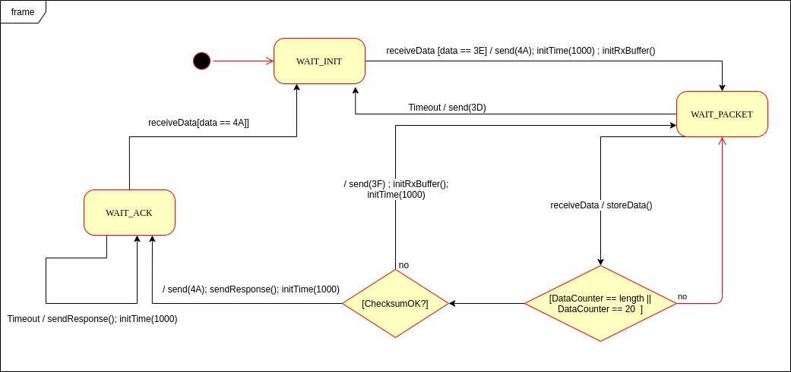

Unidad 3. Protocolos binarios 
=========================================================

Introducción 
--------------

En esta unidad seguiremos profundizando en la construcción
de aplicaciones interactivas utilizando hilos y la integración
con sistemas embebidos mediante el uso de protocolos binarios.

Propósitos de aprendizaje
^^^^^^^^^^^^^^^^^^^^^^^^^^^

Construir aplicaciones interactivas utilizando múltiples hilos
para la producción y el prototipado de experiencias interactivas.

Integrar controladores con aplicaciones interactivas mediante
el uso de protocolos seriales binarios.

Temas 
^^^^^^

* Protocolos binarios
* Diferencia entre los protocolos binarios y los protocolos ASCII
* Técnicas de programación en el sistema embebidos para manejo
  de protocolos binarios.
* Construcción de aplicaciones tipo consola que usen
  protocolos binarios.

Trayecto de acciones
-----------------------

Ejercicio 1
^^^^^^^^^^^^^

¿Cómo se ve un protocolo binario?

Para responder esta pregunta vamos a utilizar como ejemplo
`este sensor <http://www.chafon.com/productdetails.aspx?pid=382>`__.
Cuyo manual del fabricante se encuentra `aquí <https://drive.google.com/open?id=1uDtgNkUCknkj3iTkykwhthjLoTGJCcea>`__

Explora la documentación, pero lee con mucho detalle hasta la página 5. 
NO abandones el documento hasta no entender, es clave para realizar el proyecto.

Ejercicio 2
^^^^^^^^^^^^^

Recuerda el `API de arduino <https://www.arduino.cc/reference/en/language/functions/communication/serial/>`__
para el manejo del serial. En particular los siguientes métodos:

.. code-block:: cpp
   :lineno-start: 1

   Serial.available()
   Serial.read()
   Serial.readBytes(buffer, length)
   Serial.write()

Nota que la siguiente función no está en el repaso:

.. code-block:: cpp
   :lineno-start: 1
    
   Serial.readBytesUntil() 

La razón es que en un protocolo binario usualmente no tenemos
un carácter de fin de trama, como si ocurre con los protocolos
ASCII, donde usualmente el último carácter es un enter.

Analiza de nuevo el API, en particular los métodos resaltados.
NO SIGAS sin asegurarte que entiendes. Repasa los proyectos
previos.

Ejercicio 3
^^^^^^^^^^^^^^

Mira `este <https://drive.google.com/file/d/1iVr2Fiv8wXLqNyShr_EOplSvOJBIPqJP/view>`__
documento del fabricante del sensor. Podrás ver unos ejemplos de tramas. Utiliza
ScriptCommunicator para reproducir al menos un par de tramas. ¿Cuál es la idea? que
seas capaz de calcular el checksum tanto para transmitir como para recibir.

En el manual del sensor, el fabricante nos entrega el algoritmo para calcular el
checksum. Entiendes cómo utilizar este método? Si tienes dudas con algunos experimenta.

.. code-block:: cpp
   :lineno-start: 1

    unsigned int uiCrc16Cal(unsigned char const *pucY, unsigned char ucX)
    {
      const uint16_t PRESET_VALUE = 0xFFFF;
      const uint16_t POLYNOMIAL = 0x8408;
    
    
      unsigned char ucI, ucJ;
      unsigned short int uiCrcValue = PRESET_VALUE;
    
      for (ucI = 0; ucI < ucX; ucI++)
      {
        uiCrcValue = uiCrcValue ^ *(pucY + ucI);
        for (ucJ = 0; ucJ < 8; ucJ++)
        {
          if (uiCrcValue & 0x0001)
          {
            uiCrcValue = (uiCrcValue >> 1) ^ POLYNOMIAL;
          }
          else
          {
            uiCrcValue = (uiCrcValue >> 1);
          }
        }
      }
      return uiCrcValue;
    }

Ejercicio 4
^^^^^^^^^^^^^

Vamos a repasar el protocolo binario del proyecto de la unidad 3.

Un posible modelo de la solución es este:

Y una posible implementación del modelo es este otro modelo en C++:

.. code-block:: cpp 
   :lineno-start: 1

    void setup() {
      Serial.begin(115200);
    }
    
    void taskCom() {
      enum class state_t {WAIT_INIT, WAIT_PACKET, WAIT_ACK};
      static state_t state = state_t::WAIT_INIT;
      static uint8_t bufferRx[20] = {0};
      static uint8_t dataCounter = 0;
      static uint32_t timerOld;
      static uint8_t bufferTx[20];
    
      switch (state) {
        case  state_t::WAIT_INIT:
          if (Serial.available()) {
            if (Serial.read() == 0x3E) {
              Serial.write(0x4A);
              dataCounter = 0;
              timerOld = millis();
              state = state_t::WAIT_PACKET;
            }
          }
    
          break;
    
        case state_t::WAIT_PACKET:
    
          if ( (millis() - timerOld) > 1000 ) {
            Serial.write(0x3D);
            state = state_t::WAIT_INIT;
          }
          else if (Serial.available()) {
            uint8_t dataRx = Serial.read();
            if (dataCounter >= 20) {
              Serial.write(0x3F);
              dataCounter = 0;
              timerOld = millis();
              state = state_t::WAIT_PACKET;
            }
            else {
              bufferRx[dataCounter] = dataRx;
              dataCounter++;
    
              // is the packet completed?
              if (bufferRx[0] == dataCounter - 1) {
    
                // Check received data
                uint8_t calcChecksum = 0;
                for (uint8_t i = 1; i <= dataCounter - 1; i++) {
                  calcChecksum = calcChecksum ^ bufferRx[i - 1];
                }
                if (calcChecksum == bufferRx[dataCounter - 1]) {
                  bufferTx[0] = dataCounter - 3; //Length
                  calcChecksum = bufferTx[0];
    
                  // Calculate Tx checksum
                  for (uint8_t i = 4; i <= dataCounter - 1; i++) {
                    bufferTx[i - 3] = bufferRx[i - 1];
                    calcChecksum = calcChecksum ^ bufferRx[i - 1];
                  }
    
                  bufferTx[dataCounter - 3] = calcChecksum;
                  Serial.write(0x4A);
                  Serial.write(bufferTx, dataCounter - 2);
                  timerOld = millis();
                  state = state_t::WAIT_ACK;
                }
                else {
                  Serial.write(0x3F);
                  dataCounter = 0;
                  timerOld = millis();
                  state = state_t::WAIT_PACKET;
                }
              }
            }
          }
    
          break;
    
        case state_t::WAIT_ACK:
          if ( (millis() - timerOld) > 1000 ) {
            timerOld = millis();
            Serial.write(bufferTx, dataCounter - 2);
          } else if (Serial.available()) {
            if (Serial.read() == 0x4A) {
              state = state_t::WAIT_INIT;
            }
          }
    
          break;
      }
    }
    
    
    void loop() {
      taskCom();
    }

Un ejemplo de una escenario de prueba:

.. image:: ../_static/vector1.jpg
   :scale: 100%
   :align: center

Ejercicio 5
^^^^^^^^^^^^^^

Analicemos el siguiente asunto:

Cuando trabajamos con protocolos binarios es necesario
transmitir variables que tienen una longitud mayor a un byte.
Por ejemplo, los números en punto flotante cumplen con el
`estándar IEEE754 <https://www.h-schmidt.net/FloatConverter/IEEE754.html>`__
y se representan con 4 bytes.

Algo que debemos decidir al trabajar con número como los anteriormente
descritos es el orden en cual serán transmitidos sus bytes. En principio
tenemos dos posibilidades: transmitir primero el byte de menor peso (little endian)
o transmitir primero el byte de mayor peso (big endian). Al diseñar un protocolo
binario deberemos escoger una de las dos posibilidades.

Ejercicio 6
^^^^^^^^^^^^^^

¿Cómo transmitir un número de 16 bits?

.. code-block:: cpp
   :lineno-start: 1

    void setup() {
      Serial.begin(115200);
    
    }
    
    void loop() {
      //vamos a transmitir el 16205
      
      static uint16_t x = 0x3F4D;  
    
      if (Serial.available()) {
        if (Serial.read() == 's') {
          Serial.write((uint8_t)( x & 0x00FF));
          Serial.write( (uint8_t)( x >> 8 ));
        }
      }
    }    

* ¿Qué endian estamos utilizando en este caso?

Ejercicio 7
^^^^^^^^^^^^^

¿Cómo transmitir un número en punto flotante?

Veamos dos maneras:

.. code-block:: cpp
   :lineno-start: 1

    void setup() {
        Serial.begin(115200);
    }
    
    void loop() {
        // 45 60 55 d5
        // https://www.h-schmidt.net/FloatConverter/IEEE754.html
        static float num = 3589.3645;
     
        if(Serial.available()){
            if(Serial.read() == 's'){
                Serial.write ( (uint8_t *) &num,4);
            }
        }
    }

Es posible que queramos copiar los bytes que componen el número
previamente en un arreglo:

.. code-block:: cpp
   :lineno-start: 1

    void setup() {
        Serial.begin(115200);
    }
    
    void loop() {
        // 45 60 55 d5
        // https://www.h-schmidt.net/FloatConverter/IEEE754.html
        static float num = 3589.3645;
        static uint8_t arr[4] = {0};
    
        if(Serial.available()){
            if(Serial.read() == 's'){
                memcpy(arr,(uint8_t *)&num,4);
                Serial.write(arr,4);
            }
        }
    }

* ¿En qué endian estamos transmitiendo el número?

* Y si queremos transmitir en el endian contrario?

.. code-block:: cpp
   :lineno-start: 1

    void setup() {
        Serial.begin(115200);
    }
    
    void loop() {
        // 45 60 55 d5
        // https://www.h-schmidt.net/FloatConverter/IEEE754.html
        static float num = 3589.3645;
        static uint8_t arr[4] = {0};
    
        if(Serial.available()){
            if(Serial.read() == 's'){
                memcpy(arr,(uint8_t *)&num,4);
                for(int8_t i = 3; i >= 0; i--){
                  Serial.write(arr[i]);  
                }
            }
        }
    }

Ejercicio 8
^^^^^^^^^^^^^^^

Y ahora cómo lidiamos con el protocolo binario del sensor 
de RFID desde la aplicación interactiva?

Ya habíamos dado algunas pistas, es decir,
ya sabemos hacer varias cosas:

* Inicializar el puerto
* Enviar bytes
* Saber si hay datos en el puerto serial
* Leer los bytes

Por ejemplo, el siguiente código utiliza las cosas que ya
sabemos usar y permite leer los bytes que se están enviando
desde el arduino (toma el ejercicio anterior).

.. code-block:: csharp
   :lineno-start: 1

    using System;
    using System.IO.Ports;

    namespace serialRFID
    {
        class Program{
                static void Main(string[] args)
                {
                    SerialPort _serialPort = new SerialPort();
                    // Allow the user to set the appropriate properties.
                    _serialPort.PortName = "/dev/ttyUSB0";
                    _serialPort.BaudRate = 115200;
                    _serialPort.DtrEnable = true;
                    _serialPort.Open();
                    byte[] data = {0x73};
                    _serialPort.Write(data,0,1);
                    byte[] buffer = new byte[4];

                    while(true){
                        if(_serialPort.BytesToRead >= 4){
                            _serialPort.Read(buffer,0,4);
                            for(int i = 0;i < 4;i++){
                                Console.Write(buffer[i].ToString("X2") + " ");
                            }
                            Console.ReadKey();
                            _serialPort.Write(data,0,1);
                        }
                    }
                }
            }
    }

Ejercicio 9
^^^^^^^^^^^^^^^

Y si queremos que la aplicación interactiva lea los 4 bytes y lo
convierta al número en punto flotante?

Pero antes de comenzar, ¿En qué endian se envía el número en punto flotante
del ejercicio 3?

.. code-block:: csharp
   :lineno-start: 1

    using System;
    using System.IO.Ports;

    namespace serialRFID
    {
        class Program{
                static void Main(string[] args)
                {
                    SerialPort _serialPort = new SerialPort();
                    // Allow the user to set the appropriate properties.
                    _serialPort.PortName = "/dev/ttyUSB0";
                    _serialPort.BaudRate = 115200;
                    _serialPort.DtrEnable = true;
                    _serialPort.Open();
                    byte[] data = {0x73};
                    _serialPort.Write(data,0,1);
                    byte[] buffer = new byte[4];

                    while(true){
                        if(_serialPort.BytesToRead >= 4){
                            _serialPort.Read(buffer,0,4);
                            
                            for(int i = 0;i < 4;i++){
                                Console.Write(buffer[i].ToString("X2") + " ");
                            }
                            Console.WriteLine();

                            Console.WriteLine(System.BitConverter.ToSingle(buffer,0));
                            byte [] bufferReverse = new byte[4];
                            for(int i = 3; i>= 0; i--) bufferReverse[3-i] = buffer[i];
                            Console.WriteLine(System.BitConverter.ToSingle(bufferReverse,0));    

                            Console.ReadKey();
                            _serialPort.Write(data,0,1);
                        }
                    }
                }
            }
    }

PROYECTO
^^^^^^^^^^

El proyecto consiste en ser capaz de reproducir el archivo de prueba
que provee el fabricante de un sensor de RFID. El archivo se encuentra
`aquí <https://drive.google.com/file/d/1iVr2Fiv8wXLqNyShr_EOplSvOJBIPqJP/view>`__.

Para ello vamos a programar un arduino para simular el sensor (vale un millón
de pesos el sensor) y vamos a programar una aplicación interactiva en C# desde
la cual enviaremos comandos al sensor tal como aparecen en el archivo de
prueba.

No olviden calcular y verificar el checksum en Arduino y en C#.

La aplicación debe tener:

* Dos hilos.
* Un hilo debe imprimir cada 100 ms el valor de un contador (aquí simulamos
  el funcionamiento de un motor o aplicación interactiva que debe mantener
  un framerate constante.
* Otro hilo responsable de realizar las operaciones de entrada salida: eventos
  del teclado y comunicaciones seriales con el sensor. 
* Asigne una tecla a cada comando que será enviado al arduino.
