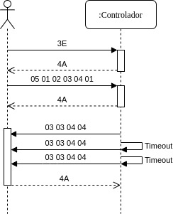

Unidad 4. Plataformas de software interactivas de tiempo real
===================================================================

Introducción 
-------------

Hemos llegado al final del curso. En esta unidad
aplicarás todos los conceptos que has aprendido para la construcción
de aplicaciones interactivas que integren sistemas embebidos con
plataformas de cómputo interactivas. En particular vamos a utilizar
Unity.

Propósitos de aprendizaje
^^^^^^^^^^^^^^^^^^^^^^^^^^

Integrar sensores y actuadores a plataformas de software
para la construcción de aplicaciones interactivas de tiempo real.

Temas
^^^^^^^

* Integración de sistemas embebidos a plataformas de cómputo
  interactivas: hilos, colas, sincronización, protocolos.
* Repaso de conceptos de programación orientado a objetos: herencia,
  clases abstractas, manejo de memoria.

Trayecto de acciones
-----------------------

Ejercicio 1
^^^^^^^^^^^^

Analiza con todo detenimiento una posible propuesta de solución al proyecto 
de la unidad anterior:

.. code-block:: csharp
   :lineno-start: 1

    using System;
    using System.IO.Ports;

    namespace sem11Reto1
    {
        class Program
        {
            private static SerialPort _serialPort = new SerialPort();
            private static readonly byte[] q_commnad = new byte[] { 0x04, 0xFF, 0x21, 0x19, 0x95 };
            private static readonly byte[] w_commnad = new byte[] { 0x05, 0x00, 0x24, 0x00, 0x25, 0x29 };
            private static readonly byte[] e_commnad = new byte[] { 0x05, 0x00, 0x2F, 0x1E, 0x72, 0x34 };
            private static readonly byte[] r_commnad =  new byte[] { 0x06, 0x00, 0x22, 0x31, 0x80, 0xE1, 0x96 };
            private static readonly byte[] t_commnad =  new byte[] { 0x05, 0x00, 0x28, 0x05, 0x28, 0xD7 };
            private static readonly byte[] y_commnad = new byte[] { 0x05, 0x00, 0x25, 0x00, 0xFD, 0x30 };
            private static byte[] buffer = new byte[32];

            static void Main(string[] args)
            {
                // Allow the user to set the appropriate properties.
                _serialPort.PortName = "COM4";
                _serialPort.BaudRate = 57600;
                _serialPort.DtrEnable = true;
                _serialPort.Open();

                while (true)
                {
                    Console.WriteLine();
                    Console.WriteLine("Commands available: Q: 0x21, W: 0x24, E: 0x2F, R: 0x22, T: 0x28, Y: 0x25");
                    switch (Console.ReadKey(true).Key)
                    {
                        case ConsoleKey.Q:
                            sendCommand(q_commnad);
                            readData();
                            break;
                        case ConsoleKey.W:
                            sendCommand(w_commnad);
                            readData();
                            break;

                        case ConsoleKey.E:
                            sendCommand(e_commnad);
                            readData();
                            break;
                        case ConsoleKey.R:
                            sendCommand(r_commnad);
                            readData();
                            break;

                        case ConsoleKey.T:
                            sendCommand(t_commnad);
                            readData();
                            break;

                        case ConsoleKey.Y:
                            sendCommand(y_commnad);
                            readData();
                            break;

                        default:
                            break;
                    }

                
                }
            }

            private static void sendCommand(byte[] data)
            {
                Console.Write("Send this packet: ");
                for(int i = 0; i < data.Length; i++)
                {
                    Console.Write("{0:X2}",data[i]);
                    Console.Write(' ');
                }
                Console.WriteLine();
                _serialPort.Write(data, 0, data.Length);
            }

            private static void readData()
            {
                // 1. Este llamado bloque completamente el hilo
                // esperando a que lleguen datos por el puerto serial
                while (_serialPort.BytesToRead == 0) ;

                // 2. Leo el primer byte que me dice la longitud
                _serialPort.Read(buffer, 0, 1);
                // 3. Espero el resto de datos
                while (_serialPort.BytesToRead < buffer[0]) ;

                // 4. Leo los datos
                _serialPort.Read(buffer, 1, buffer[0]);

                // 5. Verifica el checksum
                bool checksumOK = verifyChecksum(buffer);
                Console.Write("Packet received: ");
                for(int i = 0; i < (buffer[0] + 1); i++)
                {
                    Console.Write("{0:X2}", buffer[i]);
                    Console.Write(' ');

                }
                if(checksumOK == false)
                {
                    Console.WriteLine(" Checksum Fails");
                }
                else
                {
                    Console.WriteLine();
                }

            }

            private static bool verifyChecksum(byte[] packet)
            {
                bool checksumOK = false;
                byte ucI, ucJ;

                int uiCrcValue = 0x0000FFFF;
                int len = packet[0] + 1;

                for (ucI = 0; ucI < (len - 2); ucI++)
                {
                    uiCrcValue = uiCrcValue ^ packet[ucI];
                    for (ucJ = 0; ucJ < 8; ucJ++)
                    {
                        if ((uiCrcValue & 0x00000001) == 0x00000001)
                        {
                            uiCrcValue = (uiCrcValue >> 1) ^ 0x00008408;
                        }
                        else
                        {
                            uiCrcValue = (uiCrcValue >> 1);
                        }
                    }
                }

                int LSBCkecksum = uiCrcValue & 0x000000FF;
                int MSBCkecksum = (uiCrcValue & 0x0000FF00) >> 8;

                if ((packet[len - 2] == LSBCkecksum) && (packet[len - 1] == MSBCkecksum)) checksumOK = true;
                return checksumOK;
            }

        }
    }

Ten presente que este código no hace ninguna verificación de errores de entrada/salida,
por ejemplo:

* ¿Qué pasa si el sensor se desconecta?
* ¿Qué pasa si el sensor se desconecta en medio de una transmisión 
   y no llegan los datos?

Ahora adicionamos el hilo que muestra el contador cada 100 ms

.. code-block:: csharp
   :lineno-start: 1

    using System;
    using System.IO.Ports;
    using System.Threading;

    namespace sem11Reto1
    {
        class Program
        {
            private static SerialPort _serialPort = new SerialPort();
            private static readonly byte[] q_commnad = new byte[] { 0x04, 0xFF, 0x21, 0x19, 0x95 };
            private static readonly byte[] w_commnad = new byte[] { 0x05, 0x00, 0x24, 0x00, 0x25, 0x29 };
            private static readonly byte[] e_commnad = new byte[] { 0x05, 0x00, 0x2F, 0x1E, 0x72, 0x34 };
            private static readonly byte[] r_commnad =  new byte[] { 0x06, 0x00, 0x22, 0x31, 0x80, 0xE1, 0x96 };
            private static readonly byte[] t_commnad =  new byte[] { 0x05, 0x00, 0x28, 0x05, 0x28, 0xD7 };
            private static readonly byte[] y_commnad = new byte[] { 0x05, 0x00, 0x25, 0x00, 0xFD, 0x30 };
            private static byte[] buffer = new byte[32];
            private static bool running = true;

            private static void counterCode()
            {
                int counter = 0;
                while (running)
                {
                    Thread.Sleep(1000);
                    Console.WriteLine(counter);
                    counter = (counter + 1) % 100;
                }
            }
            static void Main(string[] args)
            {

                Thread counterThread = new Thread(counterCode);
                counterThread.Start();

                // Allow the user to set the appropriate properties.
                _serialPort.PortName = "COM4";
                _serialPort.BaudRate = 57600;
                _serialPort.DtrEnable = true;
                _serialPort.Open();

                while (running)
                {
                    Console.WriteLine();
                    Console.WriteLine("Commands available: Q: 0x21, W: 0x24, E: 0x2F, R: 0x22, T: 0x28, Y: 0x25 X:exit");
                    switch (Console.ReadKey(true).Key)
                    {
                        case ConsoleKey.Q:
                            sendCommand(q_commnad);
                            readData();
                            break;
                        case ConsoleKey.W:
                            sendCommand(w_commnad);
                            readData();
                            break;

                        case ConsoleKey.E:
                            sendCommand(e_commnad);
                            readData();
                            break;
                        case ConsoleKey.R:
                            sendCommand(r_commnad);
                            readData();
                            break;

                        case ConsoleKey.T:
                            sendCommand(t_commnad);
                            readData();
                            break;

                        case ConsoleKey.Y:
                            sendCommand(y_commnad);
                            readData();
                            break;

                        case ConsoleKey.X:
                            running = false;
                            break;
                        default:
                            break;
                    }
                }
                counterThread.Join();
            }

            private static void sendCommand(byte[] data)
            {
                Console.Write("Send this packet: ");
                for(int i = 0; i < data.Length; i++)
                {
                    Console.Write("{0:X2}",data[i]);
                    Console.Write(' ');
                }
                Console.WriteLine();
                _serialPort.Write(data, 0, data.Length);
            }

            private static void readData()
            {
                // 1. Este llamado bloque completamente el hilo
                // esperando a que lleguen datos por el puerto serial
                while (_serialPort.BytesToRead == 0) ;

                // 2. Leo el primer byte que me dice la longitud
                _serialPort.Read(buffer, 0, 1);
                // 3. Espero el resto de datos
                while (_serialPort.BytesToRead < buffer[0]) ;

                // 4. Leo los datos
                _serialPort.Read(buffer, 1, buffer[0]);

                // 5. Verifica el checksum
                bool checksumOK = verifyChecksum(buffer);
                Console.Write("Packet received: ");
                for(int i = 0; i < (buffer[0] + 1); i++)
                {
                    Console.Write("{0:X2}", buffer[i]);
                    Console.Write(' ');

                }
                if(checksumOK == false)
                {
                    Console.WriteLine(" Checksum Fails");
                }
                else
                {
                    Console.WriteLine();
                }

            }

            private static bool verifyChecksum(byte[] packet)
            {
                bool checksumOK = false;
                byte ucI, ucJ;

                int uiCrcValue = 0x0000FFFF;
                int len = packet[0] + 1;

                for (ucI = 0; ucI < (len - 2); ucI++)
                {
                    uiCrcValue = uiCrcValue ^ packet[ucI];
                    for (ucJ = 0; ucJ < 8; ucJ++)
                    {
                        if ((uiCrcValue & 0x00000001) == 0x00000001)
                        {
                            uiCrcValue = (uiCrcValue >> 1) ^ 0x00008408;
                        }
                        else
                        {
                            uiCrcValue = (uiCrcValue >> 1);
                        }
                    }
                }

                int LSBCkecksum = uiCrcValue & 0x000000FF;
                int MSBCkecksum = (uiCrcValue & 0x0000FF00) >> 8;

                if ((packet[len - 2] == LSBCkecksum) && (packet[len - 1] == MSBCkecksum)) checksumOK = true;
                return checksumOK;
            }

        }
    }

Ejercicio 2
^^^^^^^^^^^^

Para realizar la integración, vamos a utilizar un plugin para Unity llamada
Ardity. Sin embargo, vamos a analizar este plugin completamente hasta entender
cada una de sus partes.

La guía de trabajo se encuentra 
`aquí <https://docs.google.com/presentat^^^^^^^^^^^^ion/d/1uHoIzJGHLZxLbkMdF1o_Ov14xSD3wP31-MQtsbOSa2E/edit?usp=sharing>`__

Ejercicio 3
^^^^^^^^^^^^

Al final de la guía te dejo un MINI-RETO. Este consiste en estudiar a fondo
el código fuente del plugin. Es un reto grande porque posiblemente tengas que 
recordar algunas de tus cursos anteriores de programación en el programa.
Es por ello que el mini-reto requiere que repases y estudies algunas cosas nuevas.

Una vez hagas el paso anterior:

* Crea un proyecto nuevo en Unity.
* Configura el soporte para el puerto serial tal como lo viste en la guía.
* OJO, no instales el paquete Ardity. SI YA LO HICISTE, vuelva a comenzar.
* Ahora toma únicamente LOS SCRIPTS de Ardity necesarios (SOLO LOS NECESARIOS)
  para hacer que la aplicación de la guía funcione de nuevo.

Ejercicio 4
^^^^^^^^^^^^

Vamos a analizar más detalladamente una de las escenas demo de Ardity:
DemoScene_UserPoll_ReadWrite

Primero, vamos a analizar rápidamente el código de arduino:

.. code-block:: cpp
   :lineno-start: 1

    uint32_t last_time = 0;
    
    void setup()
    {
        Serial.begin(9600);
    }
    
    void loop()
    {
        // Print a heartbeat
        if ( (millis() - last_time) >  2000)
        {
            Serial.println("Arduino is alive!!");
            last_time = millis();
        }
    
        // Send some message when I receive an 'A' or a 'Z'.
        switch (Serial.read())
        {
            case 'A':
                Serial.println("That's the first letter of the abecedarium.");
                break;
            case 'Z':
                Serial.println("That's the last letter of the abecedarium.");
                break;
        }
    }

Consideraciones a tener presentes con este código:

* La velocidad de comunicación es de 9600. Esa misma velocidad se tendrá que configurar
  del lado de Unity para que ambas partes se puedan entender.
* Nota que no estamos usando la función delay(). Estamos usando millis para medir tiempos
  relativos. Nota que cada dos segundos estamos enviando un mensaje indicando que el
  arduino está activo:  ``Arduino is alive!!``
* Observa que el buffer del serial se lee constantemente. NO estamos usando
  el método available() que usualmente utilizamos. ¿Recuerdas lo anterior? Con available()
  nos aseguramos que el buffer de recepción tiene al menos un byte para leer; 
  sin embargo, cuando usamos Serial.read() sin verificar antes que tengamos datos en el
  buffer, es muy posible que el método devuelva un -1 indicando que no había nada en el
  buffer de recepción. NO OLVIDES ESTO POR FAVOR.
* Por último nota que todos los mensajes enviados por arduino usan el método println.
  ¿Y esto por qué es importante? porque println enviará la información que le pasemos
  como argumento, codificada en ASCII, y adicionará al final 2 bytes: 0x0D y 0x0A. Estos
  bytes serán utilizados por Ardity para detectar que la cadena enviada por Arduino está completa.
  NO OLVIDES VERIFICAR LO ANTERIOR, si no logras identificarlo habla con el profe.

Ahora analicemos la parte de Unity/Ardity. Para ello, carguemos una de las escenas ejemplo:
DemoScene_UserPoll_ReadWrite

.. image:: ../_static/scenes.jpg
   :scale: 100%
   :align: center

Nota que la escena tiene 3 gameObjects: Main Camera, SerialController y SampleUserPolling_ReadWrite.

Veamos el gameObject SampleUserPolling_ReadWrite. Este gameObject tiene dos components, un transform
y un script. El script tiene el código como tal de la aplicación del usuario.

.. image:: ../_static/user_code.jpg
   :scale: 100%
   :align: center

Nota que el script expone una variable pública: serialController. Esta variable es del tipo SerialController.

.. image:: ../_static/serialControllerVarCode.jpg
   :scale: 100%
   :align: center

Esa variable nos permite almacenar la referencia a un objeto tipo SerialController. ¿Donde estaría ese
objeto? Pues cuando el gameObject SerialController es creado nota que uno de sus componentes es un objeto
de tipo SerialController:

.. image:: ../_static/serialControllerGO_Components.jpg
   :scale: 100%
   :align: center

Entonces desde el editor de Unity podemos arrastrar el gameObject SerialController al campo SerialController
del gameObject SampleUserPolling_ReadWrite y cuando se despliegue la escena, automáticamente se inicializará
la variable serialController con la referencia en memoria al objeto SerialController:

.. image:: ../_static/serialControllerUnityEditor.jpg
   :scale: 100%
   :align: center

De esta manera logramos que el objeto SampleUserPolling_ReadWrite tenga acceso a la información
del objeto SerialController.

Observemos ahora qué datos y qué comportamientos tendría un objeto de tipo SampleUserPolling_ReadWrite:

.. code-block:: csharp
   :lineno-start: 1

    /**
     * Ardity (Serial Communication for Arduino + Unity)
     * Author: Daniel Wilches <dwilches@gmail.com>
     *
     * This work is released under the Creative Commons Attributions license.
     * https://creativecommons.org/licenses/by/2.0/
     */

    using UnityEngine;
    using System.Collections;

    /**
     * Sample for reading using polling by yourself, and writing too.
     */
    public class SampleUserPolling_ReadWrite : MonoBehaviour
    {
        public SerialController serialController;

        // Initialization
        void Start()
        {
            serialController = GameObject.Find("SerialController").GetComponent<SerialController>();

            Debug.Log("Press A or Z to execute some actions");
        }

        // Executed each frame
        void Update()
        {
            //---------------------------------------------------------------------
            // Send data
            //---------------------------------------------------------------------

            // If you press one of these keys send it to the serial device. A
            // sample serial device that accepts this input is given in the README.
            if (Input.GetKeyDown(KeyCode.A))
            {
                Debug.Log("Sending A");
                serialController.SendSerialMessage("A");
            }

            if (Input.GetKeyDown(KeyCode.Z))
            {
                Debug.Log("Sending Z");
                serialController.SendSerialMessage("Z");
            }

            //---------------------------------------------------------------------
            // Receive data
            //---------------------------------------------------------------------

            string message = serialController.ReadSerialMessage();

            if (message == null)
                return;

            // Check if the message is plain data or a connect/disconnect event.
            if (ReferenceEquals(message, SerialController.SERIAL_DEVICE_CONNECTED))
                Debug.Log("Connection established");
            else if (ReferenceEquals(message, SerialController.SERIAL_DEVICE_DISCONNECTED))
                Debug.Log("Connection attempt failed or disconnection detected");
            else
                Debug.Log("Message arrived: " + message);
        }
    }

Vamos a realizar una prueba. Pero antes configuremos el puerto serial en el cual está conectado
el arduino. El arduino ya debe estar corriendo el código de muestra del sitio web del plugin.

.. image:: ../_static/serialControllerCOM.jpg
   :scale: 100%
   :align: center

En este caso el puerto es COM4.

Corre el programa, abre la consola y selecciona la ventana Game del Editor de Unity. Con la ventana
seleccionada (click izquierdo del mouse), escribe las letras A y Z. Notarás los mensajes que aparecen
en la consola:

.. image:: ../_static/unityConsole.jpg
   :scale: 100%
   :align: center

Una vez la aplicación funcione nota algo en el código de SampleUserPolling_ReadWrite:

.. code-block:: csharp
   :lineno-start: 1

    serialController = GameObject.Find("SerialController").GetComponent<SerialController>();

Comenta esta línea y corre la aplicación de nuevo. Funciona?

Ahora, elimina el comentario de la línea y luego borra la referencia al SerialController
en el editor de Unity:

.. image:: ../_static/removeSerialControllerUnityEditor.jpg
   :scale: 100%
   :align: center

Corre de nuevo la aplicación.

* ¿Qué puedes concluir?
* ¿Para qué incluyó esta línea el autor del plugin?

Ahora analicemos el código del método Update de SampleUserPolling_ReadWrite:

.. code-block:: csharp
   :lineno-start: 1

    // Executed each frame
    void Update()
    {
      .
      .
      .
      serialController.SendSerialMessage("A");
      .
      .
      .
      string message = serialController.ReadSerialMessage();
      .
      .
      .
    }

¿Recuerdas cada cuánto se llama el método Update? 

Update se llama en cada frame. Lo llama automáticamente el motor de Unity

Nota los dos métodos que se resaltan:

.. code-block:: csharp
   :lineno-start: 1

    serialController.SendSerialMessage("A");
    string message = serialController.ReadSerialMessage();

Ambos métodos se llaman sobre el objeto cuya dirección en memoria está guardada en
la variable serialController.

El primer método permite enviar la letra A y el segundo permite recibir una cadena
de caracteres.

* ¿Cada cuánto se envía la letra A o la Z?
* ¿Cada cuánto leemos si nos llegaron mensajes desde el arduino?

Ahora vamos a analizar cómo transita la letra A desde el SampleUserPolling_ReadWrite hasta
el arduino.

Para enviar la letra usamos el método SendSerialMessage de la clase SerialController. Observa
que la clase tiene dos variables protegidas importantes:

.. image:: ../_static/serialControllerUMLClass.jpg
   :scale: 35%
   :align: center

.. code-block:: csharp
   :lineno-start: 1

   protected Thread thread;
   protected SerialThreadLines serialThread;

Con esas variables vamos a administrar un nuevo hilo y vamos a almacenar una referencia 
a un objeto de tipo SerialThreadLines.

En el método onEnable de SerialController tenemos:

.. code-block:: csharp
   :lineno-start: 1

   serialThread = new SerialThreadLines(portName, baudRate, reconnectionDelay, maxUnreadMessages);
   thread = new Thread(new ThreadStart(serialThread.RunForever));
   thread.Start();

Aquí vemos algo muy interesante, el código del nuevo hilo que estamos creando será RunForever y
ese código actuará sobre los datos del objeto cuya referencia está almacenada en serialThread.

Vamos a concentrarnos ahora en serialThread que es un objeto de la clase SerialThreadLines:

.. code-block:: csharp
   :lineno-start: 1

    public class SerialThreadLines : AbstractSerialThread
    {
        public SerialThreadLines(string portName,
                                 int baudRate,
                                 int delayBeforeReconnecting,
                                 int maxUnreadMessages)
            : base(portName, baudRate, delayBeforeReconnecting, maxUnreadMessages, true)
        {
        }

        protected override void SendToWire(object message, SerialPort serialPort)
        {
            serialPort.WriteLine((string) message);
        }

        protected override object ReadFromWire(SerialPort serialPort)
        {
            return serialPort.ReadLine();
        }
    }

Al ver este código no se observa por ningún lado el método RunForever, que es el código
que ejecutará nuestro hilo. ¿Dónde está? Observe que SerialThreadLines también es un
AbstractSerialThread. Entonces es de esperar que el método RunForever esté en la clase
AbstractSerialThread.

Por otro lado nota que para enviar la letra A usamos el método SendSerialMessage también
sobre los datos del objeto reverenciado por serialThread del cual ya sabemos que es un
SerialThreadLines y un AbstractSerialThread

.. code-block:: csharp
   :lineno-start: 1

    public void SendSerialMessage(string message)
    {
        serialThread.SendMessage(message);
    }

Al igual que RunForever, el método SendMessage también está definido en AbstractSerialThread.

Veamos entonces ahora qué hacemos con la letra A:

.. code-block:: csharp
   :lineno-start: 1

    public void SendMessage(object message)
    {
        outputQueue.Enqueue(message);
    }

Este código nos da la clave. Lo que estamos haciendo es guardar la letra A 
que queremos transmitir en una COLA. Esta estructura de datos permite 
PASAR información de un HILO a otro HILO.

¿Cuáles hilos?

Pues tenemos en este momento dos hilos: el hilo del motor y el nuevo hilo que creamos antes.
El hilo que ejecutará el código RunForever sobre los datos del objeto de tipo
SerialThreadLines:AbstractSerialThread. Por tanto, observa que la letra A la estamos
guardando en la COLA del SerialThreadLines:AbstractSerialThread

Si observas con detenimiento el código de RunForever:

.. code-block:: csharp
   :lineno-start: 1

    public void RunForever()
    {
        try
        {
            while (!IsStopRequested())
            {
                ...
                try
                {
                    AttemptConnection();
                    while (!IsStopRequested())
                        RunOnce();
                }
                catch (Exception ioe)
                {
                ...
                }
            }
        }
        catch (Exception e)
        {
        ...
        }
    }

Los detalles están en RunOnce():

.. code-block:: csharp
   :lineno-start: 1

    private void RunOnce()
    {
        try
        {
            // Send a message.
            if (outputQueue.Count != 0)
            {
                SendToWire(outputQueue.Dequeue(), serialPort);
            }
            object inputMessage = ReadFromWire(serialPort);
            if (inputMessage != null)
            {
                if (inputQueue.Count < maxUnreadMessages)
                {
                    inputQueue.Enqueue(inputMessage);
                }
            }
        }
        catch (TimeoutException)
        {
        }
    }

Y en este punto vemos finalmente qué es lo que pasa: para enviar la letra
A, el código del hilo pregunta si hay mensajes en la cola. Si los hay,
nota que el mensaje se saca de la cola y se envía:

.. code-block:: csharp
   :lineno-start: 1

   SendToWire(outputQueue.Dequeue(), serialPort);

Si buscamos el método SendToWire en AbstractSerialThread vemos:

.. code-block:: csharp
   :lineno-start: 1
   
   protected abstract void SendToWire(object message, SerialPort serialPort);

Y aquí es donde se conectan las clases SerialThreadLines con AbstractSerialThread, ya
que el método SendToWire es abstracto, SerialThreadLines tendrá que implementarlo

.. code-block:: csharp
   :lineno-start: 1

    public class SerialThreadLines : AbstractSerialThread
    {
        ...
        protected override void SendToWire(object message, SerialPort serialPort)
        {
            serialPort.WriteLine((string) message);
        }
        ...
    }

Aquí vemos finalmente el uso de la clase SerialPort de C# con el método
`WriteLine <https://docs.microsoft.com/en-us/dotnet/api/system.io.ports.serialport.writeline?view=netframework-4.8>`__ 

Finalmente, para recibir datos desde el serial, ocurre el proceso contrario:

.. code-block:: csharp
   :lineno-start: 1

    public class SerialThreadLines : AbstractSerialThread
    {
        ...
        protected override object ReadFromWire(SerialPort serialPort)
        {
            return serialPort.ReadLine();
        }
    }

`ReadLine <https://docs.microsoft.com/en-us/dotnet/api/system.io.ports.serialport.readline?view=netframework-4.8>`__
también es la clase SerialPort. Si leemos cómo funciona ReadLine queda completamente claro la razón de usar otro
hilo:

.. warning::

  Remarks
  Note that while this method does not return the NewLine value, the NewLine value is removed from the input buffer.

  By default, the ReadLine method will block until a line is received. If this behavior is undesirable, set the
  ReadTimeout property to any non-zero value to force the ReadLine method to throw a TimeoutException if
  a line is not available on the port.

Por tanto, volviendo a RunOnce:

.. code-block:: csharp
   :lineno-start: 1

    private void RunOnce()
    {
        try
        {
            if (outputQueue.Count != 0)
            {
                SendToWire(outputQueue.Dequeue(), serialPort);
            }

           object inputMessage = ReadFromWire(serialPort);
            if (inputMessage != null)
            {
                if (inputQueue.Count < maxUnreadMessages)
                {
                    inputQueue.Enqueue(inputMessage);
                }
                else
                {
                    Debug.LogWarning("Queue is full. Dropping message: " + inputMessage);
                }
            }
        }
        catch (TimeoutException)
        {
            // This is normal, not everytime we have a report from the serial device
        }
    }

Vemos que se envía el mensaje: 

.. code-block:: csharp
   :lineno-start: 1

    SendToWire(outputQueue.Dequeue(), serialPort);

Y luego el hilo se bloquea esperando por una respuesta:

.. code-block:: csharp
   :lineno-start: 1

    object inputMessage = ReadFromWire(serialPort);

Nota que primero se envía y luego el hilo se bloquea. NO SE DESBLOQUEARÁ HASTA que no envíe
una respuesta desde Arduino o pasen 100 ms que es el tiempo que dura bloqueada la función
antes de generar una excepción de timeout de lectura.

¿Cómo sabemos que son 100 ms? 

Mira con detenimiento el código. La siguiente línea te dará una pista.

.. code-block:: csharp
   :lineno-start: 1

   // Amount of milliseconds alloted to a single read or connect. An
    // exception is thrown when such operations take more than this time
    // to complete.
    private const int readTimeout = 100;

Ejercicio 5
^^^^^^^^^^^^

* Crea un proyecto nuevo en Unity.
* Configura el soporte para el puerto serial tal como lo viste en la guía.
* OJO, no instales el paquete Ardity. SI YA LO HICISTE, vuelva a comenzar.
* Ahora toma únicamente LOS SCRIPTS de Ardity PERO sin destruir la arquitectura 
  planteada por el autor. 
* Ahora implementa el protocolo binario de la unidad anterior (el sensor RFID).

Ejercicio 6
^^^^^^^^^^^^

De nuevo vamos a visitar el demo: DemoScene_UserPoll_ReadWrite.

Resuelve las siguientes cuestiones:

* ¿Qué excepciones se están considerando en el código?

* ¿Qué pasa si no reciben datos por el puerto serial durante 100ms?

* ¿Qué pasa si el cable serial se desconecta de manera inesperada?

* ¿Cómo se reestablece el funcionamiento de la aplicación?

* ¿Qué modificación tendríamos que hacer a la aplicación de arduino para
  reestablecer la comunicación?

Ejercicio 7
^^^^^^^^^^^^

Describe detalladamente qué pasos debes realizar para soportar un nuevo
protocolo de comunicaciones en Ardity.     

Ejercicio 8
^^^^^^^^^^^^

#. Realiza una aplicación en Arduino que MEDIANTE un protocolo BINARIO
   envíe el valor de dos variables en punto flotante y una entera con signo 32
   bits. TODAS LAS VARIABLES deben ir en el mismo paquete de DATOS.
#. El paquete de datos solo será enviado por SOLICITUD explícita. La SOLICITUD
   se realizará enviando el byte ``7E``.
#. Realiza una aplicación en Unity que solicite la variables a Arduino
   cada 100 ms.
#. Construye una interfaz de usuario en Unity para visualizar las variables. 
   RECUERDA: una interfaz de usuario, no la consola de Unity.

PROYECTO
^^^^^^^^^^^^

Construye una aplicación interactiva (AI), utilizando Unity-Ardity,
que tendrá que comunicarse con un controlador que posee varios sensores y actuadores. 

Consideraciones:

* El protocolo de integración es BINARIO.
* Deberás extender la funcionalidad de Ardity heredando de la clase
  AbstractSerialThread.
* La AI iniciará la comunicación cuando el usuario pulse la tecla ``s``.
* Puedes usar el paquete del escenario de prueba que encuentras más abajo.
* Muestra en la Consola de Unity los paquetes que estás transmitiendo
  y qué paquetes estás recibiendo.
* La secuencia de bytes más grande será de 20 bytes.

PASOS para realizar la comunicación:

1. La AI inicia una transacción enviando el byte 3E.
2. El controlador deberá responder con el byte 4A.
3. La AI no podrá continuar hasta no recibir la respuesta del controlador.
   Una vez el controlador responda, la AI enviará al controlador
   un paquete de bytes así:

.. code-block:: cpp
   :lineno-start: 1

    Byte 1 : longitud
    Byte 2 : Dirección
    Byte 3 : Comando
    Byte 4 a n : Datos
    Byte n+1: verificacion

* El byte de longitud, es el primer byte de la trama e indica cuántos bytes la AI
  enviará a continuación, es decir, la cantidad de bytes a enviar
  comprendidos desde el byte 2 hasta el byte n + 1.
* La AI calculará el byte de verificación así: Byte1 XOR Byte2 XOR … XOR ByteN.

4. El controlador esperará hasta un 1 segundo a que la trama llegue. Si esta condición
   NO se cumple el controlador enviará a la AI el byte 3D. La AI deberá iniciar de
   nuevo la secuencia de comunicación desde el paso 1. 
  
   Una vez el controlador tenga la trama completa calculará el byte de verificación
   de la misma manera que la AI lo hizo. El resultado debe ser igual al bytes de verificación
   recibido. Sí el byte de verificación calculado no corresponde al byte de verificación
   recibido, el controlador enviará el byte 3F y la AI deberá reenviar la trama. 
   Sí hay coincidencia en la verificación, el controlador deberá responder a la AI con 
   el byte 4A y luego enviar la siguiente secuencia de bytes:

.. code-block:: cpp
   :lineno-start: 1

    Byte 1 : longitud
    Byte 2 : Byte4 recibido
    Byte m : Byten recibido
    Byte m+1 : verificación

5. Si la AI recibe correctamente el paquete deberá responder con el byte 4A. 
   El controlador quedará preparado para volver al paso 1, es decir, esperar por una nueva
   trama. Si ha pasado 1 segundo y el controlador no recibe el 4A, entonces deberá
   retransmitir el paquete a la AI. Este comportamiento solo se detendrá hasta que la
   AI envíe el 4A.

Este es un posible modelo de solución para el controlador:

.. image:: ../_static/SM_model.jpg
   :scale: 80%
   :align: center

Y una posible implementación del modelo para el controlador
es este otro modelo en C++:

.. code-block:: cpp 
   :lineno-start: 1

    void setup() {
      Serial.begin(115200);
    }
    
    void taskCom() {
      enum class state_t {WAIT_INIT, WAIT_PACKET, WAIT_ACK};
      static state_t state = state_t::WAIT_INIT;
      static uint8_t bufferRx[20] = {0};
      static uint8_t dataCounter = 0;
      static uint32_t timerOld;
      static uint8_t bufferTx[20];
    
      switch (state) {
        case  state_t::WAIT_INIT:
          if (Serial.available()) {
            if (Serial.read() == 0x3E) {
              Serial.write(0x4A);
              dataCounter = 0;
              timerOld = millis();
              state = state_t::WAIT_PACKET;
            }
          }
    
          break;
    
        case state_t::WAIT_PACKET:
    
          if ( (millis() - timerOld) > 1000 ) {
            Serial.write(0x3D);
            state = state_t::WAIT_INIT;
          }
          else if (Serial.available()) {
            uint8_t dataRx = Serial.read();
            if (dataCounter >= 20) {
              Serial.write(0x3F);
              dataCounter = 0;
              timerOld = millis();
              state = state_t::WAIT_PACKET;
            }
            else {
              bufferRx[dataCounter] = dataRx;
              dataCounter++;
    
              // is the packet completed?
              if (bufferRx[0] == dataCounter - 1) {
    
                // Check received data
                uint8_t calcChecksum = 0;
                for (uint8_t i = 1; i <= dataCounter - 1; i++) {
                  calcChecksum = calcChecksum ^ bufferRx[i - 1];
                }
                if (calcChecksum == bufferRx[dataCounter - 1]) {
                  bufferTx[0] = dataCounter - 3; //Length
                  calcChecksum = bufferTx[0];
    
                  // Calculate Tx checksum
                  for (uint8_t i = 4; i <= dataCounter - 1; i++) {
                    bufferTx[i - 3] = bufferRx[i - 1];
                    calcChecksum = calcChecksum ^ bufferRx[i - 1];
                  }
    
                  bufferTx[dataCounter - 3] = calcChecksum;
                  Serial.write(0x4A);
                  Serial.write(bufferTx, dataCounter - 2);
                  timerOld = millis();
                  state = state_t::WAIT_ACK;
                }
                else {
                  Serial.write(0x3F);
                  dataCounter = 0;
                  timerOld = millis();
                  state = state_t::WAIT_PACKET;
                }
              }
            }
          }
    
          break;
    
        case state_t::WAIT_ACK:
          if ( (millis() - timerOld) > 1000 ) {
            timerOld = millis();
            Serial.write(bufferTx, dataCounter - 2);
          } else if (Serial.available()) {
            if (Serial.read() == 0x4A) {
              state = state_t::WAIT_INIT;
            }
          }
    
          break;
      }
    }
    
    
    void loop() {
      taskCom();
    }

Un ejemplo de una escenario de prueba:

