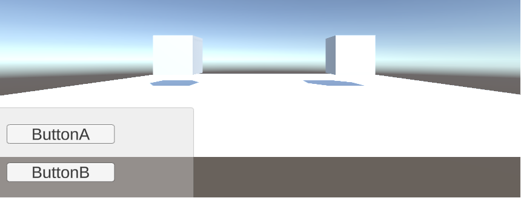

Unidad 4. Plataformas de software interactivas de tiempo real
===================================================================

Introducción 
-------------

Hemos llegado al final del curso. En esta unidad
aplicarás todos los conceptos que has aprendido para la construcción
de aplicaciones interactivas que integren sistemas embebidos con
plataformas de cómputo interactivas. En particular vamos a utilizar
Unity.

Propósitos de aprendizaje
****************************

Comprender de manera práctica los conceptos que permiten integrar sensores y 
actuadores a plataformas de software para la construcción de aplicaciones 
interactivas de tiempo real.

Temas
*******

* Integración de sistemas embebidos a plataformas de cómputo
  interactivas: hilos, colas, sincronización, protocolos.
* Repaso de conceptos de programación orientado a objetos: herencia,
  clases abstractas, manejo de memoria.

Trayecto de actividades
-------------------------

Sesión 1
**********

Ejercicio 1: caso de estudio-plugin Ardity
^^^^^^^^^^^^^^^^^^^^^^^^^^^^^^^^^^^^^^^^^^^

Para entender los conceptos que permiten integrar los conceptos estudiados 
en el curso con la plataforma Unity, vas a estudiar un plugin para Unity llamada
Ardity. Este plugin permite integrar información de dispositivos externos 
al motor.

Te propondré que realices la siguiente guía de trabajo que se encuentra 
`aquí <https://docs.google.com/presentation/d/1uHoIzJGHLZxLbkMdF1o_Ov14xSD3wP31-MQtsbOSa2E/edit?usp=sharing>`__

Ejercicio 2: evaluación formativa
^^^^^^^^^^^^^^^^^^^^^^^^^^^^^^^^^^

Al final de la guía te dejo un MINI-RETO. Este consiste en estudiar a fondo
el código fuente del plugin. Es un reto grande porque posiblemente tengas que 
recordar algunas de tus cursos anteriores de programación.
El mini-reto requiere que repases y estudies algunas cosas nuevas también.

Una vez hagas el paso anterior:

* Crea un proyecto nuevo en Unity.
* Configura el soporte para el puerto serial tal como lo viste en la guía.
* OJO, no instales el paquete Ardity. SI YA LO HICISTE, vuelve a comenzar.
* Ahora toma únicamente LOS SCRIPTS de Ardity necesarios (SOLO LOS NECESARIOS)
  para hacer que la aplicación de la guía funcione de nuevo.

Trabajo autónomo 1: análisis 
*********************************
(Tiempo estimado: 1 horas 20 minutos)

Inicialmente te propongo que repases y/o termines los ejercicios anteriores. 

Ahora, vamos a analizar más detalladamente una de las escenas demo de Ardity:
DemoScene_UserPoll_ReadWrite

Primero, vamos a analizar rápidamente el código de arduino:

.. code-block:: cpp

    uint32_t last_time = 0;
    
    void setup()
    {
        Serial.begin(9600);
    }
    
    void loop()
    {
        // Print a heartbeat
        if ( (millis() - last_time) >  2000)
        {
            Serial.println("Arduino is alive!!");
            last_time = millis();
        }
    
        // Send some message when I receive an 'A' or a 'Z'.
        switch (Serial.read())
        {
            case 'A':
                Serial.println("That's the first letter of the abecedarium.");
                break;
            case 'Z':
                Serial.println("That's the last letter of the abecedarium.");
                break;
        }
    }

Consideraciones a tener presentes con este código:

* La velocidad de comunicación es de 9600. Esa misma velocidad se tendrá que configurar
  del lado de Unity para que ambas partes se puedan entender.
* Nota que no estamos usando la función delay(). Estamos usando millis para medir tiempos
  relativos. Nota que cada dos segundos estamos enviando un mensaje indicando que el
  arduino está activo:  ``Arduino is alive!!``
* Observa que el buffer del serial se lee constantemente. NO estamos usando
  el método available() que usualmente utilizamos. ¿Recuerdas lo anterior? Con available()
  nos aseguramos que el buffer de recepción tiene al menos un byte para leer; 
  sin embargo, cuando usamos Serial.read() sin verificar antes que tengamos datos en el
  buffer, es muy posible que el método devuelva un -1 indicando que no había nada en el
  buffer de recepción. NO OLVIDES ESTO POR FAVOR.
* Por último nota que todos los mensajes enviados por arduino usan el método println.
  ¿Y esto por qué es importante? porque println enviará la información que le pasemos
  como argumento, codificada en ASCII, y adicionará al final 2 bytes: 0x0D y 0x0A. Estos
  bytes serán utilizados por Ardity para detectar que la cadena enviada por Arduino está completa.
  NO OLVIDES VERIFICAR LO ANTERIOR, si no logras identificarlo habla con el profe.

Ahora analicemos la parte de Unity/Ardity. Para ello, carguemos una de las escenas ejemplo:
DemoScene_UserPoll_ReadWrite

.. image:: ../_static/scenes.jpg
   :scale: 100%
   :align: center
   :alt: scenes

Nota que la escena tiene 3 gameObjects: Main Camera, SerialController y SampleUserPolling_ReadWrite.

Veamos el gameObject SampleUserPolling_ReadWrite. Este gameObject tiene dos components, un transform
y un script. El script tiene el código como tal de la aplicación del usuario.

.. image:: ../_static/user_code.jpg
   :scale: 100%
   :align: center
   :alt: user_code

Nota que el script expone una variable pública: serialController. Esta variable es del tipo SerialController.

.. image:: ../_static/serialControllerVarCode.jpg
   :scale: 100%
   :align: center
   :alt: controller

Esa variable nos permite almacenar la referencia a un objeto tipo SerialController. ¿Donde estaría ese
objeto? Pues cuando el gameObject SerialController es creado nota que uno de sus componentes es un objeto
de tipo SerialController:

.. image:: ../_static/serialControllerGO_Components.jpg
   :scale: 100%
   :align: center
   :alt: serial controller GO

Entonces desde el editor de Unity podemos arrastrar el gameObject SerialController al campo SerialController
del gameObject SampleUserPolling_ReadWrite y cuando se despliegue la escena, automáticamente se inicializará
la variable serialController con la referencia en memoria al objeto SerialController:

De esta manera logramos que el objeto SampleUserPolling_ReadWrite tenga acceso a la información
del objeto SerialController.

Observemos ahora qué datos y qué comportamientos tendría un objeto de tipo SampleUserPolling_ReadWrite:

.. code-block:: csharp

    /**
     * Ardity (Serial Communication for Arduino + Unity)
     * Author: Daniel Wilches <dwilches@gmail.com>
     *
     * This work is released under the Creative Commons Attributions license.
     * https://creativecommons.org/licenses/by/2.0/
     */

    using UnityEngine;
    using System.Collections;

    /**
     * Sample for reading using polling by yourself, and writing too.
     */
    public class SampleUserPolling_ReadWrite : MonoBehaviour
    {
        public SerialController serialController;

        // Initialization
        void Start()
        {
            serialController = GameObject.Find("SerialController").GetComponent<SerialController>();

            Debug.Log("Press A or Z to execute some actions");
        }

        // Executed each frame
        void Update()
        {
            //---------------------------------------------------------------------
            // Send data
            //---------------------------------------------------------------------

            // If you press one of these keys send it to the serial device. A
            // sample serial device that accepts this input is given in the README.
            if (Input.GetKeyDown(KeyCode.A))
            {
                Debug.Log("Sending A");
                serialController.SendSerialMessage("A");
            }

            if (Input.GetKeyDown(KeyCode.Z))
            {
                Debug.Log("Sending Z");
                serialController.SendSerialMessage("Z");
            }

            //---------------------------------------------------------------------
            // Receive data
            //---------------------------------------------------------------------

            string message = serialController.ReadSerialMessage();

            if (message == null)
                return;

            // Check if the message is plain data or a connect/disconnect event.
            if (ReferenceEquals(message, SerialController.SERIAL_DEVICE_CONNECTED))
                Debug.Log("Connection established");
            else if (ReferenceEquals(message, SerialController.SERIAL_DEVICE_DISCONNECTED))
                Debug.Log("Connection attempt failed or disconnection detected");
            else
                Debug.Log("Message arrived: " + message);
        }
    }

Vamos a realizar una prueba. Pero antes configuremos el puerto serial en el cual está conectado
el arduino. El arduino ya debe estar corriendo el código de muestra del sitio web del plugin.

.. image:: ../_static/serialControllerCOM.jpg
   :scale: 100%
   :align: center
   :alt: serial controller COM

En este caso el puerto es COM4.

Corre el programa, abre la consola y selecciona la ventana Game del Editor de Unity. Con la ventana
seleccionada (click izquierdo del mouse), escribe las letras A y Z. Notarás los mensajes que aparecen
en la consola:

Una vez la aplicación funcione nota algo en el código de SampleUserPolling_ReadWrite:

.. code-block:: csharp

    serialController = GameObject.Find("SerialController").GetComponent<SerialController>();

Comenta esta línea y corre la aplicación de nuevo. Funciona?

Ahora, elimina el comentario de la línea y luego borra la referencia al SerialController
en el editor de Unity:

.. image:: ../_static/removeSerialControllerUnityEditor.jpg
   :scale: 100%
   :align: center
   :alt: remove serial controller

Corre de nuevo la aplicación.

* ¿Qué puedes concluir?
* ¿Para qué incluyó esta línea el autor del plugin?

Ahora analicemos el código del método Update de SampleUserPolling_ReadWrite:

.. code-block:: csharp

    // Executed each frame
    void Update()
    {
      .
      .
      .
      serialController.SendSerialMessage("A");
      .
      .
      .
      string message = serialController.ReadSerialMessage();
      .
      .
      .
    }

¿Recuerdas cada cuánto se llama el método Update? 

Update se llama en cada frame. Lo llama automáticamente el motor de Unity

Nota los dos métodos que se resaltan:

.. code-block:: csharp

    serialController.SendSerialMessage("A");
    string message = serialController.ReadSerialMessage();

Ambos métodos se llaman sobre el objeto cuya dirección en memoria está guardada en
la variable serialController.

El primer método permite enviar la letra A y el segundo permite recibir una cadena
de caracteres.

* ¿Cada cuánto se envía la letra A o la Z?
* ¿Cada cuánto leemos si nos llegaron mensajes desde el arduino?

Ahora vamos a analizar cómo transita la letra A desde el SampleUserPolling_ReadWrite hasta
el arduino.

Para enviar la letra usamos el método SendSerialMessage de la clase SerialController. Observa
que la clase tiene dos variables protegidas importantes:

.. image:: ../_static/serialControllerUMLClass.jpg
   :scale: 35%
   :align: center
   :alt: serial controller UML class

.. code-block:: csharp

   protected Thread thread;
   protected SerialThreadLines serialThread;

Con esas variables vamos a administrar un nuevo hilo y vamos a almacenar una referencia 
a un objeto de tipo SerialThreadLines.

En el método onEnable de SerialController tenemos:

.. code-block:: csharp

   serialThread = new SerialThreadLines(portName, baudRate, reconnectionDelay, maxUnreadMessages);
   thread = new Thread(new ThreadStart(serialThread.RunForever));
   thread.Start();

Aquí vemos algo muy interesante, el código del nuevo hilo que estamos creando será RunForever y
ese código actuará sobre los datos del objeto cuya referencia está almacenada en serialThread.

Vamos a concentrarnos ahora en serialThread que es un objeto de la clase SerialThreadLines:

.. code-block:: csharp

    public class SerialThreadLines : AbstractSerialThread
    {
        public SerialThreadLines(string portName,
                                 int baudRate,
                                 int delayBeforeReconnecting,
                                 int maxUnreadMessages)
            : base(portName, baudRate, delayBeforeReconnecting, maxUnreadMessages, true)
        {
        }

        protected override void SendToWire(object message, SerialPort serialPort)
        {
            serialPort.WriteLine((string) message);
        }

        protected override object ReadFromWire(SerialPort serialPort)
        {
            return serialPort.ReadLine();
        }
    }

Al ver este código no se observa por ningún lado el método RunForever, que es el código
que ejecutará nuestro hilo. ¿Dónde está? Observe que SerialThreadLines también es un
AbstractSerialThread. Entonces es de esperar que el método RunForever esté en la clase
AbstractSerialThread.

Por otro lado nota que para enviar la letra A usamos el método SendSerialMessage también
sobre los datos del objeto reverenciado por serialThread del cual ya sabemos que es un
SerialThreadLines y un AbstractSerialThread

.. code-block:: csharp

    public void SendSerialMessage(string message)
    {
        serialThread.SendMessage(message);
    }

Al igual que RunForever, el método SendMessage también está definido en AbstractSerialThread.

Veamos entonces ahora qué hacemos con la letra A:

.. code-block:: csharp

    public void SendMessage(object message)
    {
        outputQueue.Enqueue(message);
    }

Este código nos da la clave. Lo que estamos haciendo es guardar la letra A 
que queremos transmitir en una COLA. Esta estructura de datos permite 
PASAR información de un HILO a otro HILO.

¿Cuáles hilos?

Pues tenemos en este momento dos hilos: el hilo del motor y el nuevo hilo que creamos antes.
El hilo que ejecutará el código RunForever sobre los datos del objeto de tipo
SerialThreadLines:AbstractSerialThread. Por tanto, observa que la letra A la estamos
guardando en la COLA del SerialThreadLines:AbstractSerialThread

Si observas con detenimiento el código de RunForever:

.. code-block:: csharp

    public void RunForever()
    {
        try
        {
            while (!IsStopRequested())
            {
                ...
                try
                {
                    AttemptConnection();
                    while (!IsStopRequested())
                        RunOnce();
                }
                catch (Exception ioe)
                {
                ...
                }
            }
        }
        catch (Exception e)
        {
        ...
        }
    }

Los detalles están en RunOnce():

.. code-block:: csharp

    private void RunOnce()
    {
        try
        {
            // Send a message.
            if (outputQueue.Count != 0)
            {
                SendToWire(outputQueue.Dequeue(), serialPort);
            }
            object inputMessage = ReadFromWire(serialPort);
            if (inputMessage != null)
            {
                if (inputQueue.Count < maxUnreadMessages)
                {
                    inputQueue.Enqueue(inputMessage);
                }
            }
        }
        catch (TimeoutException)
        {
        }
    }

Y en este punto vemos finalmente qué es lo que pasa: para enviar la letra
A, el código del hilo pregunta si hay mensajes en la cola. Si los hay,
nota que el mensaje se saca de la cola y se envía:

.. code-block:: csharp

   SendToWire(outputQueue.Dequeue(), serialPort);

Si buscamos el método SendToWire en AbstractSerialThread vemos:

.. code-block:: csharp
   
   protected abstract void SendToWire(object message, SerialPort serialPort);

Y aquí es donde se conectan las clases SerialThreadLines con AbstractSerialThread, ya
que el método SendToWire es abstracto, SerialThreadLines tendrá que implementarlo

.. code-block:: csharp

    public class SerialThreadLines : AbstractSerialThread
    {
        ...
        protected override void SendToWire(object message, SerialPort serialPort)
        {
            serialPort.WriteLine((string) message);
        }
        ...
    }

Aquí vemos finalmente el uso de la clase SerialPort de C# con el método
`WriteLine <https://docs.microsoft.com/en-us/dotnet/api/system.io.ports.serialport.writeline?view=netframework-4.8>`__ 

Finalmente, para recibir datos desde el serial, ocurre el proceso contrario:

.. code-block:: csharp

    public class SerialThreadLines : AbstractSerialThread
    {
        ...
        protected override object ReadFromWire(SerialPort serialPort)
        {
            return serialPort.ReadLine();
        }
    }

`ReadLine <https://docs.microsoft.com/en-us/dotnet/api/system.io.ports.serialport.readline?view=netframework-4.8>`__
también es la clase SerialPort. Si leemos cómo funciona ReadLine queda completamente claro la razón de usar otro
hilo:

.. warning::

  Remarks
  Note that while this method does not return the NewLine value, the NewLine value is removed from the input buffer.

  By default, the ReadLine method will block until a line is received. If this behavior is undesirable, set the
  ReadTimeout property to any non-zero value to force the ReadLine method to throw a TimeoutException if
  a line is not available on the port.

Por tanto, volviendo a RunOnce:

.. code-block:: csharp

    private void RunOnce()
    {
        try
        {
            if (outputQueue.Count != 0)
            {
                SendToWire(outputQueue.Dequeue(), serialPort);
            }

           object inputMessage = ReadFromWire(serialPort);
            if (inputMessage != null)
            {
                if (inputQueue.Count < maxUnreadMessages)
                {
                    inputQueue.Enqueue(inputMessage);
                }
                else
                {
                    Debug.LogWarning("Queue is full. Dropping message: " + inputMessage);
                }
            }
        }
        catch (TimeoutException)
        {
            // This is normal, not everytime we have a report from the serial device
        }
    }

Vemos que se envía el mensaje: 

.. code-block:: csharp

    SendToWire(outputQueue.Dequeue(), serialPort);

Y luego el hilo se bloquea esperando por una respuesta:

.. code-block:: csharp

    object inputMessage = ReadFromWire(serialPort);

Nota que primero se envía y luego el hilo se bloquea. NO SE DESBLOQUEARÁ HASTA que no envíe
una respuesta desde Arduino o pasen 100 ms que es el tiempo que dura bloqueada la función
antes de generar una excepción de timeout de lectura.

¿Cómo sabemos que son 100 ms? 

Mira con detenimiento el código. La siguiente línea te dará una pista.

.. code-block:: csharp

   // Amount of milliseconds alloted to a single read or connect. An
    // exception is thrown when such operations take more than this time
    // to complete.
    private const int readTimeout = 100;

Sesión 2
**********

Ejercicio 3: excepciones
^^^^^^^^^^^^^^^^^^^^^^^^

De nuevo vamos a visitar el demo: DemoScene_UserPoll_ReadWrite.

Resuelve las siguientes cuestiones:

* ¿Qué excepciones se están considerando en el código?

* ¿Qué pasa si no reciben datos por el puerto serial durante 100ms?

* ¿Qué pasa si el cable serial se desconecta de manera inesperada?

* ¿Cómo se reestablece el funcionamiento de la aplicación?

* ¿Qué modificación tendríamos que hacer a la aplicación de arduino para
  reestablecer la comunicación?

Ejercicio 4: ¿Cómo incluir soporte para nuevo protocolo
^^^^^^^^^^^^^^^^^^^^^^^^^^^^^^^^^^^^^^^^^^^^^^^^^^^^^^^^

Describe detalladamente qué pasos debes realizar para soportar un nuevo
protocolo de comunicaciones en Ardity.     

Trabajo autónomo 2: reto
***************************
(Tiempo estimado: 1 horas 20 minutos)

De nuevo, repasa los ejercicios anteriores y realiza el reto.

RETO: integración con un protocolo binario 
^^^^^^^^^^^^^^^^^^^^^^^^^^^^^^^^^^^^^^^^^^^^

#. Realiza una aplicación en Arduino que MEDIANTE un protocolo BINARIO
   envíe el valor de dos variables en punto flotante y una entera con signo 32
   bits. TODAS LAS VARIABLES deben ir en el mismo paquete de DATOS.
#. El paquete de datos solo será enviado por SOLICITUD explícita. La SOLICITUD
   se realizará enviando el byte ``7E``.
#. Realiza una aplicación en Unity que solicite la variables a Arduino
   cada 100 ms.
#. Construye una interfaz de usuario en Unity para visualizar las variables. 
   RECUERDA: una interfaz de usuario, no la consola de Unity.

Evaluación de la Unidad 4
---------------------------

Enunciado
***********

Vas a realizar una aplicación interactiva en UNITY que tenga las siguientes características:

#. Debe tener una escena con dos cubos y dos botones: CubeA, CubeB, ButtonA y ButtonB.
#. Debe estar conectada a dos controladores externos: controlador a y controlador b.
#. La aplicación se comunicará con el ``controlador a`` mediante un protocolo ascii.
#. La aplicación se comunicará con el ``controlador b`` mediante un protocolo binario.
#. DEBES emplear SOLO los scripts de Ardity que necesites, es decir, debes hacer el proyecto siguiendo
   la metodología FromScratch que empleamos en clase.
#. En cada controlador debes implementar DOS sensores (dos pulsadores). El pulsador 1 cambiará el tamaño 
   del cubo. El pulsador 2 cambiará el color. El tamaño y el color estarán determinados por el estado
   de los pulsadores. Tu debes decidir qué pasará si el pulsador está relajado o presionado.
#. En cada controlador debes implementar DOS actuadores (dos LEDs). El LED 1 debe encender y apagar a 1Hz.
   El LED 2 debe ser controlado desde Unity con un botón.

La aplicación se puede ver como en la figura:

Criterios de evaluación 
************************

Funcionamiento
^^^^^^^^^^^^^^^

#. Funcionamiento correcto de la aplicación del controlador a: 1.25
#. Funcionamiento correcto de la aplicación del controlador b: 1.25
#. Funcionamiento correcto de la aplicación interactiva para la comunicación con el 
   controlador a: 1.25
#. Funcionamiento correcto de la aplicación interactiva para la comunicación con el 
   controlador b: 1.25

Sustentación
^^^^^^^^^^^^^^^
Debes presentar la aplicación en las sesiones de clase de la semana 16 y contestar 
las preguntas del docente.

Nota
^^^^^

Estará dada por el producto: CriteriosEvaluación*Sustentación.

